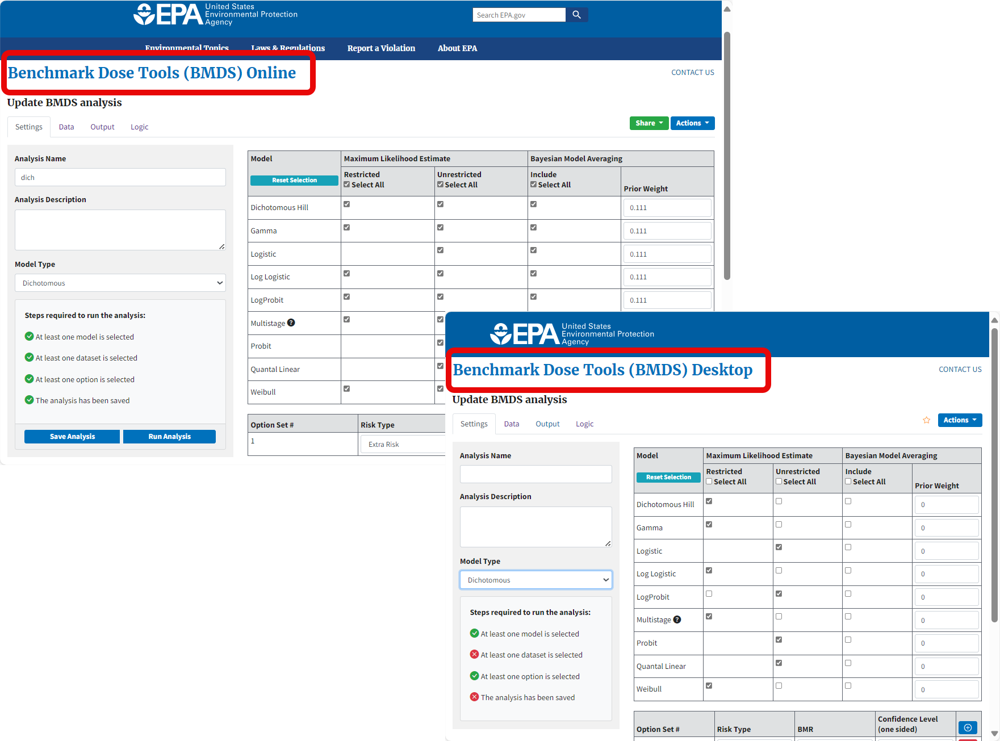
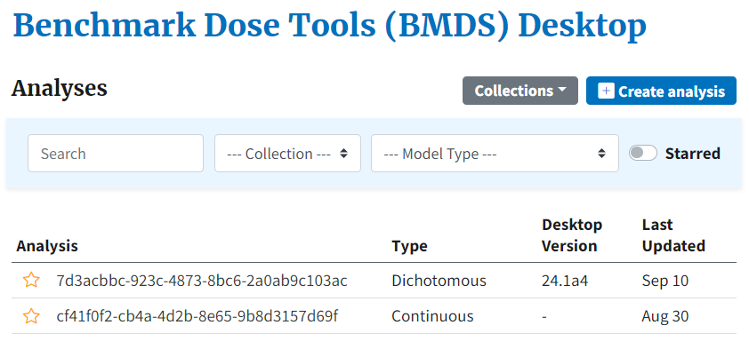
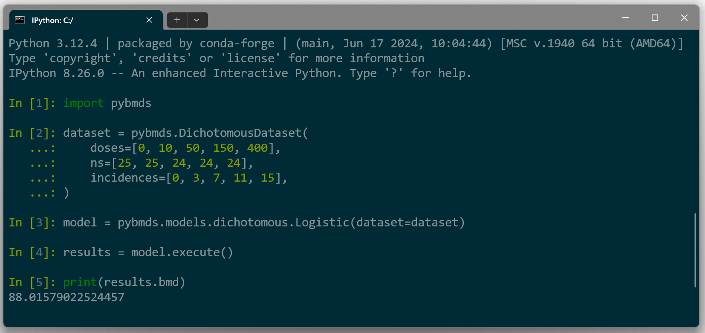

# BMDS Desktop and pybmds

New in 2024 is the rollout of BMDS Desktop and pybmds. Both applications enable the user to work offline without needing an internet connection, while each application offers its own specific advantages.

## Requirements, Installation, and Documentation

Both BMDS Desktop and pybmds require Python version 3.11 or higher, which is available via Anaconda or the [Python.org download site](https://www.python.org/downloads/).

Installing and running the BMDS Desktop and pybmds products are thoroughly described on the [BMDS GitHub site](https://github.com/USEPA/BMDS) for both the novice and experienced Python user.

If you are new to installing Python packages and want to use pybmds or BMDS Desktop for multiple projects, then please follow the detailed [online installation guide](https://usepa.github.io/BMDS/). The installation guide makes it easy to configure your computer, including adding a desktop shortcut to start and update the application. It also describes possible issues and solutions that may arise during installation.

## BMDS Desktop for Offline BMD Analysis

The bmds-ui Python package installs BMDS Desktop to the user's local system. BMDS Desktop looks and works the same as BMDS Online but runs solely on the user's local system. If running BMDS Online is not technically possible or feasible, then BMDS Desktop can be used.

[]{#_Toc185445179 .anchor}**Figure 3.** BMDS Online and BMDS Desktop use the same interface and command components and workflows, but BMDS Desktop projects run entirely on the user's local computer with no Internet connection.

{width="5.323462379702537in" height="3.944821741032371in"}

### BMDS Desktop-Specific Features and Constraints

BMDS Desktop is identical to BMDS Online, with the following differences:

-   Dose response analyses and data storage are fully offline.

-   Database files (projects) are single files containing all analyses; the BMDS Desktop opening page shows all previous analyses included in that project (see ).

-   Within a database file (project), analyses can be labelled and organized.

> []{#_Ref177398698 .anchor}**Figure 4.** BMDS Desktop home page, showing selectable and searchable list of previous analyses within a single project

{width="4.40920384951881in" height="2.1047364391951007in"}

-   Multiple analyses can be stored in a single project, but the user can run only one project (*i.e.*, database file) at a time.

-   BMDS Desktop can theoretically accept an unlimited number of [datasets](./bmds-online.md#specifying-datasets-by-endpoint) and [option sets](./bmds-online.md#maximum-number-of-option-sets); however, it is recommended to create multiple analyses rather than putting large numbers of datasets into a single analysis.

-   The Microsoft Word report does not contain URLs because the analysis was run on a local computer, not the internet.

### Constraints on Sharing Analyses with BMDS Online

You can [export an analysis or results](./bmds-online.md#sharing-and-downloading-analyses-and-results) from BMDS Desktop and import the files into BMDS Online, and vice versa. However, there are some caveats:

-   BMDS Online is limited to a maximum of 3-6 option sets and 6-10 datasets (depending on the endpoint). If the exported BMDS Desktop analysis exceeds these limits, then BMDS Online cannot load the analysis.

-   The export function is intended to share and view analyses and results only; it is not intended to support a seamless interchange of data between the two applications, nor does it support a collaborative workflow.

***Tip*** Instead of sharing an analysis, consider exporting a Word report. An exported Word report contains all the datasets, graphs, etc. needed to fully share an analysis.

BMDS Online has its own set of constraints on sharing results via URL; for more information, see Section 4.7.2 on page [31](./bmds-online.md#constraints-on-sharing-analysis-urls).

## pybmds for Advanced Research

pybmds is a Python package that is the underlying execution engine for BMDS Desktop and BMDS Online. It's also a way for users to run BMDS in a scripting environment and is designed for users familiar with basic scripting in languages like R or Python.

Unlike BMDS Online and BMDS Desktop, however, pybmds runs inside a terminal window with a command-line interface (). The pybmds command-line enables the advanced user to script batch processes, display advanced graphics, perform custom BMD analyses, and, for [Bayesian model averaging](./bayesian-dichotomous.md#bayesian-dichotomous-analysis-including-model-averaging), even override the default priors for parameter estimation.

**Figure 5.** pybmds is a command-line environment that runs in a terminal window.

{width="6.5in" height="3.06875in"}

The [pybmds user guide](https://usepa.github.io/BMDS/) includes "recipes" for BMD analyses that the advanced user can build on to create their own analyses.

pybmds can theoretically accept an unlimited number of [datasets](./bmds-online.md#specifying-datasets-by-endpoint) and [option sets](./bmds-online.md#maximum-number-of-option-sets); however, it is recommended to create multiple analyses rather than put large numbers of datasets into a single analysis.

