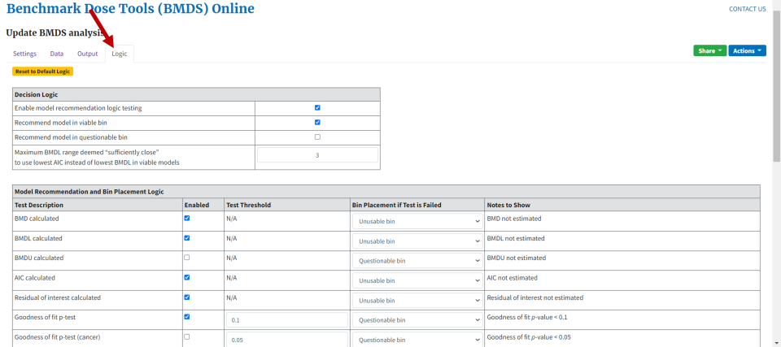

# Modeling Data in BMDS Online

For users new to BMDS Online, this section walks through the basics of
creating and sharing an online analysis, using dichotomous data as an
example. The steps also include tips on how to use BMDS Online
effectively.

## Before You Start

-   BMDS Online is best experienced in a modern web browser, such as
    Google Chrome or Microsoft Edge. Internet Explorer 11 is not
    supported.

-   No user information is saved or associated with any analysis.

-   BMDS Online will save datasets and analyses for three years on an
    EPA server; users can optionally "renew" an analysis so that it
    remains on the EPA server for another three years. Or, users can
    save to their computer an export of the data or analysis for later
    import into BMDS Online. For more information, refer to Section
    4.7.3, "Actions Menu," on page 31.

-   If data sensitivity is an issue, the user can run BMDS Desktop on
    their local computer.

## Creating a New Analysis

1.  Navigate to the [BMDS Online website](https://bmdsonline.epa.gov).

2.  Select the **Create a new BMDS analysis** button ().

[]{#_Ref148619316 .anchor}**Figure 6.** BMDS Online landing page, with
**Create a new BMDS analysis** button.

{width="5.092825896762904in"
height="3.5470220909886265in"}

BMDS Online displays a new, empty analysis page with the Settings tab
selected (). From here, you can configure an analysis, load a dataset,
execute the analysis, and select results.

Each BMDS Online analysis is self-contained and includes all the inputs
and outputs for the executed analysis. No user or personal information
is captured by BMDS Online.

[]{#_Ref148619287 .anchor}**Figure 7.** A new BMDS Online analysis page.

{width="6.5in"
height="3.879166666666667in"}

### Analyses and URLs

When a new analysis is created, a unique URL is created for the analysis
().

You can create as many analyses as you want, but ***saving an analysis
saves only its most recent execution to that unique URL***. If you edit
the data or add new data or new options, then the resulting analysis
will overwrite the previous analysis.

***Tip*** To analyze multiple datasets, create a new analysis for each
dataset rather than overwrite an existing analysis.

[]{#_Ref148619345 .anchor}**Figure 8.** A new BMDS Online analysis has a
unique URL.

{width="6.5in"
height="2.2916666666666665in"}

## Specifying an Analysis

### Steps Required to Run the Analysis

BMDS Online tracks the steps required to run an analysis (). In this
example, for a new analysis, the green checkmarks show that the default
set of models and options have been selected for the analysis. Red x's
show that, currently, no dataset has been selected and the analysis has
not been saved.

[]{#_Ref148619560 .anchor}**Figure 9.** When all checkmarks are green,
BMDS Online can run an analysis.

{width="4.048611111111111in"
height="1.8367410323709537in"}

### Specifying the Model(s) and Option(s)

1.  On the Settings tab, specify a name and description for the analysis
    (). BMDS uses the **Analysis Name** to name the files that are
    created when users select the Reporting options "data," "report," or
    "analysis" from the [Actions menu](#actions-menu-1) .

[]{#_Ref148619621 .anchor}**Figure 10.** Enter a descriptive name and
summary for the analysis; they will be included in the report.

{width="3.255601487314086in"
height="2.27668416447944in"}

2.  Select the model type for your analysis (*i.e.*, are you modeling
    dichotomous or continuous data?) (). For this example, the
    dichotomous model type has been selected.

**Note:** An analysis can have only a single model type. You cannot mix
continuous and dichotomous data in a single analysis.

[]{#_Ref148619786 .anchor}**Figure 11.** Dichotomous model type is
selected for this analysis.

{width="3.1194335083114613in"
height="1.4358409886264216in"}

3.  Select which models will be used for the analysis. For this example,
    the default selection of dichotomous maximum-likelihood estimation
    (MLE) models will be used, plus all the Bayesian dichotomous model
    averaging models. To use all the models in a column, check the
    **Select All** box ().

[]{#_Ref148619674 .anchor}**Figure 12.** Tick the Select All box to
select all the models in a column.

{width="4.941372484689414in"
height="2.840761154855643in"}

4.  Specify the option sets to be used for the analysis. For this
    example, we will use a single option set with the default benchmark
    response (BMR) of 10% extra risk.\
    \
    You can add/delete option sets by clicking the blue plus or red
    trash can icons, respectively, to the right of the option set panel
    (Figure *13*).

[]{#_Ref148619744 .anchor}**Figure 13.** Select the blue plus icon to
add a row for a new option set. Select the red trash can icon to delete
the row.

{width="6.5in"
height="1.0784722222222223in"}

***Note:*** To reset the model selection to the BMDS Online defaults,
select the **Reset Selection** button. This function does not reset the
modeling options (*e.g.*, Risk Type) already specified.

### Maximum Number of Option Sets

-   **BMDS Online:** A maximum of six option sets (for continuous,
    dichotomous, and nested dichotomous) and up to three option sets
    (for multitumor).

-   **BMDS Desktop:** No limit essentially; but it is recommended to
    create multiple analyses.

-   **pybmds:** No limit.

## Specifying Datasets

### Specifying Datasets by Endpoint

1.  Select a Model Type on the Settings tab ***before*** entering
    datasets.

2.  Select the Data tab ().

[]{#_Ref148620146 .anchor}**Figure 14.** Select the Data tab to start
specifying datasets.

{width="3.3333333333333335in"
height="1.5833333333333333in"}

3.  On the Data tab, select the **New** button to add an individual
    dataset (). For this example workflow, only the dichotomous option
    is shown for *New dataset* because Dichotomous was chosen as the
    model type on the Settings tab.

[]{#_Ref148620168 .anchor}**Figure 15.** The **New** button creates a
new empty dataset.

{width="3.3333333333333335in"
height="1.9375in"}

> Depending on the model type selected on the Settings tab, BMDS Online
> will present appropriate selections for a new dataset.

-   Continuous data:

-   Summarized (data measured on a continuous scale and presented as
    means and standard deviations), or

-   Individual (data measured on a continuous scale presented as dose
    and response data for each test subject)

-   Dichotomous data (*e.g.*, lesion incidence)

-   Nested Dichotomous data (dichotomous observations that are nested
    within experimental units, such as rodent dams and pups)

-   Multitumor data (most often limited to analyses of cancer data where
    the component datasets are for tumors occurring at various sites)

4.  BMDS Online automatically adds five rows of data when adding a new
    dataset.\
    \
    After a new empty dataset has been added, you can specify the
    dataset name, dose name and units, and response name and units. BMDS
    Online will use this information to identify the dataset in results
    and reports.\
    \
    For this example, the incidence of hepatocellular hyperplasia will
    be modeled with dose units of mg/kg-day, as shown in .

[]{#_Ref148620647 .anchor}**Figure 16.** Data tab with empty dataset,
empty graph, and details about the dataset to be analyzed.

{width="6.5in"
height="2.247916666666667in"}

### Maximum Number of Datasets

-   **BMDS Online:** A maximum of six datasets (for continuous,
    dichotomous, and nested dichotomous) or 10 datasets (for
    multitumor).

-   **BMDS Desktop:** No limit essentially; but it is recommended to
    create multiple analyses instead of putting large numbers of
    datasets into a single analysis.

-   **pybmds:** No limit.

### Adding Datasets, Method 1: Manually

Manually enter Dose, N, and Incidence data by typing the data into the
table.

New rows can be added by clicking the blue plus icon; unneeded rows can
be deleted by clicking the red trash can icon ().

[]{#_Ref148620704 .anchor}**Figure 17.** Select the blue plus icon to
add five rows at a time; select the red trash can icon to delete that
row.

{width="4.768055555555556in"
height="3.2235312773403324in"}

### Adding Datasets, Method 2: Copy and Paste

BMDS Online can import datasets by copying and pasting from an Excel or
HTML formatted source.

1.  Select and copy the cells (numbers only; do not include column
    titles or header text) ().

[]{#_Ref148620818 .anchor}**Figure 18.** Select and copy the data from
Excel.

{width="3.3333333333333335in"
height="1.6111111111111112in"}

2.  In BMDS Online, select the aqua Excel icon in the dataset table
    header (). A *Paste from Excel* window displays.

> []{#_Ref148620871 .anchor}**Figure 19.** Select the **Paste from
> Excel** button (right).

{width="2.375in" height="0.9375in"}

3.  Click the mouse inside the *Paste from Excel* window's text box,
    paste the data, and select the Load icon (). The dataset is then
    fully entered in BMDS Online.

[]{#_Ref148620904 .anchor}**Figure 20.** After pasting in the data from
Excel, select Load to enter the data into BMDS Online.

{width="2.9337117235345582in"
height="3.7282589676290465in"}

### Adding Datasets, Method 3: Edit Sample Data

Select the **Load an example dataset** link to create ready-to-customize
sample data.

[]{#_Toc185445197 .anchor}**Figure 21.** Sample dichotomous dataset,
ready for editing.

{width="4.117963692038495in"
height="2.246402012248469in"}

### Insert and Save Multiple Datasets

BMDS Online displays only one dataset at a time. However, it tracks
***all*** datasets created in the current session.

All datasets created during a session are saved via the [Actions
menu's](#actions-menu-1) **Download analysis** option and all specified
datasets in a session can be Shared.

Select the **Create** button to create a new default dataset with an
autogenerated name. The user can switch between datasets created during
the current session by selecting them from the **Select existing**
picklist.

[]{#_Toc185445198 .anchor}**Figure 22.** Creating multiple datasets in
BMDS Online.

{width="2.4808628608923886in"
height="2.4083705161854767in"}

### Delete a Dataset

Select the dataset from the **Select existing** picklist, then select
the **Delete** button beside the **Dataset name** field.

[]{#_Toc185445199 .anchor}**Figure 23.** Data tab with **Delete** button
highlighted.

{width="4.209994531933508in"
height="3.0922769028871393in"}

### Document the Dataset

BMDS Online enters a default dataset name as a placeholder but it's a
good practice to enter a unique name for the dataset. The dataset name
will be used as the title for the plot.

Specifying the Dose units and Response units above the dataset () will
enter those units into the plot ().

[]{#_Ref148622188 .anchor}**Figure 24.** Specify the dataset's units
here...

{width="5.236459973753281in"
height="1.2050568678915135in"}

[]{#_Ref148622206 .anchor}**Figure 25.** ...and they provide additional
context for the plot's axes.

{width="3.2079090113735784in"
height="3.2240562117235347in"}

### All Rows Must Have Data

When the user saves an analysis, BMDS Online displays an error if the
dataset is missing any values.

[]{#_Toc185445202 .anchor}**Figure 26.** BMDS Online displays an error
if there are missing values in a dataset.

{width="5.289623797025372in"
height="2.632379702537183in"}

### Dataset Plot

Note that the plot to the right of the dataset table updates as data is
entered (). The plot provides visual feedback on the entered data to
draw attention to trends or anomalies that may need correction.

[]{#_Ref148622333 .anchor}**Figure 27.** Dataset and plot.

{width="6.5in"
height="2.022222222222222in"}

Hover the cursor over a data point to see additional extrapolations from
the entered data ().

[]{#_Ref148622416 .anchor}**Figure 28.** Hover the cursor over a data
point to see extra plot details.

{width="2.9583552055993in"
height="2.6953904199475067in"}

The plot's upper right corner features a line of icons () that help the
user to, from left to right:

-   Download the plot as a PNG image (camera icon)

-   Zoom into the plot (magnifying glass icon)

-   Restore the plot to default view (home icon)

-   Display the Plotly.com website, who are makers of the plotting
    feature (graph icon)

[]{#_Ref148622522 .anchor}**Figure 29.** Plotly accessories.

{width="1.4834623797025372in"
height="0.3416961942257218in"}

Visit the [Plotly Website Help
Page](https://plotly.com/chart-studio-help/zoom-pan-hover-controls/) for
detailed instructions on the use of these plot controls.

## Running an Analysis

1.  After all datasets are loaded, return to the Settings tab to run the
    analysis.

2.  Use the *Enabled* column's checkboxes to select all datasets to
    include in the analysis. On the Settings tab, a green checkmark now
    appears next to *At least one dataset is selected* ().

[]{#_Ref156987860 .anchor}**Figure 30.** Enable datasets to satisfy
another analysis requirement.

{width="3.6908409886264217in"
height="3.3802274715660543in"}

3.  For dichotomous data, BMDS Online automatically selects the Maximum
    multistage degree to be 3. However, you can manually select a range
    of options from the **Maximum multistage degree** picklist (). For
    this example analysis, the default setting is used. For more
    information, refer to Section 9.2, "Maximum Multistage Degree," on
    page 69.

[]{#_Ref148628787 .anchor}**Figure 31.** Hover the mouse over the
question mark icon for help text on Maximum multistage degree setting.

{width="5.355755686789151in"
height="2.057736220472441in"}

4.  Select the **Save Analysis** button to complete all the steps
    required to enable the **Run Analysis** button. Notice that all
    steps now have a green checkmark next to them ().

[]{#_Ref148628855 .anchor}**Figure 32.** Selecting Save Analysis ensures
all specifications are in place for an analysis.

{width="3.9196423884514435in"
height="2.785207786526684in"}

5.  Select the **Run Analysis** button to execute the analysis. A
    running analysis can be stopped by selecting the **Cancel
    execution** button ().

[]{#_Ref148628892 .anchor}**Figure 33.** Select **Cancel execution** to
stop a running analysis.

{width="4.044642388451444in"
height="1.9639851268591426in"}

6.  After successful execution, the modeling results are displayed on
    the Output tab ().

## Viewing Analysis Results

BMDS Online displays a set of results for one dataset at a time on the
Output tab. The display includes the dataset under analysis, option
settings, results, and a plot.

The large Model Results table is an abbreviated display showing the most
frequently used and referenced values from a BMD analysis.

[]{#_Ref177725002 .anchor}**Figure 34.** The Output tab is a large
scrolling page showing results for one dataset at a time.

{width="6.5in"
height="2.9243055555555557in"}

To select a different set of results, select the specific dataset+option
set combination from the **Select an output** picklist.

[]{#_Toc185445211 .anchor}**Figure 35.** Select the output results to
display in the Output tab.

{width="1.8290977690288714in"
height="1.5687521872265966in"}

### Summary Results Table

Numerical results are displayed in a summary table for all models.
Select the **Show** icon in the *Recommendation and Notes* column header
to display a full set of model notes and warnings. Select the **Hide**
icon to hide the model notes ().

[]{#_Ref148629035 .anchor}**Figure 36.** The **Show/Hide** buttons
toggle display of additional model warnings and messages.

{width="2.7200317147856516in"
height="2.3214709098862643in"}

Hover the cursor over rows within the Model Results table to display
individual model curves in the plot ().

[]{#_Ref148629097 .anchor}**Figure 37.** Hovering the cursor over a
model row displays that model's plot.

{width="6.476848206474191in"
height="2.2419870953630796in"}

To investigate an individual model's results, select that model's name
in the Model column. BMDS will overlay a window showing all the
numerical and graphical model outputs for that model ().

[]{#_Ref148629123 .anchor}**Figure 38.** Select a model's name to
display a window showing all results for that model.

{width="5.274038713910761in"
height="2.427410323709536in"}

### Recommended MLE Models

For the maximum-likelihood estimation (MLE) models, BMDS Online applies
a set of model selection logic criteria to recommend a best fitting
model (the blue row marked **Recommended** in ). The logic criteria used
to make the recommendations are located on the Logic tab ().

[]{#_Ref148690854 .anchor}**Figure 39.** The Logic tab contains the
rules BMDS Online uses to make model recommendations. It is highly
recommended to leave the settings as-is.

{width="6.5in"
height="2.7569444444444446in"}

On the Logic tab, you can investigate the criteria BMDS Online used to
recommend the best-fitting model. Users can change any of the criteria
for model selection based on the needs of their analysis or to comport
with the modeling guidance of their organizations. ***However, it is
highly recommended that new users leave the logic settings as-is; logic
settings should only be changed under the guidance of experienced
modelers.*** For more information, refer to Section 7.0, "Model
Recommendations and Decision Logic," on page
[44](#model-recommendations-and-decision-logic)

If any logic setting changes, the default logic settings can be
reapplied by selecting the **Reset to Default Logic** button.

### Selecting the Best Fitting Model

Back on the Output tab, the user can choose the recommended model, or an
alternative, from the **Selected best-fitting model** picklist ().

[]{#_Ref148690882 .anchor}**Figure 40.** The **Selected best-fitting
model** picklist, with the Multistage 3 model selected.

{width="2.6403947944007in"
height="1.820077646544182in"}

Enter notes on model selection in the **Selection notes** field ().
Click the **Save model selection** button to save this documentation
with the results analysis. This documentation will be included in the
downloaded Word report.

[]{#_Ref148691110 .anchor}**Figure 41.** Use the Selection notes box to
record the reason why a specific model was selected.

{width="6.5in"
height="1.0055555555555555in"}

Select the **Save model selection** button to finalize model selection.
BMDS Online displays the selected model row in green, and any selection
notes will be displayed in a footnote at the bottom of the table ().

[]{#_Ref148691246 .anchor}**Figure 42.** The final output table:
recommended row in blue, user-selected row in green, and footnotes.

{width="6.5in" height="2.5875in"}

Individual model and model averaging results can also be investigated by
clicking on the desired row in the results table. In , the Model Average
link is selected to display the Model Average results graph. Hover the
mouse across the curves to investigate results in more detail.

[]{#_Ref148691301 .anchor}**Figure 43.** Selecting the Model Average
link from the Bayesian Model Results table displays the Model Average
results window. Hover the cursor over the results curves to display more
details on each model's result.

{width="6.5in"
height="3.2375in"}

## Sharing and Downloading Analyses and Results

After an analysis has been configured and successfully executed, it can
be shared with others or downloaded.

The Share and Actions menus in the top-right corner of the BMDS Online
application include options for other ways to interact with the
analysis.

*Tip* BMDS Online analyses are linked to the URL of the *current*
session. To get back to that analysis later: email the link to yourself
or save the link in a Microsoft Word document with a full description of
the analysis.

### Share Menu

[]{#_Toc185445220 .anchor}**Figure 44.** BMDS Online Share menu options.

{width="2.236111111111111in"
height="1.9351673228346458in"}

-   **Read-only links**: users can share read-only links so
    collaborators can view the current analysis and download reports but
    cannot edit or execute the analysis.

-   **Edit link**: users can share links to collaborators so they can
    edit the analysis settings, change input data, and re-execute the
    analysis.

### Constraints on Sharing Analysis URLs

-   **Only the most recent analysis is available.** BMDS Online analyses
    are linked to the URL of the ***current*** session. When a link is
    shared, only the most recent execution of that analysis is preserved
    and will be available to others. Therefore, if you need to perform
    more work after sharing an analysis link, we recommend [creating a
    new analysis](#creating-a-new-analysis).

-   **Analyses are deleted after three years unless extended.** If you
    share the link with others, note that analyses are deleted after
    three years, unless retention of the analysis is extended from the
    Actions menu. The **Download analysis** feature can be used to save
    and share analyses that need to be retained long-term.

### Actions Menu {#actions-menu-1}

[]{#_Toc185445221 .anchor}**Figure 45.** BMDS Online Actions menu
options.

{width="2.9238648293963254in"
height="2.7919083552055994in"}

-   **Load analysis**: Load a previously downloaded analysis (using the
    **Download analysis** option described below).

-   **Extend deletion date**: BMDS Online will store analyses for three
    years after the date of creation. Select **Extend deletion date** to
    extend deletion to three years from the time this button was
    clicked.

-   **Delete analysis**: Delete the current analysis. If an analysis is
    deleted, it cannot be restored.

-   **Download data**: Download the analysis as an Excel file. By
    default, the user-specified Analysis Name is the Excel filename; the
    user can change the filename before saving. The Excel file contains
    all the datasets, their option settings, and their analysis results.

-   **Download report**: Download the analysis results as a Word file.
    Options for the Word report can include only the user-selected
    model, all models, and all models with the BMD Cumulative Data
    Function (CDF) table (). Note that the Word report contains the
    analysis URL, and users can access their analyses via the generated
    report.[^1] The name given to the Word file is the user-specified
    Analysis Name.

[^1]: The BMDS Desktop report does not include URLs because the analysis resides on the user's local system rather than the Internet.

-   **Download analysis**: Download the analysis as a JSON file. This is
    a machine-readable file format that can be saved or shared, and then
    uploaded into BMDS Online via **Load analysis**. The name given to
    the JSON file is the user-specified **Analysis Name**.

### Microsoft Word Report

As described in the previous section, select the Actions menu's
**Download report** option to display the following panel where the user
can customize what will appear in the report.

The **Long dataset format** option is recommended for most users.
Selecting the options **Include all models** and **Include BMD CDF
Table** make the report considerably longer.

[]{#_Ref157270082 .anchor}**Figure 46.** The Actions **Download report**
option displays items the user can include in the Word report.

{width="6.5in"
height="2.545138888888889in"}

## Citing BMDS Results

An exported Word report contains a recommended citation for that
product; for example, a report from BMDS Desktop will show only the BMDS
Desktop citation. The user can adapt the citation as appropriate.

The following example citations include each application's package
version and timestamps to aid in reproducing the analysis.

> U.S. Environmental Protection Agency. (2024). BMDS Online (24.1;
> pybmds 24.1; bmdscore 24.1) \[Software\]. Available from
> https://bmdsonline.epa.gov. Accessed September 18, 2024.
>
> U.S. Environmental Protection Agency. (2024). BMDS Desktop (24.1;
> pybmds 24.1; bmdscore 24.1) \[Software\]. Available from
> https://pypi.org/project/bmds-ui/. Accessed September 18, 2024.
>
> U.S. Environmental Protection Agency. (2024). pybmds (24.1; bmdscore
> 24.1) \[Software\]. Available from https://pypi.org/project/pybmds/.
> Executed on September 18, 2024.

