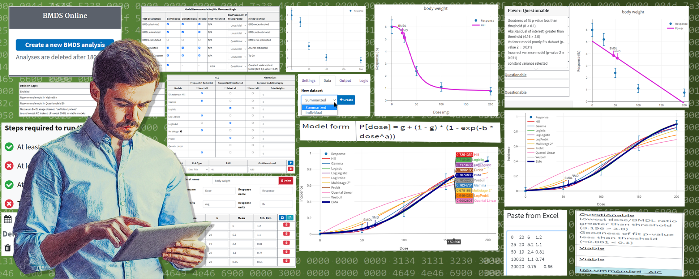
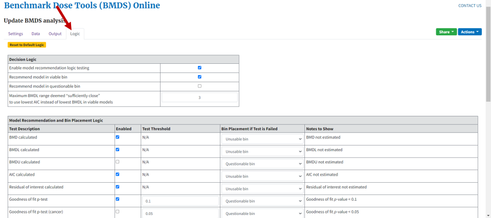
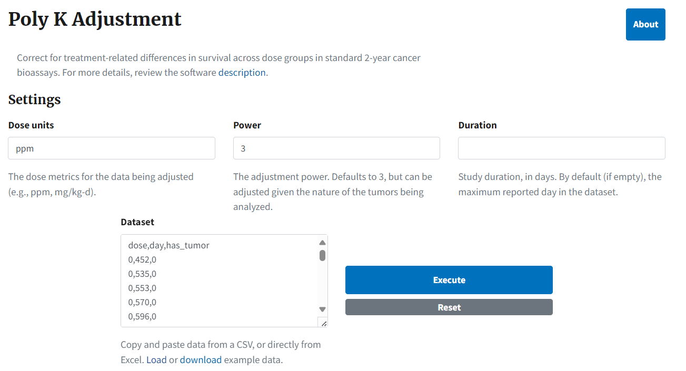

{width="8.60465113735783in"
height="11.03150699912511in"}{width="2.0083333333333333in"
height="0.7895833333333333in"}

Benchmark Dose Software (BMDS)

User Guide

EPA 600/X-24/344 I November 2024 I www.epa.gov/research

{width="8.556944444444444in"
height="3.426388888888889in"}

**Office of Research and Development**

**Center for Public Health and Environmental Assessment**

This page is intentionally left blank

EPA 600/X-24/344 I November 2024 I www.epa.gov/research

Benchmark Dose Software (BMDS)

User Guide

{width="1.3298611111111112in"
height="0.40902777777777777in"}{width="3.46800634295713in"
height="0.8194444444444444in"}{width="1.2361111111111112in"
height="0.6180566491688539in"}

# Authors and Reviewers {#authors-and-reviewers .TOC-Heading}

**Federal Authors**

Jeff Gift, Ph.D.

J. Allen Davis, M.S.

Todd Blessinger, Ph.D.

Andy Shapiro

> U.S. EPA
>
> Office of Research and Development
>
> Center for Public Health and Environmental Assessment (CPHEA)
>
> RTP, NC, Cincinnati, OH and Washington, DC

Matthew Wheeler, Ph.D.

> National Institute for Environmental Health Sciences (NIEHS)

**Contract Authors**

Cody Simmons, Ph.D.

Bruce Allen, M.S.

Michael E. Brown, M.S.

> General Dynamics Information Technology / ARA
>
> US EPA, 109 T.W. Alexander Dr.
>
> Research Triangle Park, NC 27711

**Reviewers**

Philip Villanueva, M.S.

> EPA Office of Pesticide Programs, Health Effects Division, Chemistry &
> Exposure Branch

Geoffrey (Colin) Peterson, Ph.D.

> EPA Center for Public Health and Environmental Assessment, Chemical
> and Pollutant Assessment Division, Toxic Effects Assessment Branch

# Support for BMDS provided by {#support-for-bmds-provided-by .TOC-Heading}

National Institute for Environmental Health Sciences (NIEHS)

National Institute for Occupational Safety and Health (NIOSH)

# Disclaimer {#disclaimer .TOC-Heading}

This User Guide was created under the Agency's Quality Assurance (QA)
program for environmental information, with an approved Quality
Assurance Project Plan (QAPP) for Enhancements to Benchmark Dose
Software (BMDS), L-HEEAD-0032189-QP-1-3 (approved 6/14/2023). An
Independent QA audit (L-HEEAD-Audit-1157) was conducted on the BMDS
project on July 20, 2022. In addition, this product was reviewed by QA,
and two internal technical reviewers.

# Contents {#contents .TOC-Heading}

[Contents [iii](#_Toc185445003)](#_Toc185445003)

[1.0 Overview [1](#overview)](#overview)

[1.1 BMDS for Dose-Response Modeling
[1](#bmds-for-dose-response-modeling)](#bmds-for-dose-response-modeling)

[1.1.1 Dose-Response Modeling
[1](#dose-response-modeling)](#dose-response-modeling)

[1.1.2 Types of Responses Modeled
[2](#types-of-responses-modeled)](#types-of-responses-modeled)

[1.1.3 Presentation of Model Results
[2](#presentation-of-model-results)](#presentation-of-model-results)

[1.2 How EPA Uses BMD Methods
[3](#how-epa-uses-bmd-methods)](#how-epa-uses-bmd-methods)

[1.3 BMDS Development History
[3](#bmds-development-history)](#bmds-development-history)

[1.4 What's New: BMDS Online is EPA's Primary Dose-Response Modeling
Platform
[4](#whats-new-bmds-online-is-epas-primary-dose-response-modeling-platform)](#whats-new-bmds-online-is-epas-primary-dose-response-modeling-platform)

[1.4.1 Privacy is Respected
[4](#privacy-is-respected)](#privacy-is-respected)

[1.4.2 Results Saved for Three Years
[4](#results-saved-for-three-years)](#results-saved-for-three-years)

[1.5 What's New: Work Offline with BMDS Desktop and pybmds
[4](#whats-new-work-offline-with-bmds-desktop-and-pybmds)](#whats-new-work-offline-with-bmds-desktop-and-pybmds)

[1.6 What's New: Active Development Stopped on BMDS 3.3
[5](#whats-new-active-development-stopped-on-bmds-3.3)](#whats-new-active-development-stopped-on-bmds-3.3)

[1.7 What's New: Key Improvements and Enhancements
[5](#whats-new-key-improvements-and-enhancements)](#whats-new-key-improvements-and-enhancements)

[1.8 BMDS Resources [5](#bmds-resources)](#bmds-resources)

[1.8.1 BMDS Website [5](#bmds-website)](#bmds-website)

[1.8.2 BMDS Mailing List [5](#bmds-mailing-list)](#bmds-mailing-list)

[1.8.3 BMDS Glossary [6](#bmds-glossary)](#bmds-glossary)

[1.8.4 BMDS Source Code [6](#bmds-source-code)](#bmds-source-code)

[1.8.5 BMDS Support [6](#bmds-support)](#bmds-support)

[2.0 BMDS Desktop and pybmds
[7](#bmds-desktop-and-pybmds)](#bmds-desktop-and-pybmds)

[2.1 Requirements, Installation, and Documentation
[7](#requirements-installation-and-documentation)](#requirements-installation-and-documentation)

[2.2 BMDS Desktop for Offline BMD Analysis
[7](#bmds-desktop-for-offline-bmd-analysis)](#bmds-desktop-for-offline-bmd-analysis)

[2.2.1 BMDS Desktop-Specific Features and Constraints
[8](#bmds-desktop-specific-features-and-constraints)](#bmds-desktop-specific-features-and-constraints)

[2.2.2 Constraints on Sharing Analyses with BMDS Online
[8](#constraints-on-sharing-analyses-with-bmds-online)](#constraints-on-sharing-analyses-with-bmds-online)

[2.3 pybmds for Advanced Research
[9](#pybmds-for-advanced-research)](#pybmds-for-advanced-research)

[3.0 Benchmark Dose Models Included in BMDS
[10](#benchmark-dose-models-included-in-bmds)](#benchmark-dose-models-included-in-bmds)

[3.1 Models Not Included in BMDS Online
[11](#models-not-included-in-bmds-online)](#models-not-included-in-bmds-online)

[4.0 Modeling Data in BMDS Online
[12](#modeling-data-in-bmds-online)](#modeling-data-in-bmds-online)

[4.1 Before You Start [12](#before-you-start)](#before-you-start)

[4.2 Creating a New Analysis
[12](#creating-a-new-analysis)](#creating-a-new-analysis)

[4.2.1 Analyses and URLs [13](#analyses-and-urls)](#analyses-and-urls)

[4.3 Specifying an Analysis
[14](#specifying-an-analysis)](#specifying-an-analysis)

[4.3.1 Steps Required to Run the Analysis
[14](#steps-required-to-run-the-analysis)](#steps-required-to-run-the-analysis)

[4.3.2 Specifying the Model(s) and Option(s)
[14](#specifying-the-models-and-options)](#specifying-the-models-and-options)

[4.3.3 Maximum Number of Option Sets
[16](#maximum-number-of-option-sets)](#maximum-number-of-option-sets)

[4.4 Specifying Datasets
[16](#specifying-datasets)](#specifying-datasets)

[4.4.1 Specifying Datasets by Endpoint
[16](#specifying-datasets-by-endpoint)](#specifying-datasets-by-endpoint)

[4.4.2 Maximum Number of Datasets
[18](#maximum-number-of-datasets)](#maximum-number-of-datasets)

[4.4.3 Adding Datasets, Method 1: Manually
[18](#adding-datasets-method-1-manually)](#adding-datasets-method-1-manually)

[4.4.4 Adding Datasets, Method 2: Copy and Paste
[19](#adding-datasets-method-2-copy-and-paste)](#adding-datasets-method-2-copy-and-paste)

[4.4.5 Adding Datasets, Method 3: Edit Sample Data
[20](#adding-datasets-method-3-edit-sample-data)](#adding-datasets-method-3-edit-sample-data)

[4.4.6 Insert and Save Multiple Datasets
[20](#insert-and-save-multiple-datasets)](#insert-and-save-multiple-datasets)

[4.4.7 Delete a Dataset [21](#delete-a-dataset)](#delete-a-dataset)

[4.4.8 Document the Dataset
[21](#document-the-dataset)](#document-the-dataset)

[4.4.9 All Rows Must Have Data
[22](#all-rows-must-have-data)](#all-rows-must-have-data)

[4.4.10 Dataset Plot [23](#dataset-plot)](#dataset-plot)

[4.5 Running an Analysis
[24](#running-an-analysis)](#running-an-analysis)

[4.6 Viewing Analysis Results
[26](#viewing-analysis-results)](#viewing-analysis-results)

[4.6.1 Summary Results Table
[26](#summary-results-table)](#summary-results-table)

[4.6.2 Recommended MLE Models
[28](#recommended-mle-models)](#recommended-mle-models)

[4.6.3 Selecting the Best Fitting Model
[28](#selecting-the-best-fitting-model)](#selecting-the-best-fitting-model)

[4.7 Sharing and Downloading Analyses and Results
[30](#sharing-and-downloading-analyses-and-results)](#sharing-and-downloading-analyses-and-results)

[4.7.1 Share Menu [30](#share-menu)](#share-menu)

[4.7.2 Constraints on Sharing Analysis URLs
[31](#constraints-on-sharing-analysis-urls)](#constraints-on-sharing-analysis-urls)

[4.7.3 Actions Menu [31](#actions-menu-1)](#actions-menu-1)

[4.7.4 Microsoft Word Report
[32](#microsoft-word-report)](#microsoft-word-report)

[4.8 Citing BMDS Results
[32](#citing-bmds-results)](#citing-bmds-results)

[5.0 BMDS Modeling Methods
[33](#bmds-modeling-methods)](#bmds-modeling-methods)

[5.1 Maximum Likelihood and Related Non-Bayesian Methods
[33](#maximum-likelihood-and-related-non-bayesian-methods)](#maximum-likelihood-and-related-non-bayesian-methods)

[5.2 Bayesian [33](#bayesian)](#bayesian)

[5.3 Optimization Algorithms Used in BMDS
[34](#optimization-algorithms-used-in-bmds)](#optimization-algorithms-used-in-bmds)

[6.0 Results Output Common to MLE Models
[36](#results-output-common-to-mle-models)](#results-output-common-to-mle-models)

[6.1 All Models: Output Tab
[36](#all-models-output-tab)](#all-models-output-tab)

[6.2 Individual Model Results
[38](#individual-model-results)](#individual-model-results)

[6.2.1 Individual Model Result Window Layouts
[39](#individual-model-result-window-layouts)](#individual-model-result-window-layouts)

[6.2.2 Summary Table of Key Fit Statistics (All Endpoints)
[40](#summary-table-of-key-fit-statistics-all-endpoints)](#summary-table-of-key-fit-statistics-all-endpoints)

[6.2.3 Model Parameters Table (All Endpoints)
[42](#model-parameters-table-all-endpoints)](#model-parameters-table-all-endpoints)

[6.2.4 Cumulative Distribution Function (CDF) Table (All Endpoints)
[42](#cumulative-distribution-function-cdf-table-all-endpoints)](#cumulative-distribution-function-cdf-table-all-endpoints)

[6.2.5 Graphs/Plots (All Endpoints)
[43](#graphsplots-all-endpoints)](#graphsplots-all-endpoints)

[7.0 Model Recommendations and Decision Logic
[44](#model-recommendations-and-decision-logic)](#model-recommendations-and-decision-logic)

[7.1 About the Logic Tab
[44](#about-the-logic-tab)](#about-the-logic-tab)

[7.2 How BMDS Recommends a Model
[44](#how-bmds-recommends-a-model)](#how-bmds-recommends-a-model)

[7.2.1 Unusable Bin [44](#unusable-bin)](#unusable-bin)

[7.2.2 Questionable Bin [45](#questionable-bin)](#questionable-bin)

[7.2.3 Warnings [45](#warnings)](#warnings)

[7.2.4 Viable [45](#viable)](#viable)

[7.3 Changing the Decision and Recommendation Logic
[46](#changing-the-decision-and-recommendation-logic)](#changing-the-decision-and-recommendation-logic)

[7.4 Documenting Recommendations in the Word Report
[47](#documenting-recommendations-in-the-word-report)](#documenting-recommendations-in-the-word-report)

[8.0 Continuous Endpoints
[48](#continuous-endpoints)](#continuous-endpoints)

[8.1 Continuous Response Models
[48](#continuous-response-models)](#continuous-response-models)

[8.2 Entering Continuous Response Data (Data Tab)
[49](#entering-continuous-response-data-data-tab)](#entering-continuous-response-data-data-tab)

[8.3 Dataset Specifications (Settings Tab)
[49](#dataset-specifications-settings-tab)](#dataset-specifications-settings-tab)

[8.3.1 Maximum Polynomial Degree
[50](#maximum-polynomial-degree)](#maximum-polynomial-degree)

[8.3.2 Adverse Direction [50](#adverse-direction)](#adverse-direction)

[8.4 Option Sets [50](#option-sets)](#option-sets)

[8.4.1 Defining the BMD [51](#defining-the-bmd)](#defining-the-bmd)

[8.4.2 Distribution and Variance
[52](#distribution-and-variance)](#distribution-and-variance)

[8.5 Specific Continuous Results
[56](#specific-continuous-results)](#specific-continuous-results)

[8.5.1 Goodness of Fit Table
[56](#goodness-of-fit-table)](#goodness-of-fit-table)

[8.5.2 Likelihoods of Interest Table
[57](#likelihoods-of-interest-table)](#likelihoods-of-interest-table)

[8.5.3 Tests of Mean and Variance Fits
[58](#tests-of-mean-and-variance-fits)](#tests-of-mean-and-variance-fits)

[8.5.4 Plot and Error Bar Calculation
[61](#plot-and-error-bar-calculation)](#plot-and-error-bar-calculation)

[8.6 Mathematical Details for Models for Continuous Endpoints in Simple
Designs
[61](#mathematical-details-for-models-for-continuous-endpoints-in-simple-designs)](#mathematical-details-for-models-for-continuous-endpoints-in-simple-designs)

[8.6.1 Continuous Dose-Response Models & Parameters
[62](#continuous-dose-response-models-parameters)](#continuous-dose-response-models-parameters)

[8.6.2 Variance Model [64](#variance-model)](#variance-model)

[8.6.3 Likelihood Function
[64](#likelihood-function)](#likelihood-function)

[8.6.4 AIC and Model Comparisons
[65](#aic-and-model-comparisons)](#aic-and-model-comparisons)

[8.6.5 BMDL and BMDU Computation
[66](#bmdl-and-bmdu-computation)](#bmdl-and-bmdu-computation)

[8.7 Continuous Response Data with Negative Means
[67](#continuous-response-data-with-negative-means)](#continuous-response-data-with-negative-means)

[8.7.1 Modeling Transformed Negative Data
[67](#modeling-transformed-negative-data)](#modeling-transformed-negative-data)

[9.0 Dichotomous Endpoints
[68](#dichotomous-endpoints)](#dichotomous-endpoints)

[9.1 Dichotomous Response Models
[68](#dichotomous-response-models)](#dichotomous-response-models)

[9.2 Maximum Multistage Degree
[69](#maximum-multistage-degree)](#maximum-multistage-degree)

[9.3 Option Sets [69](#option-sets-1)](#option-sets-1)

[9.3.1 Risk Type [70](#risk-type)](#risk-type)

[9.3.2 BMR [70](#bmr)](#bmr)

[9.3.3 BMR and Plots [70](#bmr-and-plots)](#bmr-and-plots)

[9.3.4 Confidence Level (one sided)
[70](#confidence-level-one-sided)](#confidence-level-one-sided)

[9.4 Specific Dichotomous Results
[71](#specific-dichotomous-results)](#specific-dichotomous-results)

[9.4.1 Goodness of Fit Table
[71](#goodness-of-fit-table-1)](#goodness-of-fit-table-1)

[9.4.2 Analysis of Deviance Table
[72](#analysis-of-deviance-table)](#analysis-of-deviance-table)

[9.4.3 Plot and Error Bar Calculation
[72](#plot-and-error-bar-calculation-1)](#plot-and-error-bar-calculation-1)

[9.5 Mathematical Details for Models for Dichotomous Endpoints in Simple
Designs
[73](#mathematical-details-for-models-for-dichotomous-endpoints-in-simple-designs)](#mathematical-details-for-models-for-dichotomous-endpoints-in-simple-designs)

[9.5.1 Likelihood Function
[77](#likelihood-function-1)](#likelihood-function-1)

[9.5.2 AIC and Model Comparisons
[77](#aic-and-model-comparisons-1)](#aic-and-model-comparisons-1)

[9.5.3 BMD Computation [78](#bmd-computation)](#bmd-computation)

[9.5.4 BMDL and BMDU Computation
[79](#bmdl-and-bmdu-computation-1)](#bmdl-and-bmdu-computation-1)

[10.0 Nested Dichotomous Endpoints
[80](#nested-dichotomous-endpoints)](#nested-dichotomous-endpoints)

[10.1 Nested Logistic Model
[81](#nested-logistic-model)](#nested-logistic-model)

[10.2 Entering Nested Dichotomous Data
[81](#entering-nested-dichotomous-data)](#entering-nested-dichotomous-data)

[10.3 Option Set [82](#option-set)](#option-set)

[10.3.1 Risk Type [83](#risk-type-1)](#risk-type-1)

[10.3.2 BMR [83](#bmr-1)](#bmr-1)

[10.3.3 BMR and Plots [83](#bmr-and-plots-1)](#bmr-and-plots-1)

[10.3.4 Confidence Level (one sided)
[83](#confidence-level-one-sided-1)](#confidence-level-one-sided-1)

[10.3.5 Litter Specific Covariate
[84](#litter-specific-covariate)](#litter-specific-covariate)

[10.3.6 Bootstrapping [84](#bootstrapping)](#bootstrapping)

[10.4 Specific Nested Dichotomous Results
[85](#specific-nested-dichotomous-results)](#specific-nested-dichotomous-results)

[10.4.1 Four Combinations of Nested Models
[85](#four-combinations-of-nested-models)](#four-combinations-of-nested-models)

[10.4.2 Bootstrap Results Table
[86](#bootstrap-results-table)](#bootstrap-results-table)

[10.4.3 Bootstrap Runs Table
[86](#bootstrap-runs-table)](#bootstrap-runs-table)

[10.4.4 Scaled Residuals Table
[87](#scaled-residuals-table)](#scaled-residuals-table)

[10.4.5 Litter Data Table [87](#litter-data-table)](#litter-data-table)

[10.5 Mathematical Details for Models for Nested Dichotomous Endpoints
[88](#mathematical-details-for-models-for-nested-dichotomous-endpoints)](#mathematical-details-for-models-for-nested-dichotomous-endpoints)

[10.5.1 Likelihood Function
[91](#likelihood-function-2)](#likelihood-function-2)

[10.5.2 Goodness of Fit Information---Litter Data
[91](#goodness-of-fit-informationlitter-data)](#goodness-of-fit-informationlitter-data)

[10.5.3 Plot and Error Bar Calculation
[93](#plot-and-error-bar-calculation-2)](#plot-and-error-bar-calculation-2)

[10.5.4 BMD Computation [93](#bmd-computation-1)](#bmd-computation-1)

[10.5.5 BMDL Computation [93](#bmdl-computation)](#bmdl-computation)

[11.0 Multiple Tumor Analysis
[94](#multiple-tumor-analysis)](#multiple-tumor-analysis)

[11.1 Assumptions [94](#assumptions)](#assumptions)

[11.2 Multistage Multitumor Model Description
[95](#multistage-multitumor-model-description)](#multistage-multitumor-model-description)

[11.3 Entering Multitumor Data
[97](#entering-multitumor-data)](#entering-multitumor-data)

[11.3.1 Setting Polynomial Degree for a Dataset
[97](#setting-polynomial-degree-for-a-dataset)](#setting-polynomial-degree-for-a-dataset)

[11.3.2 Poly K Adjustment [98](#poly-k-adjustment)](#poly-k-adjustment)

[11.3.3 More on the Poly K Adjustment Approach
[100](#more-on-the-poly-k-adjustment-approach)](#more-on-the-poly-k-adjustment-approach)

[11.4 Option Set [101](#option-set-1)](#option-set-1)

[11.4.1 Risk Type [102](#risk-type-2)](#risk-type-2)

[11.4.2 BMR [102](#bmr-2)](#bmr-2)

[11.4.3 Confidence Level (one sided)
[102](#confidence-level-one-sided-2)](#confidence-level-one-sided-2)

[11.5 Multistage Multitumor Results
[102](#multistage-multitumor-results)](#multistage-multitumor-results)

[11.5.1 Cancer Slope Factor
[102](#cancer-slope-factor)](#cancer-slope-factor)

[11.6 Troubleshooting a Tumor Analysis
[103](#troubleshooting-a-tumor-analysis)](#troubleshooting-a-tumor-analysis)

[12.0 Bayesian Dichotomous Analysis, including Model Averaging
[105](#bayesian-dichotomous-analysis-including-model-averaging)](#bayesian-dichotomous-analysis-including-model-averaging)

[12.1 Results Specific to Bayesian Dichotomous Models
[106](#results-specific-to-bayesian-dichotomous-models)](#results-specific-to-bayesian-dichotomous-models)

[12.2 Bayesian Dichotomous Model Descriptions
[108](#bayesian-dichotomous-model-descriptions)](#bayesian-dichotomous-model-descriptions)

[13.0 Special Considerations
[111](#special-considerations)](#special-considerations)

[13.1 Test for Combining Two Datasets for the Same Endpoint
[111](#test-for-combining-two-datasets-for-the-same-endpoint)](#test-for-combining-two-datasets-for-the-same-endpoint)

[14.0 References [112](#references)](#references)

# Table of Tables {#table-of-tables .TOC-Heading}

Table 1. *List of Maximum-Likelihood Estimation (MLE) Continuous Models*
[10](#_Toc77956652)

Table 2. *List of MLE Dichotomous Models* [10](#_Toc77956653)

Table 3. *List of Nested Dichotomous Models* [10](#_Toc77956654)

Table 4. *List of Specialized Models* [10](#_Toc77956655)

Table 5. *Options related to Continuous BMR Type and BMRF.*
[55](#_Ref39673999)

Table 6. *Likelihood values and models for continuous endpoints.*
[58](#_Toc47700589)

Table 7. *The individual continuous models and their respective
parameters.* [63](#_Ref549302492)

Table 8. *The individual dichotomous models and their respective
parameters.* [74](#_Ref722443575)

Table 9. *Calculation of the BMD for the individual dichotomous models.*
[78](#_Ref41750443)

Table 10. *All forms of nested models run by BMDS.* [85](#_Toc512002153)

Table 11. *Individual nested dichotomous models and their respective
parameters*. [89](#_Ref41836755)

Table 12. *Determining the denominator contribution (Poly K)*
[101](#_Toc512002154)

Table 13. *Bayes factors for dichotomous models.* [107](#_Ref162021897)

Table 14. *Bayesian dichotomous models and their respective parameter
priors.* [109](#_Ref548672746)

# Table of Figures  {#table-of-figures .TOC-Heading}

[**Figure 1.** The dose-response relationship: A benchmark dose (BMD) is
the dose amount estimated to produce a response (BMR) of a specific
magnitude in the test subject. The BMD's lower confidence limit (BMDL)
is a dose where the observable physical effect is less than the
predetermined BMR. [1](#_Toc185445177)](#_Toc185445177)

[**Figure 2.** BMDS results for a dichotomous endpoint, presented using
graph and tables. [3](#_Toc185445178)](#_Toc185445178)

[**Figure 3.** BMDS Online and BMDS Desktop use the same interface and
command components and workflows, but BMDS Desktop projects run entirely
on the user's local computer with no Internet connection.
[7](#_Toc185445179)](#_Toc185445179)

[**Figure 4.** BMDS Desktop home page, showing selectable and searchable
list of previous analyses within a single project
[8](#_Ref177398698)](#_Ref177398698)

[**Figure 5.** pybmds is a command-line environment that runs in a
terminal window. [9](#_Ref177487202)](#_Ref177487202)

[**Figure 6.** BMDS Online landing page, with **Create a new BMDS
analysis** button. [12](#_Ref148619316)](#_Ref148619316)

[**Figure 7.** A new BMDS Online analysis page.
[13](#_Ref148619287)](#_Ref148619287)

[**Figure 8.** A new BMDS Online analysis has a unique URL.
[14](#_Ref148619345)](#_Ref148619345)

[**Figure 9.** When all checkmarks are green, BMDS Online can run an
analysis. [14](#_Ref148619560)](#_Ref148619560)

[**Figure 10.** Enter a descriptive name and summary for the analysis;
they will be included in the report.
[15](#_Ref148619621)](#_Ref148619621)

[**Figure 11.** Dichotomous model type is selected for this analysis.
[15](#_Ref148619786)](#_Ref148619786)

[**Figure 12.** Tick the Select All box to select all the models in a
column. [16](#_Ref148619674)](#_Ref148619674)

[**Figure 13.** Select the blue plus icon to add a row for a new option
set. Select the red trash can icon to delete the row.
[16](#_Ref148619744)](#_Ref148619744)

[**Figure 14.** Select the Data tab to start specifying datasets.
[17](#_Ref148620146)](#_Ref148620146)

[**Figure 15.** The **New** button creates a new empty dataset.
[17](#_Ref148620168)](#_Ref148620168)

[**Figure 16.** Data tab with empty dataset, empty graph, and details
about the dataset to be analyzed. [18](#_Ref148620647)](#_Ref148620647)

[**Figure 17.** Select the blue plus icon to add five rows at a time;
select the red trash can icon to delete that row.
[18](#_Ref148620704)](#_Ref148620704)

[**Figure 18.** Select and copy the data from Excel.
[19](#_Ref148620818)](#_Ref148620818)

[**Figure 19.** Select the **Paste from Excel** button (right).
[19](#_Ref148620871)](#_Ref148620871)

[**Figure 20.** After pasting in the data from Excel, select Load to
enter the data into BMDS Online. [20](#_Ref148620904)](#_Ref148620904)

[**Figure 21.** Sample dichotomous dataset, ready for editing.
[20](#_Toc185445197)](#_Toc185445197)

[**Figure 22.** Creating multiple datasets in BMDS Online.
[21](#_Toc185445198)](#_Toc185445198)

[**Figure 23.** Data tab with **Delete** button highlighted.
[21](#_Toc185445199)](#_Toc185445199)

[**Figure 24.** Specify the dataset's units here...
[22](#_Ref148622188)](#_Ref148622188)

[**Figure 25.** ...and they provide additional context for the plot's
axes. [22](#_Ref148622206)](#_Ref148622206)

[**Figure 26.** BMDS Online displays an error if there are missing
values in a dataset. [22](#_Toc185445202)](#_Toc185445202)

[**Figure 27.** Dataset and plot. [23](#_Ref148622333)](#_Ref148622333)

[**Figure 28.** Hover the cursor over a data point to see extra plot
details. [23](#_Ref148622416)](#_Ref148622416)

[**Figure 29.** Plotly accessories.
[24](#_Ref148622522)](#_Ref148622522)

[**Figure 30.** Enable datasets to satisfy another analysis requirement.
[24](#_Ref156987860)](#_Ref156987860)

[**Figure 31.** Hover the mouse over the question mark icon for help
text on Maximum multistage degree setting.
[25](#_Ref148628787)](#_Ref148628787)

[**Figure 32.** Selecting Save Analysis ensures all specifications are
in place for an analysis. [25](#_Ref148628855)](#_Ref148628855)

[**Figure 33.** Select **Cancel execution** to stop a running analysis.
[25](#_Ref148628892)](#_Ref148628892)

[**Figure 34.** The Output tab is a large scrolling page showing results
for one dataset at a time. [26](#_Ref177725002)](#_Ref177725002)

[**Figure 35.** Select the output results to display in the Output tab.
[26](#_Toc185445211)](#_Toc185445211)

[**Figure 36.** The **Show/Hide** buttons toggle display of additional
model warnings and messages. [27](#_Ref148629035)](#_Ref148629035)

[**Figure 37.** Hovering the cursor over a model row displays that
model's plot. [27](#_Ref148629097)](#_Ref148629097)

[**Figure 38.** Select a model's name to display a window showing all
results for that model. [27](#_Ref148629123)](#_Ref148629123)

[**Figure 39.** The Logic tab contains the rules BMDS Online uses to
make model recommendations. It is highly recommended to leave the
settings as-is. [28](#_Ref148690854)](#_Ref148690854)

[**Figure 40.** The **Selected best-fitting model** picklist, with the
Multistage 3 model selected. [28](#_Ref148690882)](#_Ref148690882)

[**Figure 41.** Use the Selection notes box to record the reason why a
specific model was selected. [29](#_Ref148691110)](#_Ref148691110)

[**Figure 42.** The final output table: recommended row in blue,
user-selected row in green, and footnotes.
[29](#_Ref148691246)](#_Ref148691246)

[**Figure 43.** Selecting the Model Average link from the Bayesian Model
Results table displays the Model Average results window. Hover the
cursor over the results curves to display more details on each model's
result. [30](#_Ref148691301)](#_Ref148691301)

[**Figure 44.** BMDS Online Share menu options.
[30](#_Toc185445220)](#_Toc185445220)

[**Figure 45.** BMDS Online Actions menu options.
[31](#_Toc185445221)](#_Toc185445221)

[**Figure 46.** The Actions **Download report** option displays items
the user can include in the Word report.
[32](#_Ref157270082)](#_Ref157270082)

[**Figure 47.** Continuous Results Output tab layout.
[36](#_Toc185445223)](#_Toc185445223)

[**Figure 48.** Dichotomous Results Output tab layout.
[37](#_Toc185445224)](#_Toc185445224)

[**Figure 49.** Nested Dichotomous Results Output tab layout.
[37](#_Toc185445225)](#_Toc185445225)

[**Figure 50.** Multistage Multitumor Results Output tab layout.
[38](#_Toc185445226)](#_Toc185445226)

[**Figure 51.** Select a model name in the results table \...
[38](#_Ref183108349)](#_Ref183108349)

[**Figure 52.** \... to display a window showing all results for that
model. [38](#_Ref183108350)](#_Ref183108350)

[**Figure 53.** Continuous model result window layout.
[39](#_Toc185445229)](#_Toc185445229)

[**Figure 54.** Dichotomous model result window layout.
[39](#_Toc185445230)](#_Toc185445230)

[**Figure 55.** Nested Dichotomous model results window layout.
[40](#_Toc185445231)](#_Toc185445231)

[**Figure 56.** Multistage Multitumor model results window layout.
[40](#_Toc185445232)](#_Toc185445232)

[**Figure 57.** Example Modeling Summary table for a dichotomous model.
[41](#_Toc185445233)](#_Toc185445233)

[**Figure 58.** Model Parameters table for Exponential 3 (Continuous),
with popup description of bounded variable.
[42](#_Toc47700637)](#_Toc47700637)

[**Figure 59.** CDF table and graph.
[42](#_Ref177727762)](#_Ref177727762)

[**Figure 60**. Results plot for the Multistage 2 model.
[43](#_Toc47700638)](#_Toc47700638)

[**Figure 61.** Decision Logic settings.
[46](#_Toc185445237)](#_Toc185445237)

[**Figure 62.** Users can change the bin placement logic for a test.
[47](#_Toc185445238)](#_Toc185445238)

[**Figure 63.** Default selection of continuous models on BMDS Online's
Settings tab. [48](#_Toc77956735)](#_Toc77956735)

[**Figure 64.** Default column headers for summarized data (top) and
individual data (bottom) [49](#_Toc185445240)](#_Toc185445240)

[**Figure 65.** Dataset specification settings, with Enabled checkboxes
selected. [49](#_Toc185445241)](#_Toc185445241)

[**Figure 66.** Maximum polynomial degree selections.
[50](#_Toc185445242)](#_Toc185445242)

[**Figure 67.** **Adverse Direction** picklist for the selected dataset.
[50](#_Toc109392434)](#_Toc109392434)

[**Figure 68.** Continuous Model Option Set row.
[51](#_Toc47700641)](#_Toc47700641)

[**Figure 69.** **BMR Type** picklist selections.
[51](#_Toc185445245)](#_Toc185445245)

[**Figure 70.** **Distribution and Variance** picklist selections.
[52](#_Toc185445246)](#_Toc185445246)

[**Figure 71.** Goodness of Fit table headings, with Normal assumption.
[56](#_Ref184734400)](#_Ref184734400)

[**Figure 72.** Goodness of Fit table headings, with Lognormal
assumption. Note the column header similarities/differences between the
two tables. [56](#_Ref184734412)](#_Ref184734412)

[**Figure 73.** Likelihoods of Interest table.
[57](#_Toc109392440)](#_Toc109392440)

[**Figure 74.** Test of Means and Variance Fits table.
[59](#_Toc109392441)](#_Toc109392441)

[**Figure 75**. Maximum likelihood approach results plot for continuous
data. [61](#_Toc15484421)](#_Toc15484421)

[**Figure 76.** Default dichotomous model selection.
[68](#_Toc47700647)](#_Toc47700647)

[**Figure 77.** Maximum Multistage Degrees for dichotomous datasets.
[69](#_Toc77956743)](#_Toc77956743)

[**Figure 78.** Dichotomous Model options.
[69](#_Toc47700648)](#_Toc47700648)

[**Figure 79**. Results plot, with horizontal bar centered on the y-axis
at the modeled BMR. [70](#_Ref157091435)](#_Ref157091435)

[**Figure 80.** Goodness of Fit table for MLE Dichotomous.
[71](#_Toc185445256)](#_Toc185445256)

[**Figure 81.** Analysis of Deviance table for MLE Dichotomous.
[72](#_Toc185445257)](#_Toc185445257)

[**Figure 82.** Dichotomous endpoint plot with error bars on the data
points. [73](#_Ref157091436)](#_Ref157091436)

[**Figure 83.** BMDS nested model selection.
[81](#_Toc47700655)](#_Toc47700655)

[**Figure 84.** Nested dataset formatted correctly for BMDS analysis.
[82](#_Ref88591241)](#_Ref88591241)

[**Figure 85.** Nested Model options.
[82](#_Toc47700656)](#_Toc47700656)

[**Figure 86**. Results plot, with horizontal bar centered on the y-axis
at the modeled BMR. [83](#_Toc185445262)](#_Toc185445262)

[**Figure 87.** Litter Specific Covariate options.
[84](#_Toc185445263)](#_Toc185445263)

[**Figure 88.** Nested model results as listed on the Output tab.
[85](#_Toc185445264)](#_Toc185445264)

[**Figure 89.** Bootstrap Results table.
[86](#_Toc185445265)](#_Toc185445265)

[**Figure 90.** Bootstrap Runs table.
[86](#_Toc185445266)](#_Toc185445266)

[**Figure 91.** Summarized Scaled Residuals.
[87](#_Ref177662539)](#_Ref177662539)

[**Figure 92.** Partial capture of the Litter Data table from Results
Workbook. [87](#_Ref177662524)](#_Ref177662524)

[**Figure 93.** The **Degree** picklist with the auto-select option
highlighted. [95](#_Ref153972310)](#_Ref153972310)

[**Figure 94.** Dataset options for multitumor data.
[97](#_Toc109392458)](#_Toc109392458)

[**Figure 95.** BMDS Online will display an error message if the result
does not meet the threshold value specified in this Dichotomous Logic
tab setting. [98](#_Ref184733166)](#_Ref184733166)

[**Figure 96.** With Multistage Cancer/Multitumor as the model type,
BMDS Online displays a Poly K Adjustment link under the data table.
[98](#_Toc185445272)](#_Toc185445272)

[**Figure 97.** The Poly K Adjustment page, with an example dataset.
[99](#_Ref175841798)](#_Ref175841798)

[**Figure 98.** Result of running a Poly K adjustment, with plot of
tumor incidence over study duration
[100](#_Ref184671158)](#_Ref184671158)

[**Figure 99.** Slope Factor (fourth row in table) appears only on
restricted Multistage model results for multistage/multitumor endpoints.
[103](#_Toc47700651)](#_Toc47700651)

[**Figure 100.** The dashed line for the Multistage model plot
representing cancer slope factor. [103](#_Toc47700652)](#_Toc47700652)

[**Figure 101.** Sample Bayesian dichotomous results plot.
[107](#_Toc47700653)](#_Toc47700653)

# Overview

The U.S. Environmental Protection Agency (EPA) Benchmark Dose Software
(BMDS) was developed as a tool to facilitate the application of
benchmark dose (BMD) methods to EPA hazardous pollutant risk
assessments.

This user guide provides instruction on how to use BMDS but is not
intended to address or replace EPA BMD guidance. However, every attempt
has been made to make this software consistent with EPA guidance,
including the Risk Assessment Forum's (RAF) [Benchmark Dose Technical
Guidance
Document](https://www.epa.gov/risk/benchmark-dose-technical-guidance).
([U.S. EPA,
2012](https://hero.epa.gov/hero/index.cfm?action=search.view&reference_id=1239433)).

## BMDS for Dose-Response Modeling

BMDS facilitates dose-response modeling. BMDS models are currently
accessible primarily via an online browser-based web application.

### Dose-Response Modeling

Dose-response modeling is a technique, often used in toxicology and risk
assessment, for quantitatively relating exposure (the dose) to a
biological outcome (the response). It may be thought of as an elaborate
form of regression, which is the statistical technique used to explore
or represent the relationship(s) between two (or more) variables.

In the dose-response context, the dose term (*e.g.*, mg of chemical per
kg body weight per day) is most often viewed as the "cause" of the
response (*e.g.*, presence of a tumor or other manifestation of disease
or a measure of the weight of some organ that might be susceptible to
the toxic effects of the exposure).

[]{#_Toc185445177 .anchor}**Figure 1.** The dose-response relationship:
A benchmark dose (BMD) is the dose amount estimated to produce a
response (BMR) of a specific magnitude in the test subject. The BMD's
lower confidence limit (BMDL) is a dose where the observable physical
effect is less than the predetermined BMR.

{width="4.775807086614173in"
height="2.298611111111111in"}

EPA's Benchmark Dose Software (BMDS) provides easy access to numerous
dose-response models that help risk assessors estimate the quantitative
relationship between a chemical ***dose*** and the test
subject's ***response***. The user can select from and/or compare the
models to make predictions about the quantitative relationship between
dose and response. One specific focus of this software is the estimation
of a statistical benchmark dose (BMD), including bounds (*e.g.*, 95%
confidence intervals) on such estimates.

The BMD is a dose estimated to produce a response level of a defined
(benchmark) magnitude. The [online BMDS
Glossary](https://sor.epa.gov/sor_internet/registry/termreg/searchandretrieve/glossariesandkeywordlists/search.do?details=&vocabName=BMDS%20Glossary&uid=1821254&taxonomyName=BMDS%20Glossaryhttp://ofmpub.epa.gov/sor_internet/registry/termreg/searchandretrieve/glossariesandkeywordlists/search.do?details=&vocabName=BMDS%20Glossary&uid=1821254&taxonomyName=BMDS%20Glossary)
defines BMD as follows:

*An exposure due to a dose of a substance associated with a specified
low incidence of risk, generally in the range of 1% to 10%, of a health
effect; or the dose associated with a specified measure or change of a
biological effect.*

The BMD is a range, rather than a fixed number. For example, the
benchmark dose lower confidence limit (BMDL) can be regarded as a dose
where the observable physical effect is *less* than the predetermined
benchmark response (BMR).

### Types of Responses Modeled

Another key aspect of dose-response modeling is that the models,
statistical assumptions, and techniques that it uses depend on the type
of response under consideration.

For BMDS, as reflected many times over in this user guide, the
distinctions that are made (*i.e.*, for which separate and distinct
modeling approaches are applied) can be categorized with respect to the
following three types of response: continuous endpoints, dichotomous
endpoints, and nested dichotomous endpoints. (Nested continuous
endpoints will be added to a future release.)

The key features of those response (endpoint) types are as follows:

-   **Continuous Endpoint**: the response is measured on a continuous
    scale, so its valid values are real numbers (often restricted to
    positive values, but not always). Organ weight, body weight,
    concentration levels of biological markers --- these are all
    examples of continuous endpoints whose values might be affected by
    exposure to the compound under consideration.

-   **Dichotomous Endpoint**: the response here is the presence or
    absence of a disease state or other "counter" of system malfunction.
    In this case, each experimental unit will either have the response
    or not. Dichotomous dose-response models predict the proportion of
    such units that have the response. Tumor responses are a subcategory
    of dichotomous endpoints with cancer-specific model selection
    considerations that are automated in the BMDS Multitumor model; for
    more information, see Section 11.0, "Multiple Tumor Analysis," on
    page [94](#multiple-tumor-analysis).

-   **Nested Dichotomous Endpoint:** as for Dichotomous endpoints, the
    presence or absence of a disease state or counter is the response.
    However, in this case each experimental unit may have more than one
    such count (*i.e.*, the counts are nested within an experimental
    unit). The most common example of such an endpoint is with
    developmental toxicity experiments in which the experimental unit is
    the pregnant dam and the fetuses or offspring from each dam's litter
    are examined for the presence or absence of an effect (*e.g.*,
    malformation).

Collectively, the application of the methods for fitting mathematical
models to data is referred to as BMD modeling or the BMD approach. BMDS
facilitates these operations by providing simple data-management tools
and an easy-to-use interface to run multiple models on one or more
dose-response datasets.

### Presentation of Model Results

BMDS presents model results in text and graphic outputs that can be
printed or saved and incorporated into other documents. Results from all
models include:

-   Model-run options chosen by the user

-   Goodness-of-fit information

-   BMD

-   Estimates of the bounds (*e.g.*, confidence limits) on the BMD
    (notated BMDL and BMDU for the lower bound and upper bound,
    respectively)

[]{#_Toc185445178 .anchor}**Figure 2.** BMDS results for a dichotomous
endpoint, presented using graph and tables.

{width="6.476848206474191in"
height="2.2419870953630796in"}

## How EPA Uses BMD Methods

EPA uses BMD methods to derive reference doses estimates (such as
reference doses (RfDs), reference concentrations (RfCs), and slope
factors,[^1] which are used along with other scientific information to
set standards for human health effects.

Prior to the availability of tools such as BMDS, noncancer risk
assessment benchmarks such as RfDs and RfCs were determined from
no-observed-adverse-effect levels (NOAELs), which represent the highest
experimental dose for which no statistically or biologically significant
increase in an adverse health effect has been documented.

However, using the NOAEL in determining RfDs and RfCs has long been
recognized as having limitations:

-   It is limited to one of the doses in the study and is dependent on
    study design.

-   It does not account for variability in the estimate of the
    dose-response.

-   It does not account for the slope of the dose-response curve.

-   It cannot be applied when there is no NOAEL, except through the
    application of an uncertainty factor ([Kimmel and Gaylor,
    1988](https://hero.epa.gov/hero/index.cfm?action=search.view&reference_id=4250);
    [Crump,
    1984](https://hero.epa.gov/hero/index.cfm?action=search.view&reference_id=66651)).

*A goal of the BMD approach is to define a starting point of departure
(POD) for the computation of a reference value (RfD or RfC) or slope
factor that is more independent of study design.* The EPA Risk
Assessment Forum has published [technical
guidance](https://www.epa.gov/risk/benchmark-dose-technical-guidance)
for the application of the BMD approach in cancer and non-cancer
dose-response assessments ([U.S. EPA,
2012](https://www.epa.gov/risk/benchmark-dose-technical-guidance?action=search.view&reference_id=1239433)).

## BMDS Development History

Research into model development for BMDS started in 1995 and the first
BMDS prototype was internally reviewed by EPA in 1997. After external
and public reviews in 1998-1999, and extensive Quality Assurance testing
in 1999-2000, the first public version of BMDS, version 1.2, was
released in April 2000. Since that time, BMDS has been transformed from
a standalone Windows application to an Excel-based application in 2018,
and then to a browser-based web application in 2022.

The 2018 release of BMDS 3.0 included Bayesian versions of all
maximum-likelihood estimation (MLE) dichotomous models, and Bayesian
model averaging using all or weighted dichotomous models.

The [BMDS application
history](https://www.epa.gov/bmds/about-benchmark-dose-tools#history) is
documented on the BMDS website.

## What's New: BMDS Online is EPA's Primary Dose-Response Modeling Platform

[BMDS Online](https://bmdsonline.epa.gov/) is the U.S. EPA's primary
application for benchmark dose-response modeling.

BMDS Online leverages aspects of the familiar BMDS 3.x Excel interface
yet delivers faster performance and enables greater accessibility for
users. Now, instead of downloading and installing an Excel macro-based
application, users only need an internet connection to run a BMD
analysis.

There is also the added flexibility of offline processing with the
simultaneous releases of BMDS Desktop and pybmds. For more information
on these programs, refer to "BMDS Desktop and pybmds" on page
[7](#bmds-desktop-and-pybmds).

Learn more about BMDS Online on the [BMDS
website](https://www.epa.gov/bmds).

### Privacy is Respected

The BMDS Online application does not track personal information about
users of the software.

### Results Saved for Three Years

BMDS Online will save datasets and analyses for three years; users can
rerun or delete the analyses at any time, and they can optionally
"renew" an analysis to continue saving for another three years.

If data sensitivity is an issue, BMDS Desktop or pybmds should be used
for offline analysis.

## What's New: Work Offline with BMDS Desktop and pybmds

The 2024 BMDS Online upgrade includes the release of two new
applications:

-   **BMDS Desktop** is a Python-based version of BMDS Online that runs
    offline in a web browser and replaces the Excel-based BMDS 3.3. It
    is intended for users with increased data privacy or sensitivity
    concerns that prevent them from being able to run BMD analyses on
    EPA infrastructure.

-   **pybmds** enables users to run dose-response analyses in a
    scripting environment, along with running high-throughput or batch
    analyses of thousands of individual datasets. pybmds is a
    command-line application and is intended for the advanced user with
    some development experience.

For more information, refer to Section 2.0, "BMDS Desktop and pybmds,"
on page [7](#bmds-desktop-and-pybmds).

## What's New: Active Development Stopped on BMDS 3.3

Active development has stopped on the Excel-based BMDS 3.3 application,
which was first introduced in 2018. While the Excel framework for the
application was modern and familiar to users at the time, several issues
hampered innovation and maintenance:

-   Excel incompatibilities across different versions of Microsoft
    Office

-   Limitations to the design of the user interface both functionally
    and aesthetically

-   Slow performance when writing to Excel workbooks and Word reports

-   Limitations in Excel's Visual Basic for Applications (VBA)
    programming language hindered BMDS development and complicated its
    maintenance

-   BMDS Excel's macro-based nature occasionally triggered workplace
    security restrictions that stalled or prevented uptake of BMDS
    within some organizations

BMDS Online is now the primary application where new development and
innovation will occur. BMDS Online also offers an easier introduction to
BMD analysis for new users.

BMDS 3.3 will remain
[downloadable](https://www.epa.gov/bmds/download-bmds/) but will receive
no further updates.

## What's New: Key Improvements and Enhancements

All improvements and enhancements listed below are available in BMDS
Online, BMDS Desktop, and pybmds:

-   Addition of Multistage Cancer/Multitumor model, along with a [poly-k
    trend test](#poly-k-adjustment)

-   Addition of the Nested Logistic nested dichotomous model for
    developmental toxicity data

-   Enhancements and under-the-hood fixes to improve efficiency, error
    handling, and stability for future development

For a complete list of what's new or changed in the current release,
refer to the BMDS website's [Release History
page](https://www.epa.gov/bmds/bmds-online-release-history).

## BMDS Resources

### BMDS Website

The [BMDS website](https://www.epa.gov/bmds) contains the most
up-to-date information and updates pertaining to BMDS.

In addition to the latest downloadable version of BMDS, the site
includes links to [troubleshooting and usage
tips](https://www.epa.gov/node/277054), [BMDS Online Release
History](https://www.epa.gov/bmds/bmds-online-release-history), links to
technical guidance, links to [external and peer-review
information](https://www.epa.gov/node/266953#eapr) on models used in
BMDS, and opportunities to participate in the development of the next
generation of BMDS models.

### BMDS Mailing List

The BMDS mailing list is the best way to stay current with software
development, training opportunities, and other information relevant to
your work with BMDS.

The BMDS mailing list is low traffic; members receive about 2-4
announcements per year.

To join the mailing list, please [sign up on the BMDS
website](https://www.epa.gov/bmds/how-subscribe-bmds-bulletin-email-list).

### BMDS Glossary

For definitions of terms used in this guide, please refer to the [online
BMDS
Glossary](https://sor.epa.gov/sor_internet/registry/termreg/searchandretrieve/glossariesandkeywordlists/search.do?details=&vocabName=BMDS%20Glossary&uid=1821254&taxonomyName=BMDS%20Glossaryhttp://ofmpub.epa.gov/sor_internet/registry/termreg/searchandretrieve/glossariesandkeywordlists/search.do?details=&vocabName=BMDS%20Glossary&uid=1821254&taxonomyName=BMDS%20Glossary).
The glossary items can be exported to other formats, such as PDF or
Excel.

Another good source of dose-response terminology is the [Integrated Risk
Information System (IRIS)
Glossary](https://sor.epa.gov/sor_internet/registry/termreg/searchandretrieve/glossariesandkeywordlists/search.do?details=&vocabName=IRIS%20Glossary).

### BMDS Source Code

The BMDS source code is available from the following GitHub sites:

-   pybmds and BMDS core code: <https://github.com/USEPA/bmds>

-   BMDS Desktop and BMDS Online: <https://github.com/USEPA/bmds-ui>

Python packages to install pybmds and BMDS Desktop are available from
the Python package inventory (pypi) at:

-   <https://pypi.org/project/pybmds/>

-   <https://pypi.org/project/bmds-ui/>

The documentation for BMDS Desktop and pybmds are at
<https://usepa.github.io/BMDS/>.

### BMDS Support

The [BMDS Contact Us
page](https://www.epa.gov/bmds/forms/contact-us-about-benchmark-dose-tools)
serves as the online Help Desk for all BMDS applications. Use the page
to post questions, concerns, comments, or suggestions on any aspect of
the software or its usage.

# BMDS Desktop and pybmds

New in 2024 is the rollout of BMDS Desktop and pybmds. Both applications
enable the user to work offline without needing an internet connection,
while each application offers its own specific advantages.

## Requirements, Installation, and Documentation

Both BMDS Desktop and pybmds require Python version 3.11 or higher,
which is available via Anaconda or the [Python.org download
site](https://www.python.org/downloads/).

Installing and running the BMDS Desktop and pybmds products are
thoroughly described on the [BMDS GitHub
site](https://github.com/USEPA/BMDS) for both the novice and experienced
Python user.

If you are new to installing Python packages and want to use pybmds or
BMDS Desktop for multiple projects, then please follow the detailed
[online installation guide](https://usepa.github.io/BMDS/). The
installation guide makes it easy to configure your computer, including
adding a desktop shortcut to start and update the application. It also
describes possible issues and solutions that may arise during
installation.

## BMDS Desktop for Offline BMD Analysis

The bmds-ui Python package installs BMDS Desktop to the user's local
system. BMDS Desktop looks and works the same as BMDS Online but runs
solely on the user's local system. If running BMDS Online is not
technically possible or feasible, then BMDS Desktop can be used.

[]{#_Toc185445179 .anchor}**Figure 3.** BMDS Online and BMDS Desktop use
the same interface and command components and workflows, but BMDS
Desktop projects run entirely on the user's local computer with no
Internet connection.

{width="5.323462379702537in"
height="3.944821741032371in"}

### BMDS Desktop-Specific Features and Constraints

BMDS Desktop is identical to BMDS Online, with the following
differences:

-   Dose response analyses and data storage are fully offline.

-   Database files (projects) are single files containing all analyses;
    the BMDS Desktop opening page shows all previous analyses included
    in that project (see ).

-   Within a database file (project), analyses can be labelled and
    organized.

> []{#_Ref177398698 .anchor}**Figure 4.** BMDS Desktop home page,
> showing selectable and searchable list of previous analyses within a
> single project

{width="4.40920384951881in"
height="2.1047364391951007in"}

-   Multiple analyses can be stored in a single project, but the user
    can run only one project (*i.e.*, database file) at a time.

-   BMDS Desktop can theoretically accept an unlimited number of
    [datasets](#specifying-datasets-by-endpoint) and [option
    sets](#maximum-number-of-option-sets); however, it is recommended to
    create multiple analyses rather than putting large numbers of
    datasets into a single analysis.

-   The Microsoft Word report does not contain URLs because the analysis
    was run on a local computer, not the internet.

### Constraints on Sharing Analyses with BMDS Online

You can [export an analysis or
results](#sharing-and-downloading-analyses-and-results) from BMDS
Desktop and import the files into BMDS Online, and vice versa. However,
there are some caveats:

-   BMDS Online is limited to a maximum of 3-6 option sets and 6-10
    datasets (depending on the endpoint). If the exported BMDS Desktop
    analysis exceeds these limits, then BMDS Online cannot load the
    analysis.

-   The export function is intended to share and view analyses and
    results only; it is not intended to support a seamless interchange
    of data between the two applications, nor does it support a
    collaborative workflow.

***Tip*** Instead of sharing an analysis, consider exporting a Word
report. An exported Word report contains all the datasets, graphs, etc.
needed to fully share an analysis.

BMDS Online has its own set of constraints on sharing results via URL;
for more information, see Section 4.7.2 on page
[31](#constraints-on-sharing-analysis-urls).

## pybmds for Advanced Research

pybmds is a Python package that is the underlying execution engine for
BMDS Desktop and BMDS Online. It's also a way for users to run BMDS in a
scripting environment and is designed for users familiar with basic
scripting in languages like R or Python.

Unlike BMDS Online and BMDS Desktop, however, pybmds runs inside a
terminal window with a command-line interface (). The pybmds
command-line enables the advanced user to script batch processes,
display advanced graphics, perform custom BMD analyses, and, for
[Bayesian model
averaging](#bayesian-dichotomous-analysis-including-model-averaging),
even override the default priors for parameter estimation.

[]{#_Ref177487202 .anchor}**Figure 5.** pybmds is a command-line
environment that runs in a terminal window.

{width="6.5in" height="3.06875in"}

The [pybmds user guide](https://usepa.github.io/BMDS/) includes
"recipes" for BMD analyses that the advanced user can build on to create
their own analyses.

pybmds can theoretically accept an unlimited number of
[datasets](#specifying-datasets-by-endpoint) and [option
sets](#maximum-number-of-option-sets); however, it is recommended to
create multiple analyses rather than put large numbers of datasets into
a single analysis.

# Benchmark Dose Models Included in BMDS

Most of the models in the following tables were developed by U.S. EPA
and are available in BMDS, unless otherwise noted.

Some models are flagged as available only in BMDS 2.7. The [BMDS
2.7](https://www.epa.gov/bmds/benchmark-dose-software-bmds-version-27-materials)
and [BMDS 3.3](https://www.epa.gov/bmds/download-bmds/) software
packages are available for download but are no longer supported or
updated by EPA.

[]{#_Toc77956652 .anchor}Table 1. *List of Maximum-Likelihood Estimation
(MLE) Continuous Models*

  ------------------------------------------------------------------------
  Model                  BMDS 2.7       BMDS 3.3       BMDS Online
  ---------------------- -------------- -------------- -------------------
  Exponential            Yes            Yes            Yes

  Hill                   Yes            Yes            Yes

  Linear                 Yes            Yes            Yes

  Polynomial             Yes            Yes            Yes

  Power                  Yes            Yes            Yes
  ------------------------------------------------------------------------

  : This table identifies which BMDS products contain the MLE continuous
  models

[]{#_Toc77956653 .anchor}Table 2. *List of MLE Dichotomous Models*

  ------------------------------------------------------------------------
  Model                  BMDS 2.7       BMDS 3.3       BMDS Online
  ---------------------- -------------- -------------- -------------------
  Gamma                  Yes            Yes            Yes

  Logistic               Yes            Yes            Yes

  Log-Logistic           Yes            Yes            Yes

  Log-Probit             Yes            Yes            Yes

  Multistage             Yes            Yes            Yes

  Probit                 Yes            Yes            Yes

  Weibull                Yes            Yes            Yes

  Quantal Linear         Yes            Yes            Yes

  Dichotomous Hill       Yes            Yes            Yes
  ------------------------------------------------------------------------

  : This table identifies which BMDS products contain the MLE
  dichotomous models

[]{#_Toc77956654 .anchor}Table 3. *List of Nested Dichotomous Models*

  -------------------------------------------------------------------------
  Model                                 BMDS 2.7   BMDS 3.3   BMDS Online
  ------------------------------------- ---------- ---------- -------------
  Nested Logistic                       Yes        Yes        Yes

  National Center for Toxicological     Yes        No         No
  Research (NCTR)

  Rai and Van Ryzin\                    Yes        No         No
  (No longer supported)
  -------------------------------------------------------------------------

  : This table identifies which BMDS products contain the nested
  dichotomous models

[]{#_Toc77956655 .anchor}Table 4. *List of Specialized Models*

  -------------------------------------------------------------------------
  Model                                 BMDS 2.7   BMDS 3.3   BMDS Online
  ------------------------------------- ---------- ---------- -------------
  Bayesian model averaging              No         Yes        Yes
  (dichotomous)

  Multistage Cancer/Multitumor          Yes        Yes        Yes
  -------------------------------------------------------------------------

  : This table identifies which BMDS products contain the Bayesian model
  averaging and Multstage Cance/Multitumor models

## Models Not Included in BMDS Online

BMDS Online contains all the models and features that were available in
BMDS 2.7 except for:

-   Dichotomous background-dose models, which were rarely used.

-   Rai and Van Ryzin nested dichotomous model, which was not included
    in BMDS due to the planned inclusion, and increased reliability, of
    the Nested Logistic and NCTR models.

-   [ToxicoDiffusion
    model](https://cfpub.epa.gov/ncea/bmds/recordisplay.cfm?deid=308355)---also
    known as Repeated Response Measures--- was not included because it
    required R to be installed on the target computer.

-   [[Ten Berge Concentration x Time
    model]{.underline}](https://cfpub.epa.gov/ncea/bmds/recordisplay.cfm?deid=308352),
    which was superseded by [[EPA's categorical regression software
    CatReg](https://www.epa.gov/bmds/catreg).]{.underline} CatReg has
    the same functionality but with added features and options.

-   NCTR (National Center for Toxicological Research) nested dichotomous
    model, which is slated for inclusion in a future BMDS release.

All these models --- excluding CatReg --- can be accessed in BMDS 2.7,
[which is available from the BMDS
website](https://www.epa.gov/bmds/benchmark-dose-software-bmds-version-27-materials).

# Modeling Data in BMDS Online

For users new to BMDS Online, this section walks through the basics of
creating and sharing an online analysis, using dichotomous data as an
example. The steps also include tips on how to use BMDS Online
effectively.

## Before You Start

-   BMDS Online is best experienced in a modern web browser, such as
    Google Chrome or Microsoft Edge. Internet Explorer 11 is not
    supported.

-   No user information is saved or associated with any analysis.

-   BMDS Online will save datasets and analyses for three years on an
    EPA server; users can optionally "renew" an analysis so that it
    remains on the EPA server for another three years. Or, users can
    save to their computer an export of the data or analysis for later
    import into BMDS Online. For more information, refer to Section
    4.7.3, "Actions Menu," on page 31.

-   If data sensitivity is an issue, the user can run BMDS Desktop on
    their local computer.

## Creating a New Analysis

1.  Navigate to the [BMDS Online website](https://bmdsonline.epa.gov).

2.  Select the **Create a new BMDS analysis** button ().

[]{#_Ref148619316 .anchor}**Figure 6.** BMDS Online landing page, with
**Create a new BMDS analysis** button.

{width="5.092825896762904in"
height="3.5470220909886265in"}

BMDS Online displays a new, empty analysis page with the Settings tab
selected (). From here, you can configure an analysis, load a dataset,
execute the analysis, and select results.

Each BMDS Online analysis is self-contained and includes all the inputs
and outputs for the executed analysis. No user or personal information
is captured by BMDS Online.

[]{#_Ref148619287 .anchor}**Figure 7.** A new BMDS Online analysis page.

{width="6.5in"
height="3.879166666666667in"}

### Analyses and URLs

When a new analysis is created, a unique URL is created for the analysis
().

You can create as many analyses as you want, but ***saving an analysis
saves only its most recent execution to that unique URL***. If you edit
the data or add new data or new options, then the resulting analysis
will overwrite the previous analysis.

***Tip*** To analyze multiple datasets, create a new analysis for each
dataset rather than overwrite an existing analysis.

[]{#_Ref148619345 .anchor}**Figure 8.** A new BMDS Online analysis has a
unique URL.

{width="6.5in"
height="2.2916666666666665in"}

## Specifying an Analysis

### Steps Required to Run the Analysis

BMDS Online tracks the steps required to run an analysis (). In this
example, for a new analysis, the green checkmarks show that the default
set of models and options have been selected for the analysis. Red x's
show that, currently, no dataset has been selected and the analysis has
not been saved.

[]{#_Ref148619560 .anchor}**Figure 9.** When all checkmarks are green,
BMDS Online can run an analysis.

{width="4.048611111111111in"
height="1.8367410323709537in"}

### Specifying the Model(s) and Option(s)

1.  On the Settings tab, specify a name and description for the analysis
    (). BMDS uses the **Analysis Name** to name the files that are
    created when users select the Reporting options "data," "report," or
    "analysis" from the [Actions menu](#actions-menu-1) .

[]{#_Ref148619621 .anchor}**Figure 10.** Enter a descriptive name and
summary for the analysis; they will be included in the report.

{width="3.255601487314086in"
height="2.27668416447944in"}

2.  Select the model type for your analysis (*i.e.*, are you modeling
    dichotomous or continuous data?) (). For this example, the
    dichotomous model type has been selected.

**Note:** An analysis can have only a single model type. You cannot mix
continuous and dichotomous data in a single analysis.

[]{#_Ref148619786 .anchor}**Figure 11.** Dichotomous model type is
selected for this analysis.

{width="3.1194335083114613in"
height="1.4358409886264216in"}

3.  Select which models will be used for the analysis. For this example,
    the default selection of dichotomous maximum-likelihood estimation
    (MLE) models will be used, plus all the Bayesian dichotomous model
    averaging models. To use all the models in a column, check the
    **Select All** box ().

[]{#_Ref148619674 .anchor}**Figure 12.** Tick the Select All box to
select all the models in a column.

{width="4.941372484689414in"
height="2.840761154855643in"}

4.  Specify the option sets to be used for the analysis. For this
    example, we will use a single option set with the default benchmark
    response (BMR) of 10% extra risk.\
    \
    You can add/delete option sets by clicking the blue plus or red
    trash can icons, respectively, to the right of the option set panel
    (Figure *13*).

[]{#_Ref148619744 .anchor}**Figure 13.** Select the blue plus icon to
add a row for a new option set. Select the red trash can icon to delete
the row.

{width="6.5in"
height="1.0784722222222223in"}

***Note:*** To reset the model selection to the BMDS Online defaults,
select the **Reset Selection** button. This function does not reset the
modeling options (*e.g.*, Risk Type) already specified.

### Maximum Number of Option Sets

-   **BMDS Online:** A maximum of six option sets (for continuous,
    dichotomous, and nested dichotomous) and up to three option sets
    (for multitumor).

-   **BMDS Desktop:** No limit essentially; but it is recommended to
    create multiple analyses.

-   **pybmds:** No limit.

## Specifying Datasets

### Specifying Datasets by Endpoint

1.  Select a Model Type on the Settings tab ***before*** entering
    datasets.

2.  Select the Data tab ().

[]{#_Ref148620146 .anchor}**Figure 14.** Select the Data tab to start
specifying datasets.

{width="3.3333333333333335in"
height="1.5833333333333333in"}

3.  On the Data tab, select the **New** button to add an individual
    dataset (). For this example workflow, only the dichotomous option
    is shown for *New dataset* because Dichotomous was chosen as the
    model type on the Settings tab.

[]{#_Ref148620168 .anchor}**Figure 15.** The **New** button creates a
new empty dataset.

{width="3.3333333333333335in"
height="1.9375in"}

> Depending on the model type selected on the Settings tab, BMDS Online
> will present appropriate selections for a new dataset.

-   Continuous data:

-   Summarized (data measured on a continuous scale and presented as
    means and standard deviations), or

-   Individual (data measured on a continuous scale presented as dose
    and response data for each test subject)

-   Dichotomous data (*e.g.*, lesion incidence)

-   Nested Dichotomous data (dichotomous observations that are nested
    within experimental units, such as rodent dams and pups)

-   Multitumor data (most often limited to analyses of cancer data where
    the component datasets are for tumors occurring at various sites)

4.  BMDS Online automatically adds five rows of data when adding a new
    dataset.\
    \
    After a new empty dataset has been added, you can specify the
    dataset name, dose name and units, and response name and units. BMDS
    Online will use this information to identify the dataset in results
    and reports.\
    \
    For this example, the incidence of hepatocellular hyperplasia will
    be modeled with dose units of mg/kg-day, as shown in .

[]{#_Ref148620647 .anchor}**Figure 16.** Data tab with empty dataset,
empty graph, and details about the dataset to be analyzed.

{width="6.5in"
height="2.247916666666667in"}

### Maximum Number of Datasets

-   **BMDS Online:** A maximum of six datasets (for continuous,
    dichotomous, and nested dichotomous) or 10 datasets (for
    multitumor).

-   **BMDS Desktop:** No limit essentially; but it is recommended to
    create multiple analyses instead of putting large numbers of
    datasets into a single analysis.

-   **pybmds:** No limit.

### Adding Datasets, Method 1: Manually

Manually enter Dose, N, and Incidence data by typing the data into the
table.

New rows can be added by clicking the blue plus icon; unneeded rows can
be deleted by clicking the red trash can icon ().

[]{#_Ref148620704 .anchor}**Figure 17.** Select the blue plus icon to
add five rows at a time; select the red trash can icon to delete that
row.

{width="4.768055555555556in"
height="3.2235312773403324in"}

### Adding Datasets, Method 2: Copy and Paste

BMDS Online can import datasets by copying and pasting from an Excel or
HTML formatted source.

1.  Select and copy the cells (numbers only; do not include column
    titles or header text) ().

[]{#_Ref148620818 .anchor}**Figure 18.** Select and copy the data from
Excel.

{width="3.3333333333333335in"
height="1.6111111111111112in"}

2.  In BMDS Online, select the aqua Excel icon in the dataset table
    header (). A *Paste from Excel* window displays.

> []{#_Ref148620871 .anchor}**Figure 19.** Select the **Paste from
> Excel** button (right).

{width="2.375in" height="0.9375in"}

3.  Click the mouse inside the *Paste from Excel* window's text box,
    paste the data, and select the Load icon (). The dataset is then
    fully entered in BMDS Online.

[]{#_Ref148620904 .anchor}**Figure 20.** After pasting in the data from
Excel, select Load to enter the data into BMDS Online.

{width="2.9337117235345582in"
height="3.7282589676290465in"}

### Adding Datasets, Method 3: Edit Sample Data

Select the **Load an example dataset** link to create ready-to-customize
sample data.

[]{#_Toc185445197 .anchor}**Figure 21.** Sample dichotomous dataset,
ready for editing.

{width="4.117963692038495in"
height="2.246402012248469in"}

### Insert and Save Multiple Datasets

BMDS Online displays only one dataset at a time. However, it tracks
***all*** datasets created in the current session.

All datasets created during a session are saved via the [Actions
menu's](#actions-menu-1) **Download analysis** option and all specified
datasets in a session can be Shared.

Select the **Create** button to create a new default dataset with an
autogenerated name. The user can switch between datasets created during
the current session by selecting them from the **Select existing**
picklist.

[]{#_Toc185445198 .anchor}**Figure 22.** Creating multiple datasets in
BMDS Online.

{width="2.4808628608923886in"
height="2.4083705161854767in"}

### Delete a Dataset

Select the dataset from the **Select existing** picklist, then select
the **Delete** button beside the **Dataset name** field.

[]{#_Toc185445199 .anchor}**Figure 23.** Data tab with **Delete** button
highlighted.

{width="4.209994531933508in"
height="3.0922769028871393in"}

### Document the Dataset

BMDS Online enters a default dataset name as a placeholder but it's a
good practice to enter a unique name for the dataset. The dataset name
will be used as the title for the plot.

Specifying the Dose units and Response units above the dataset () will
enter those units into the plot ().

[]{#_Ref148622188 .anchor}**Figure 24.** Specify the dataset's units
here...

{width="5.236459973753281in"
height="1.2050568678915135in"}

[]{#_Ref148622206 .anchor}**Figure 25.** ...and they provide additional
context for the plot's axes.

{width="3.2079090113735784in"
height="3.2240562117235347in"}

### All Rows Must Have Data

When the user saves an analysis, BMDS Online displays an error if the
dataset is missing any values.

[]{#_Toc185445202 .anchor}**Figure 26.** BMDS Online displays an error
if there are missing values in a dataset.

{width="5.289623797025372in"
height="2.632379702537183in"}

### Dataset Plot

Note that the plot to the right of the dataset table updates as data is
entered (). The plot provides visual feedback on the entered data to
draw attention to trends or anomalies that may need correction.

[]{#_Ref148622333 .anchor}**Figure 27.** Dataset and plot.

{width="6.5in"
height="2.022222222222222in"}

Hover the cursor over a data point to see additional extrapolations from
the entered data ().

[]{#_Ref148622416 .anchor}**Figure 28.** Hover the cursor over a data
point to see extra plot details.

{width="2.9583552055993in"
height="2.6953904199475067in"}

The plot's upper right corner features a line of icons () that help the
user to, from left to right:

-   Download the plot as a PNG image (camera icon)

-   Zoom into the plot (magnifying glass icon)

-   Restore the plot to default view (home icon)

-   Display the Plotly.com website, who are makers of the plotting
    feature (graph icon)

[]{#_Ref148622522 .anchor}**Figure 29.** Plotly accessories.

{width="1.4834623797025372in"
height="0.3416961942257218in"}

Visit the [Plotly Website Help
Page](https://plotly.com/chart-studio-help/zoom-pan-hover-controls/) for
detailed instructions on the use of these plot controls.

## Running an Analysis

1.  After all datasets are loaded, return to the Settings tab to run the
    analysis.

2.  Use the *Enabled* column's checkboxes to select all datasets to
    include in the analysis. On the Settings tab, a green checkmark now
    appears next to *At least one dataset is selected* ().

[]{#_Ref156987860 .anchor}**Figure 30.** Enable datasets to satisfy
another analysis requirement.

{width="3.6908409886264217in"
height="3.3802274715660543in"}

3.  For dichotomous data, BMDS Online automatically selects the Maximum
    multistage degree to be 3. However, you can manually select a range
    of options from the **Maximum multistage degree** picklist (). For
    this example analysis, the default setting is used. For more
    information, refer to Section 9.2, "Maximum Multistage Degree," on
    page 69.

[]{#_Ref148628787 .anchor}**Figure 31.** Hover the mouse over the
question mark icon for help text on Maximum multistage degree setting.

{width="5.355755686789151in"
height="2.057736220472441in"}

4.  Select the **Save Analysis** button to complete all the steps
    required to enable the **Run Analysis** button. Notice that all
    steps now have a green checkmark next to them ().

[]{#_Ref148628855 .anchor}**Figure 32.** Selecting Save Analysis ensures
all specifications are in place for an analysis.

{width="3.9196423884514435in"
height="2.785207786526684in"}

5.  Select the **Run Analysis** button to execute the analysis. A
    running analysis can be stopped by selecting the **Cancel
    execution** button ().

[]{#_Ref148628892 .anchor}**Figure 33.** Select **Cancel execution** to
stop a running analysis.

{width="4.044642388451444in"
height="1.9639851268591426in"}

6.  After successful execution, the modeling results are displayed on
    the Output tab ().

## Viewing Analysis Results

BMDS Online displays a set of results for one dataset at a time on the
Output tab. The display includes the dataset under analysis, option
settings, results, and a plot.

The large Model Results table is an abbreviated display showing the most
frequently used and referenced values from a BMD analysis.

[]{#_Ref177725002 .anchor}**Figure 34.** The Output tab is a large
scrolling page showing results for one dataset at a time.

{width="6.5in"
height="2.9243055555555557in"}

To select a different set of results, select the specific dataset+option
set combination from the **Select an output** picklist.

[]{#_Toc185445211 .anchor}**Figure 35.** Select the output results to
display in the Output tab.

{width="1.8290977690288714in"
height="1.5687521872265966in"}

### Summary Results Table

Numerical results are displayed in a summary table for all models.
Select the **Show** icon in the *Recommendation and Notes* column header
to display a full set of model notes and warnings. Select the **Hide**
icon to hide the model notes ().

[]{#_Ref148629035 .anchor}**Figure 36.** The **Show/Hide** buttons
toggle display of additional model warnings and messages.

{width="2.7200317147856516in"
height="2.3214709098862643in"}

Hover the cursor over rows within the Model Results table to display
individual model curves in the plot ().

[]{#_Ref148629097 .anchor}**Figure 37.** Hovering the cursor over a
model row displays that model's plot.

{width="6.476848206474191in"
height="2.2419870953630796in"}

To investigate an individual model's results, select that model's name
in the Model column. BMDS will overlay a window showing all the
numerical and graphical model outputs for that model ().

[]{#_Ref148629123 .anchor}**Figure 38.** Select a model's name to
display a window showing all results for that model.

{width="5.274038713910761in"
height="2.427410323709536in"}

### Recommended MLE Models

For the maximum-likelihood estimation (MLE) models, BMDS Online applies
a set of model selection logic criteria to recommend a best fitting
model (the blue row marked **Recommended** in ). The logic criteria used
to make the recommendations are located on the Logic tab ().

[]{#_Ref148690854 .anchor}**Figure 39.** The Logic tab contains the
rules BMDS Online uses to make model recommendations. It is highly
recommended to leave the settings as-is.

{width="6.5in"
height="2.7569444444444446in"}

On the Logic tab, you can investigate the criteria BMDS Online used to
recommend the best-fitting model. Users can change any of the criteria
for model selection based on the needs of their analysis or to comport
with the modeling guidance of their organizations. ***However, it is
highly recommended that new users leave the logic settings as-is; logic
settings should only be changed under the guidance of experienced
modelers.*** For more information, refer to Section 7.0, "Model
Recommendations and Decision Logic," on page
[44](#model-recommendations-and-decision-logic)

If any logic setting changes, the default logic settings can be
reapplied by selecting the **Reset to Default Logic** button.

### Selecting the Best Fitting Model

Back on the Output tab, the user can choose the recommended model, or an
alternative, from the **Selected best-fitting model** picklist ().

[]{#_Ref148690882 .anchor}**Figure 40.** The **Selected best-fitting
model** picklist, with the Multistage 3 model selected.

{width="2.6403947944007in"
height="1.820077646544182in"}

Enter notes on model selection in the **Selection notes** field ().
Click the **Save model selection** button to save this documentation
with the results analysis. This documentation will be included in the
downloaded Word report.

[]{#_Ref148691110 .anchor}**Figure 41.** Use the Selection notes box to
record the reason why a specific model was selected.

{width="6.5in"
height="1.0055555555555555in"}

Select the **Save model selection** button to finalize model selection.
BMDS Online displays the selected model row in green, and any selection
notes will be displayed in a footnote at the bottom of the table ().

[]{#_Ref148691246 .anchor}**Figure 42.** The final output table:
recommended row in blue, user-selected row in green, and footnotes.

{width="6.5in" height="2.5875in"}

Individual model and model averaging results can also be investigated by
clicking on the desired row in the results table. In , the Model Average
link is selected to display the Model Average results graph. Hover the
mouse across the curves to investigate results in more detail.

[]{#_Ref148691301 .anchor}**Figure 43.** Selecting the Model Average
link from the Bayesian Model Results table displays the Model Average
results window. Hover the cursor over the results curves to display more
details on each model's result.

{width="6.5in"
height="3.2375in"}

## Sharing and Downloading Analyses and Results

After an analysis has been configured and successfully executed, it can
be shared with others or downloaded.

The Share and Actions menus in the top-right corner of the BMDS Online
application include options for other ways to interact with the
analysis.

*Tip* BMDS Online analyses are linked to the URL of the *current*
session. To get back to that analysis later: email the link to yourself
or save the link in a Microsoft Word document with a full description of
the analysis.

### Share Menu

[]{#_Toc185445220 .anchor}**Figure 44.** BMDS Online Share menu options.

{width="2.236111111111111in"
height="1.9351673228346458in"}

-   **Read-only links**: users can share read-only links so
    collaborators can view the current analysis and download reports but
    cannot edit or execute the analysis.

-   **Edit link**: users can share links to collaborators so they can
    edit the analysis settings, change input data, and re-execute the
    analysis.

### Constraints on Sharing Analysis URLs

-   **Only the most recent analysis is available.** BMDS Online analyses
    are linked to the URL of the ***current*** session. When a link is
    shared, only the most recent execution of that analysis is preserved
    and will be available to others. Therefore, if you need to perform
    more work after sharing an analysis link, we recommend [creating a
    new analysis](#creating-a-new-analysis).

-   **Analyses are deleted after three years unless extended.** If you
    share the link with others, note that analyses are deleted after
    three years, unless retention of the analysis is extended from the
    Actions menu. The **Download analysis** feature can be used to save
    and share analyses that need to be retained long-term.

### Actions Menu {#actions-menu-1}

[]{#_Toc185445221 .anchor}**Figure 45.** BMDS Online Actions menu
options.

{width="2.9238648293963254in"
height="2.7919083552055994in"}

-   **Load analysis**: Load a previously downloaded analysis (using the
    **Download analysis** option described below).

-   **Extend deletion date**: BMDS Online will store analyses for three
    years after the date of creation. Select **Extend deletion date** to
    extend deletion to three years from the time this button was
    clicked.

-   **Delete analysis**: Delete the current analysis. If an analysis is
    deleted, it cannot be restored.

-   **Download data**: Download the analysis as an Excel file. By
    default, the user-specified Analysis Name is the Excel filename; the
    user can change the filename before saving. The Excel file contains
    all the datasets, their option settings, and their analysis results.

-   **Download report**: Download the analysis results as a Word file.
    Options for the Word report can include only the user-selected
    model, all models, and all models with the BMD Cumulative Data
    Function (CDF) table (). Note that the Word report contains the
    analysis URL, and users can access their analyses via the generated
    report.[^2] The name given to the Word file is the user-specified
    Analysis Name.

-   **Download analysis**: Download the analysis as a JSON file. This is
    a machine-readable file format that can be saved or shared, and then
    uploaded into BMDS Online via **Load analysis**. The name given to
    the JSON file is the user-specified **Analysis Name**.

### Microsoft Word Report

As described in the previous section, select the Actions menu's
**Download report** option to display the following panel where the user
can customize what will appear in the report.

The **Long dataset format** option is recommended for most users.
Selecting the options **Include all models** and **Include BMD CDF
Table** make the report considerably longer.

[]{#_Ref157270082 .anchor}**Figure 46.** The Actions **Download report**
option displays items the user can include in the Word report.

{width="6.5in"
height="2.545138888888889in"}

## Citing BMDS Results

An exported Word report contains a recommended citation for that
product; for example, a report from BMDS Desktop will show only the BMDS
Desktop citation. The user can adapt the citation as appropriate.

The following example citations include each application's package
version and timestamps to aid in reproducing the analysis.

> U.S. Environmental Protection Agency. (2024). BMDS Online (24.1;
> pybmds 24.1; bmdscore 24.1) \[Software\]. Available from
> https://bmdsonline.epa.gov. Accessed September 18, 2024.
>
> U.S. Environmental Protection Agency. (2024). BMDS Desktop (24.1;
> pybmds 24.1; bmdscore 24.1) \[Software\]. Available from
> https://pypi.org/project/bmds-ui/. Accessed September 18, 2024.
>
> U.S. Environmental Protection Agency. (2024). pybmds (24.1; bmdscore
> 24.1) \[Software\]. Available from https://pypi.org/project/pybmds/.
> Executed on September 18, 2024.

# BMDS Modeling Methods

BMDS employs two general modeling approaches: Bayesian for dichotomous
endpoints only, and non-Bayesian methods (such as maximum likelihood)
for all endpoints including dichotomous.

Both Bayesian and non-Bayesian methods estimate parameters of a
statistical model based on observed data. Both approaches use the
likelihood function, which measures how well the model explains the
observed data and provides key statistics such as point estimates (BMD)
and bounds (BMDL). However, the precise way the likelihood is used
differs somewhat between the two approaches.

## Maximum Likelihood and Related Non-Bayesian Methods

The BMDS non-Bayesian methods are maximum likelihood estimation (MLE)
and statistics that rely on optimized likelihood values, particularly
profile likelihood bounds and the Akaike Information Criterion (AIC) for
model-selection. In this documentation, the term *MLE method* is used
for the group of methods associated with likelihood maximization,
recognizing that the term may be considered to apply most specifically
to point estimation.[^3]

The MLE approach is based on finding the parameter values that maximize
the likelihood function. In simpler terms, it chooses the parameters
that make the observed data most probable. Models fit by these methods
report associated bounds determined by profile likelihood
approaches.[^4]

Models not labeled as Bayesian are, by default, MLE.

Specifics on the MLE model equations are presented in the following
sections:

-   Section 8.6, "Mathematical Details for Models for Continuous
    Endpoints in Simple Designs," on page
    [61](#mathematical-details-for-models-for-continuous-endpoints-in-simple-designs)

-   Section 9.5, "Mathematical Details for Models for Dichotomous
    Endpoints in Simple Designs," on page
    [73](#mathematical-details-for-models-for-dichotomous-endpoints-in-simple-designs)

-   Section 10.5, "Mathematical Details for Models for Nested
    Dichotomous Endpoints," on page
    [88](#mathematical-details-for-models-for-nested-dichotomous-endpoints)

## Bayesian

Bayesian methods combine prior information about parameters with the
observed data to update the probability of an event of interest, as more
evidence becomes available. Bayesian analysis can be more
computationally intensive than MLE methodology but offers a richer view
of parameter uncertainty.

Following the Bayesian approach, distributions describing the *a priori*
uncertainty in the parameter values (the so-called prior distributions)
are updated using the data under consideration to yield *a posteriori*
distributions (the so-called posterior distributions). A quantile of the
posterior BMD distribution, for example the 5th percentile, may be used
for a Bayesian BMDL.[^5] A Bayesian point estimation procedure analogous
to maximum likelihood is *maximum* *a posteriori probability* *(MAP)*
estimation.[^6]

The likelihood function plays a critical, formal role in Bayesian
inference, different from its role in maximum likelihood.

***Note*** At this time, EPA does not offer technical guidance on
Bayesian modeling or Bayesian model averaging.

See the following table where the priors and model constraints are
presented:

-   Table 14: Bayesian dichotomous models and their respective parameter
    priors on page [109](#_Ref548672746)

To see how model parameter estimates are reported in the BMDS results,
refer to Section 6.2.3, "Model Parameters," on page
[42](#model-parameters-table-all-endpoints).

Bayesian analysis is described in more detail in Section 12.0, "Bayesian
Dichotomous Analysis, including Model Averaging," on page
[105](#bayesian-dichotomous-analysis-including-model-averaging).

## Optimization Algorithms Used in BMDS

BMDS uses the NLopt optimization library for MLE analyses and some
Bayesian computations. Somewhat differently constrained optimization
methods are involved for BMD and BMDL computations (Bayesian or MLE).

Several optimization algorithms available in the library are used to
ensure reliability of the estimation:

-   For global optimization involving the maximum likelihood or maximum
    *a posteriori* estimation subject to bounds on parameters (which are
    inequality constraints), the L-BFGS[^7] method is attempted first.
    If it fails to converge, gradient-free algorithms (subplex and
    BOBYQA[^8]) are then attempted. Note that the parameter bounds will
    be carried forward into the calculations that follow.

-   The Bayesian BMDL in BMDS, as well as profile likelihood, involves
    *profiling*, wherein parameters are optimized with the BMD fixed at
    specific values, in addition to the inequality constraints on the
    individual parameters. Fixing the BMD will add a linear or nonlinear
    equality constraint.

-   For equality-constrained optimizations, the augmented Lagrangian
    algorithm is used and either the L-BFGS, BOBYQA, or subplex
    algorithm is used in the local optimization step. When two
    approaches produce different results, the values producing the
    larger optimum are used.

-   For optimizations involving ***only*** inequality constraints, the
    COBYLA[^9] and MMA[^10] approaches are used and compared. In the
    case the methods return different optimum, the values producing the
    larger of the two are used.

NLopt 2.4.1 was used when developing the BMDS model code. This version
is available for download from the [NLopt GitHub
site](https://github.com/stevengj/nlopt/releases). For more information
regarding the algorithms, refer to the [NLopt documentation
site](https://nlopt.readthedocs.io/en/latest/).

# Results Output Common to MLE Models

BMDS results provide the user with goodness-of-fit criteria and model
results to aid in determining the appropriateness of the Model and
Option Set to the benchmark dose derivation.

BMDS Online displays summary results for the analysis for the Model and
Option Set in the Output tab. From the Output tab, the user can then
select an individual model's detailed results and statistics. Individual
model results open in their own window when the model name is selected.

## All Models: Output Tab

The Output tab displays several tables of results and calculations
depending on the type of endpoint.

-   Dataset and Option Set tables: Reproduces the dataset and option set
    selections for the analysis.

-   Maximum Likelihood Approach Model Results table, for both Restricted
    and Unrestricted models. The table includes key fit statistics with
    BMDS recommendations for best-fitting model.

-   Graph of the dataset; hover the pointer over a model name to display
    the curve.

-   Model Selection block where the user can document the best-fitting
    model.

-   Bayesian Model Results table (Dichotomous only) and graph.

The following wireframe diagrams provide a simple overview of the tables
and plots shown on the Output tab for each endpoint type.

[]{#_Toc185445223 .anchor}**Figure 47.** Continuous Results Output tab
layout.

{width="5.2625in"
height="2.4625798337707785in"}

[]{#_Toc185445224 .anchor}**Figure 48.** Dichotomous Results Output tab
layout.

{width="5.424459755030621in"
height="3.8666666666666667in"}

[]{#_Toc185445225 .anchor}**Figure 49.** Nested Dichotomous Results
Output tab layout.

{width="5.382653105861768in"
height="2.3782163167104113in"}

[]{#_Toc185445226 .anchor}**Figure 50.** Multistage Multitumor Results
Output tab layout.

{width="4.684178696412949in"
height="2.298051181102362in"}

## Individual Model Results

From the Output tab's Maximum Likelihood Approach Model Results table,
select any model link () to display a popup window thoroughly detailing
that model's stats results ().

[]{#_Ref183108349 .anchor}**Figure 51.** Select a model name in the
results table \...

{width="1.2428893263342082in"
height="2.166155949256343in"}

[]{#_Ref183108350 .anchor}**Figure 52.** \... to display a window
showing all results for that model.

s{width="5.152244094488189in"
height="2.371353893263342in"}

### Individual Model Result Window Layouts

The individual model results window layout differs based on the type of
endpoint: continuous, dichotomous, and nested dichotomous. The following
wireframe diagrams illustrate the results displayed by BMDS for each
model type.

[]{#_Toc185445229 .anchor}**Figure 53.** Continuous model result window
layout.

{width="4.54in" height="3.4in"}

[]{#_Toc185445230 .anchor}**Figure 54.** Dichotomous model result window
layout.

{width="4.51in" height="3.38in"}

[]{#_Toc185445231 .anchor}**Figure 55.** Nested Dichotomous model
results window layout.

{width="4.373811242344707in"
height="3.397836832895888in"}

[]{#_Toc185445232 .anchor}**Figure 56.** Multistage Multitumor model
results window layout.

{width="4.37731627296588in"
height="3.346120953630796in"}

### Summary Table of Key Fit Statistics (All Endpoints)

A model result window's Modeling Summary table for the Model-Option set
contains---depending on the endpoint type---the BMD, BMDL, and BMDU
estimates, AIC, Log Likelihood, the overall goodness-of-fit test
p-value, and degrees of freedom (d.f.).

[]{#_Toc185445233 .anchor}**Figure 57.** Example Modeling Summary table
for a dichotomous model.

{width="2.496596675415573in"
height="2.03159886264217in"}

#### AIC

The Akaike Information Criterion (AIC) ([Akaike,
1973](https://hero.epa.gov/hero/index.cfm?action=search.view&reference_id=591))
value is calculated as follows:

$$AIC\  = \  - 2 \times LL\  + \ 2 \times p$$

where LL is the log-likelihood at the maximum likelihood estimates for
the parameters, and p is the number of model parameters estimated (and
not on a restriction boundary).[^11]

The AIC can be used to compare different models fit (using the same
fitting method, *e.g.*, least squares or maximum likelihood) to the same
dataset. Smaller values of the AIC indicate better fit. Although AIC
comparisons are not exact (they rely on rules of thumb for interpreting
AIC differences), they can provide useful guidance in model selection.

Model-type specific details on the AIC are discussed in the following
sections:

-   For continuous endpoints, refer to Section 8.6.4 on page
    [65](#aic-and-model-comparisons).

-   For dichotomous endpoints, refer to Section 9.5.2 on page
    [77](#aic-and-model-comparisons-1).

#### P-value

The goodness-of-fit p-value is computed based on the degrees of freedom
and the Chi^2^ value (Chi^2^ is assumed to be distributed as a
Chi-square distribution having degrees of freedom equal to degrees of
freedom). The p-value measures the "closeness" of the model predictions
to the observed data. If the overall p-value is larger than some
predetermined critical p-value, then the user might infer that the model
appropriately describes the observed dose-response pattern. The critical
p-value used by EPA is generally 0.1 but is sometimes relaxed to 0.05
for the Multistage model when it is applied to cancer data ([U.S. EPA,
2012](https://hero.epa.gov/hero/index.cfm?action=search.view&reference_id=1239433)).

### Model Parameters Table (All Endpoints)

[]{#_Toc47700637 .anchor}**Figure 58.** Model Parameters table for
Exponential 3 (Continuous), with popup description of bounded variable.

{width="5.257245188101487in"
height="1.9506846019247595in"}

The Model Parameters table includes the estimates for the parameter
values that "optimize" the model fit.

Parameter estimates are checked to see if they fall within a given
tolerance (1.0e^-6^) of parameter boundaries. If so, they are marked as
*On Bound*. This tolerance value applies to all parameters.

### Cumulative Distribution Function (CDF) Table (All Endpoints)

CDF stands for *cumulative distribution function*, in this case for the
BMD estimate. It lists the percentiles associated with the CDF for the
BMD being estimated ().

Note that the BMD value associated with the CDF value of 0.5 is the MLE
of the BMD (and matches the value reported for the BMD in the Summary
table discussed above).

The CDF block may also correspond to the Summary table in terms of the
BMDL and BMDU values reported in the latter. Recall that the confidence
level specified by the user in the options is a one-sided confidence
level. So, if that confidence level is related to one of the cumulative
percentiles in the CDF block, the BMD values will match.

As an example, if the confidence level specified by the user is 0.95
(95% one-sided confidence limits requested), then the BMDU from the
Benchmark Dose table will match the BMD value listed for 0.95 in the CDF
block. And the BMDL will match the BMD value listed for 0.05 in the CDF
block.

[]{#_Ref177727762 .anchor}**Figure 59.** CDF table and graph.

{width="5.282240813648294in"
height="2.1066885389326333in"}

### Graphs/Plots (All Endpoints)

Graphical outputs (plots) are displayed on both the Output tab and on
the individual model result window.

[]{#_Toc47700638 .anchor}**Figure 60**. Results plot for the Multistage
2 model.

{width="3.1683125546806647in"
height="2.890197944006999in"}

The results plot shows the dose-response curve estimated by the model.

-   Data points are shown as blue dots with their individual group
    confidence intervals.

-   The horizontal bar is centered on the y-axis at the modeled BMR.

-   The diamond symbol inside the horizontal bar is the BMD.

-   The horizontal bar's left edge is the BMDL, the right is the BMDU.

Error bar calculations for the data points differ slightly based on the
endpoint:

-   For continuous endpoints, refer to Section 8.5.4, "Plot and Error
    Bar Calculation," on page [61](#plot-and-error-bar-calculation).

-   For dichotomous endpoints, refer to Section 9.4.3, "Plot and Error
    Bar Calculation," on page [72](#plot-and-error-bar-calculation-1).

-   For nested endpoints, refer to Section 10.5.3, "Plot and Error Bar
    Calculation," on page [93](#plot-and-error-bar-calculation-2).

# Model Recommendations and Decision Logic

BMDS analyzes modeling results and automatically recommends model
selections that are consistent with the 2012 EPA Benchmark Dose
Technical Guidance ([U.S. EPA,
2012](https://hero.epa.gov/hero/index.cfm?action=search.view&reference_id=1239433)).

BMDS Online displays the logic tests relevant to the model type selected
on the Settings tab: Continuous, Dichotomous, or Nested.
Multitumor/Multistage Dichotomous does not have its own set of logic
rules because [it is a special instance of Dichotomous
modeling](#multiple-tumor-analysis).

On the Logic tab, users can enable or disable specific decision logic
settings and even alter specific test criteria. ***However, it is highly
recommended that new users leave the logic settings as-is; logic
settings should only be changed under the guidance of experienced
modelers.***

## About the Logic Tab

The purpose of the Logic tab and its settings in BMDS are to assist
users in performing BMD analyses in accordance with EPA Benchmark Dose
Technical Guidance ([U.S. EPA,
2012](https://hero.epa.gov/hero/index.cfm?action=search.view&reference_id=1239433)).

The logic settings can be overridden but are set to default values and
options that are most consistent with EPA's BMD guidance.

Models that meet all logic criteria are considered viable. If a modeling
result fails any of the criteria listed in Sections 7.2.1 or 7.2.2, its
results are placed in the Unusable or Questionable bin, respectively,
and are not classed as Viable for recommendation.

For the criteria listed in Section 7.2.3, failure of the criteria only
results in a warning.

The recommended model is chosen from the Viable models, as described in
Section 7.2.4. If the range of BMDL estimates from all Viable models is
less than a user-specified "Maximum BMDL range deemed sufficiently
close" (set to 3-fold by default), the Viable model with the lowest BMDL
is chosen. Otherwise, the Viable model with the lowest AIC is chosen.

## How BMDS Recommends a Model

BMDS places each model into one of three different bins:

-   **Unusable**---required outputs such as BMD or BMDL are not
    estimated.

-   **Questionable**---some serious deficiencies with model based on
    user-defined decision logic.

-   **Viable**---highest quality model, no serious deficiencies found
    based on user-defined logic but may contain warnings.

The default settings for factors (tests) that determine bin placement
are consistent with EPA Benchmark Dose Technical Guidance ([U.S. EPA,
2012](https://hero.epa.gov/hero/index.cfm?action=search.view&reference_id=1239433)).

### Unusable Bin

If ***any*** of the following tests are true, then the results are
classed as Unusable:

-   BMD not estimated or invalid

-   BMDL not estimated or invalid

-   AIC not estimated or invalid

These tests apply to all datasets.

### Questionable Bin

If ***any*** of the tests described in this section are true, then the
results are classed as Questionable.

The following default settings that can cause test failure, and thereby
affect bin placement, are not explicitly given in the EPA BMD guidance.
These settings have been assigned based on general EPA practice and are,
therefore, more open to user discretion:

-   BMDL range default fail: \> 3-fold (all dataset types)

-   Constant and non-constant variance p-value[^12] default fail: \<
    0.05 (continuous only)

-   Ratio of BMD/BMDL (serious) default fail: \> 20 (all dataset types)

-   BMD lower than lowest dose (serious) default fail: \> 10 (all
    dataset types)

-   BMDL lower than lowest dose (serious) default fail: \> 10 (all
    dataset types)

Other tests that will classify a result as Questionable include:

-   Absolute value of scaled residual of interest \> 2 (all dataset
    types)

-   Goodness- of- fit p-test \< 0.05 (dichotomous, multistage cancer
    model only)

-   Goodness- of- fit p-test \< 0.1 (all other models for continuous and
    dichotomous datasets)

### Warnings

If ***any*** of the tests described in this section are true, then BMDS
displays a warning in the Results table. However, the results are still
classed as Viable.

For all dataset types, the tests are:

-   BMD/BMDL ratio \> 5

-   BMDS result included a warning

-   BMD or BMDL higher than highest dose

-   BMD or BMDL 3x lower than lowest non-zero dose

-   BMDU not estimated

For continuous datasets only, the test is:

-   Modeled response standard deviation is \> 1.5x actual response
    standard deviation of control

### Viable

All models start as Viable before the logic tests are applied.

After all models of the same Option Set (*i.e.*, same model run settings
such as BMR Type, BMRF, etc.) have been placed into one of the three
quality bins, a best-fitting model is recommended from the Viable bin.

The model recommendation criteria are based on BMDL or AIC criteria
defined in the 2012 EPA Benchmark Dose Technical Guidance ([U.S. EPA,
2012](https://hero.epa.gov/hero/index.cfm?action=search.view&reference_id=1239433))
and the following criteria:

-   If the range of BMDLs from models remaining in the Viable bin
    is \< 3, then recommend the BMDL from the model with the lowest AIC

-   Otherwise, recommend the lowest BMDL from models remaining in the
    Viable bin.

## Changing the Decision and Recommendation Logic

***Note*** When changing the decision logic; an experienced user or
statistician should be consulted to ensure the criteria selections are
reasonable.\
\
Any changes to the BMDS default logic should be noted in any results or
reports.

For all selections in the Decision Logic and Model Recommendation and
Bin Placement Logic tables, the user can:

-   Select the check boxes to enable or disable a setting or test.

-   Change the bin placement based on the threshold value.

-   Change numeric values to alter the BMDL range (Decision Logic) or
    threshold test range (Model/Bin logic).

-   Select the **Reset to Default Logic** button to revert all changes.

Logic settings are saved with the Settings and Results of a run; loading
a previously run analysis will restore any customized logic settings.

[]{#_Toc185445237 .anchor}**Figure 61.** Decision Logic settings.

{width="3.119078083989501in"
height="2.7820964566929134in"}

The BMDS Decision Logic settings are:

-   Enable model recommendation logic testing. Default is selected.

-   Recommend model in viable bin. Default is selected.

-   Recommend model in questionable bin. Default is unselected. Enable
    this only to be more lenient on which models the logic could
    recommend.

-   Maximum BMDL range deemed "sufficiently close" to use lowest AIC
    instead of lowest BMDL in viable models. Default is 3. Allowable
    range is from zero (0) to 10,000.

-   A value of zero would ensure the lowest BMDL is used for model
    recommendation.

-   A value of 10,000 would almost certainly ensure that the lowest AIC
    is used for model recommendation, meaning that consideration of
    model uncertainty is relaxed (*i.e*., a greater range of BMDLs would
    be necessary for the lowest BMDL to be used as the selection
    criterion).

[]{#_Toc185445238 .anchor}**Figure 62.** Users can change the bin
placement logic for a test.

{width="5.321083770778652in"
height="2.8163462379702535in"}

The *Notes to Show* column text cannot be edited. BMDS automatically
updates a note to reflect any changed threshold values.

## Documenting Recommendations in the Word Report

Based on the decision logic entered by the user, BMDS will attempt to
select a recommended, best-fitting model. A user must ultimately select
a model and may choose to disagree with the BMDS auto-determination. If
so, the user should document that disagreement in the Word Report.

Any changes made by the user to the BMDS default logic also should be
noted in any results or reports.

BMDS automatically generates suggested text for the *BMDS
Recommendation* and *BMDS Recommendation Notes* columns of the Results
Workbook summary tables and the Word Report File tables.

The Word Report's tables can be modified extensively, and the user is
encouraged to take advantage of this flexibility to change and/or expand
on the table headers and the justification provided for why a model was
selected.

The Word Report's plots are images. Changes to the plot formatting
(*e.g.*, title and axis labels) must be made in BMDS prior to generating
the Word Report.

# Continuous Endpoints

Continuous endpoints take on values that are real numbers (as opposed to
integers, for example), measuring things that can vary continuously
(weights, concentrations, etc.).

The three key features of such measures that need to be specified to
estimate a BMD are:

1.  What direction of change indicates a toxic response (i.e., adverse
    direction; see Section 8.3.2 on page [50](#adverse-direction)),

2.  Definition of the BMD relative to the change in the response (see
    Section 8.4.1 on page [51](#defining-the-bmd)), and

3.  How the responses are distributed (see Section 8.4.2 on page
    [52](#distribution-and-variance)).

With respect to the distribution, one needs to consider the type of
distribution and the nature of the variability around the center of the
distribution. The options available to the user, discussed in Section
8.4, relate to all those choices.

This section provides details on the following topics:

-   Implementation of continuous models in BMDS

-   Entering continuous model data

-   Continuous model options

-   Options for restricting values of certain model parameters

## Continuous Response Models

All the traditional maximum-likelihood estimation (MLE) models and
options that were available for analyzing continuous response data in
previous versions of BMDS are available in BMDS Online.

[]{#_Toc77956735 .anchor}**Figure 63.** Default selection of continuous
models on BMDS Online's Settings tab.

{width="4.61080271216098in"
height="1.9748622047244095in"}

Also available for all continuous models are options for Hybrid-Extra
Risk and Hybrid-Added Risk (see Table 5 on page 55), and the Lognormal
response distribution assumption (previously only available for
Exponential models).

The user can choose to run the Hill, Polynomial, and Power models either
restricted or unrestricted; the Linear model is not restricted while the
Exponential models can ***only*** be run restricted.

## Entering Continuous Response Data (Data Tab)

A BMDS analysis can have the following number of continuous datasets:

-   **BMDS Online:** A maximum of six datasets.

-   **BMDS Desktop:** No limit essentially; but it is recommended to
    create multiple analyses instead of putting large numbers of
    datasets into a single analysis.

-   **pybmds:** No limit.

For details on inserting or importing datasets, refer to "Specifying
Dataset," on page [16](#specifying-datasets).

For summarized continuous response data, the default column headers are
*Dose*, *N*, *Mean* and *Std. Dev*.

For individual continuous response data, the default column headers are
*Dose* and *Response*.

[]{#_Toc185445240 .anchor}**Figure 64.** Default column headers for
summarized data (top) and individual data (bottom)

{width="4.036129702537183in"
height="3.5249365704286966in"}

## Dataset Specifications (Settings Tab)

Datasets for an analysis can be a mix of individual and summarized data.
Select a dataset's Enabled checkbox to include it in the analysis.

[]{#_Toc185445241 .anchor}**Figure 65.** Dataset specification settings,
with Enabled checkboxes selected.

{width="3.819890638670166in"
height="1.5318350831146106in"}

### Maximum Polynomial Degree

[]{#_Toc185445242 .anchor}**Figure 66.** Maximum polynomial degree
selections.

{width="1.6799781277340333in"
height="1.9787882764654419in"}

The default value for the maximum polynomial degree is lesser of N-1 or
3, but the user can change this value to a higher number of degrees up
to the lesser of N-1 or 8.

Hover the pointer over the question mark to display the following help
text:

> *Studies have indicated that higher degree polynomial models are not
> warranted I that they generally do not sufficiently improve fit over
> simpler models (Nitcheve et al., 2007; PMC2040324). Complex models
> also increase computing processing time and the chance of model
> failure.*

### Adverse Direction

Choices for the **Adverse Direction** option are Automatic (default),
Up, or Down.

[]{#_Toc109392434 .anchor}**Figure 67.** **Adverse Direction** picklist
for the selected dataset.

{width="0.947166447944007in"
height="1.3469444444444445in"}

This option refers to whether adversity increases as the dose-response
curve rises "up" or falls "down." Manually choose the adverse direction
if the direction of adversity is known for the endpoint being studied.

If Automatic is chosen, BMDS chooses the adverse direction based on the
shape of the observed dose-response relationship.

This selection only affects how the user-designated benchmark response
(BMR) is used in conjunction with model results to obtain the BMD.

## Option Sets

On the BMDS Online Settings tab, the user can define up to six Option
Sets to apply to multiple user-selected models and multiple
user-selected datasets in a single batch process. (There is no limit on
option sets in BMDS Desktop and pybmds.)

Select the blue Plus button to add a new Option Set row. Select the red
Trashcan button to delete that Option Set row.

[]{#_Toc47700641 .anchor}**Figure 68.** Continuous Model Option Set row.

{width="6.5in"
height="0.6833333333333333in"}

### Defining the BMD

The following options are related to the definition of the BMD and its
bounds:

-   **Benchmark Response (BMR) Type**, which defines the method of
    choice for determining the response level used to derive the BMD
    (*i.e.*, relative deviation, standard deviation, etc.). For details
    on these methods, refer to Table 5 on page [55](#_Ref39673999).

[]{#_Toc185445245 .anchor}**Figure 69.** **BMR Type** picklist
selections.

{width="1.6668110236220472in"
height="2.5002165354330708in"}

-   The **BMRF (Benchmark Response factor)** is specific to the method
    selected for the BMR Type. Table 5 summarizes the options related to
    BMR Type and BMRF.

-   **Tail Probability** marks the cut-off for defining adversity and
    applies only to Hybrid-Extra Risk BMR Type, not the background rate.
    If the default setting of 0.01, for example, is used, this indicates
    that the user has specified that, in the absence of exposure, the
    probability of a response that is considered adverse is 0.01. This
    is a "tail probability" in the sense that it specifies how much of
    the tail of the distribution of responses (upper or lower) is in the
    adverse range. It implicitly defines the cut-off between Normal and
    adverse responses. The user can edit the value for this setting.

-   **Confidence Level** is set to 0.95 by default. This confidence
    level corresponds to a **one-sided** confidence bound, in either
    direction. In other words, if the confidence level is set to 0.95,
    the BMDL is the one-sided 95% lower bound on the BMD; the BMDU is
    the one-sided 95% upper bound on the BMD. The interval from the BMDL
    to the BMDU would, in that case, be a 90% confidence interval.

### Distribution and Variance

[]{#_Toc185445246 .anchor}**Figure 70.** **Distribution and Variance**
picklist selections.

{width="1.6658070866141732in"
height="1.5478127734033247in"}

The underlying data distribution and the variability around the center
of that distribution are linked options.

In total, three combinations are allowed:

1.  **Normal distribution, constant variance (default):** each dose
    group has the same variance, which is estimated by BMDS along with
    the dose-response model parameters.

```{=html}
<!-- -->
```
1.  **Normal distribution, non-constant (modeled) variance:** each dose
    group may have a different variance, described by a variance model
    (see Section 8.5.2) with two parameters (α and ρ) relating the dose
    group's estimated mean value (see below) to the variance. Those two
    parameters are estimated simultaneously with the parameters of the
    dose-response model.[^13]

2.  **Lognormal distribution, constant coefficient of variation (CV):**
    for lognormally distributed responses, each dose group has the same
    CV, which entails that the log-scale variance is constant over dose
    groups (though the natural-scale variance will differ from group to
    group[^14]).

With respect to the response distribution (Normal or Lognormal), please
note the following:

-   The Lognormal distribution can only be assumed when the responses
    are strictly positive. The Lognormal distribution is only applicable
    to positive real values.

-   Regardless of the distribution assumed, the dose-response model
    under consideration is the representation of the change in the
    median of the distribution of responses as a function of dose. If we
    denote the median at dose d by m(d), then it is always true for BMDS
    that m(d) = f(d), where f(d) is the dose-response function under
    consideration (see list of possible functions in Table 7 on page
    [63](#_Ref549302492)).

-   If the assumed data distribution is Normal, then it is also true
    that the mean at dose d, μ(d), is equal to the median. Thus, it is
    common under the Normal assumption to describe the dose-response
    function as a model of the mean response, and to write μ(d) = f(d),
    where f(d) is again one of the dose-response functions described in
    Table 7 on page [63](#_Ref549302492).

When modeling continuous response data, the standard assumption for the
BMDS continuous models is that the underlying distributions (one for
each dose group) are Normal, with a mean given by the dose-response
model and a variance as specified by the user (constant or a function of
the mean response). An alternative assumption is that the responses are
lognormally distributed.

In BMDS, all continuous models allow the user to choose between Normal
and Lognormal response distribution assumptions; prior versions of BMDS
only allowed this choice for Exponential models.

If the user has access to the individual response data, those data can
be log-transformed prior to analysis but, as discussed below, this is
not a recommended approach. If the user suspects that the responses are
lognormally distributed, the recommended approach is to model the
untransformed data assuming the underlying distribution is Lognormal
with median values defined by the dose-response function and a constant
log-scale variance, corresponding to an assumption of a constant CV.

#### Exact and Approximate MLE Solutions

The exact MLE solution cannot be obtained when the data are assumed to
be Lognormally distributed and the data are presented in terms of
group-specific means and standard deviations. In that case, the results
are *approximate* MLE solutions. The means (m~L~) and standard
deviations (s~L~) of the log-transformed data are estimated as follows:

estimated log-scale sample mean (m~L~):
$m_{L} = \ln{(m) - \frac{s_{L}^{2}}{2}}$

estimated log-scale sample standard deviation (s~L~):
$s_{L} = \sqrt{(\ln\left\lbrack 1 + \frac{s^{2}}{m^{2}} \right\rbrack)}$

where m and s are the sample mean and sample standard deviation,
respectively.

When data are assumed to be lognormally distributed and individual
response data are available, BMDS provides an exact maximum-likelihood
estimation (MLE) solution. In BMDS, the exact solution is the ***only***
solution option implemented when individual observations are input, and
the Lognormal assumption is chosen. BMDS does not provide an option for
computing the approximate solution.

If the user wants to compute an approximate solution from individual
observations (*e.g.*, for research purposes), then they should use the
following procedure:

1.  Compute the group-specific sample means and sample standard
    deviations.

2.  Input those values as would be done for an analysis based on those
    summary statistics (but still selecting Lognormal as the
    distribution type).

#### Log-transformed Responses are NOT Recommended

***Using log-transformed responses in the analysis is not
recommended.***

If the user chooses to log-transform the data prior to analysis, then
the interpretation of the BMD and BMDL estimates would have to be
considered carefully (and perhaps in consultation with a statistician).
Data interpretation when using log-transformed responses will not be the
same as when using the natural-scale response values. Indeed, the
models---when "transformed back" to the natural scale---will not
correspond to any of the standard BMDS models.

For example, if using the power model on log-transformed responses, the
user is actually implicitly modeling the medians (on the natural-scale)
with the function $e^{(background + slope \times {dose)}^{power}}$ which
is not a standard BMDS model and whose characteristics (*e.g.*,
exponential increases in response) may not be those desired by the user.

Similarly, the interpretation of the BMD will not correspond to simple
expressions (*e.g.*, if the BMR is set equal to a relative deviation of
10%, that relative deviation will be assessed on the log-scale and so
will not yield BMD or BMDL estimates that correspond to a 10% change in
the original mean responses).

For these reasons, log-transforming the response values is not
considered a best practice and, as stated, should only be applied and
interpreted with supporting statistical expertise.

Therefore, in most cases, the user should use non-transformed values and
select the Lognormal distribution if the data are assumed to be
lognormally distributed.

[]{#_Ref39673999 .anchor}Table 5. *Options related to Continuous BMR
Type and BMRF.*

+------------+---------------+-------------------------+-------------+
| Analysis   | Verbal        | Mathematical Definition | BMRF Notes  |
| File, Main | Definition:   |                         |             |
| Tab Option | The BMD is    |                         |             |
| Name       | the dose      |                         |             |
|            | yielding ...  |                         |             |
+============+===============+=========================+=============+
| Rel. Dev.  | *Relative     | $$\frac{|m(BMD)\ –\ m(  | BMRF is the |
|            | Deviation*:   | 0)|}{m(0)}\  = \ BMRF$$ | specified   |
|            |               |                         | change      |
|            | ... the       |                         |             |
|            | specified     |                         | Default     |
|            | change in     |                         | value = 0.1 |
|            | median        |                         | \[10%       |
|            | response      |                         | change in   |
|            | relative to   |                         | median\]    |
|            | the           |                         |             |
|            | background    |                         |             |
|            | median        |                         |             |
+------------+---------------+-------------------------+-------------+
| Abs. Dev.  | *Absolute     | $$|m(BMD)               | BMRF is the |
|            | Deviation*:   | \ –\ m(0)|\  = \ BMRF$$ | specified   |
|            |               |                         | change      |
|            | ... the       |                         |             |
|            | specified     |                         | There is no |
|            | change in     |                         | default     |
|            | median        |                         | because it  |
|            | response      |                         | is very     |
|            |               |                         | endpoint    |
|            |               |                         | specific    |
+------------+---------------+-------------------------+-------------+
| Point      | *Fixed        | $$m(BMD)\  = \ BMRF$$   | BMRF is the |
|            | Value*:       |                         | specified   |
|            |               |                         | point value |
|            | ... a median  |                         |             |
|            | equal to the  |                         | There is no |
|            | specified     |                         | default     |
|            | point value   |                         | because it  |
|            |               |                         | is very     |
|            |               |                         | endpoint    |
|            |               |                         | specific    |
+------------+---------------+-------------------------+-------------+
| Std. Dev.  | *Standard     | Normal Responses:       | BMRF is the |
|            | Deviation*:   |                         | multiple of |
|            |               | $$\f                    | the         |
|            | ... the       | rac{|m(BMD)\ –\ m(0)|}{ | standard    |
|            | specified     | \sigma(0)}\  = \ BMRF$$ | deviation   |
|            | change in     |                         |             |
|            | median        | Lognormal Responses:    | Default     |
|            | relative to   |                         | value = 1   |
|            | the control   | $$\frac{|ln(m(BM        | \[change in |
|            | standard      | D))\ –\ ln(m(0))|}{\sig | median (or  |
|            | deviation     | ma_{L}(0)}\  = \ BMRF$$ | log-median) |
|            |               |                         | equal to 1  |
|            |               |                         | standard    |
|            |               |                         | deviation   |
|            |               |                         | (or         |
|            |               |                         | log-scale   |
|            |               |                         | standard    |
|            |               |                         | d           |
|            |               |                         | eviation)\] |
+------------+---------------+-------------------------+-------------+
| Hy         | *Increased    | If high responses are   | BMRF is the |
| brid-Extra | Extra Risk*:  | adverse:                | extra risk. |
| Risk       |               |                         | (Default    |
|            | ... the       | $$BMRF = \ \            | 0.5)        |
|            | specified     | frac{\Pr\left( X > X_{0 |             |
|            | extra risk,   | } \middle| BMD \right)  | This option |
|            | defined by    | - \Pr\left( X > X_{0} \ | also        |
|            | the estimated | middle| 0 \right)}{1\   | requires    |
|            | distribution  | - {\ Pr}\left( X > X_{0 | specifying  |
|            | and           | } \middle| 0 \right)}$$ | a tail      |
|            | background    |                         | p           |
|            | rate          | If low responses are    | robability, |
|            |               | adverse:                | which is    |
|            |               |                         | the         |
|            |               | $$BMRF\  = \            | probability |
|            |               | frac{\Pr\left( X < X_{0 | of extreme  |
|            |               | } \middle| BMD \right)  | (adverse)   |
|            |               | - \Pr\left( X < X_{0} \ | response at |
|            |               | middle| 0 \right)}{1\   | dose=0.     |
|            |               | - {\ Pr}\left( X < X_{0 |             |
|            |               | } \middle| 0 \right)}$$ |             |
|            |               |                         |             |
|            |               | where $X_{0}$ is a      |             |
|            |               | response value and      |             |
|            |               | $\Pr\left( X < X_       |             |
|            |               | {0} \middle| d \right)$ |             |
|            |               | is the probability that |             |
|            |               | the response, $X$, is   |             |
|            |               | less than $X_{0}$ at    |             |
|            |               | dose $d$. For d=0, the  |             |
|            |               | latter equals the       |             |
|            |               | user-specified "tail    |             |
|            |               | probability" and        |             |
|            |               | $X_{0}$ is then a       |             |
|            |               | function of that tail   |             |
|            |               | probability and the     |             |
|            |               | estimated control-group |             |
|            |               | response-distribution.  |             |
+------------+---------------+-------------------------+-------------+
| Hy         | *Increased    | If high responses are   | BMRF is the |
| brid-Added | Added Risk:*  | adverse:                | added risk. |
| Risk       |               |                         | (Default    |
|            | ... the       | $$BMRF = \              | 0.5)        |
|            | specified     | Pr\left( X > X_{0} \mid |             |
|            | added risk,   | dle| BMD \right) - Pr(X | This option |
|            | defined by    |  > X_{0}|0)\ \ \ \ \ $$ | also        |
|            | the estimated |                         | requires    |
|            | distribution  | If low responses are    | specifying  |
|            | and           | adverse:                | a tail      |
|            | background    |                         | p           |
|            | rate          | $$BMRF = \              | robability, |
|            |               | Pr\left( X < X_{0} \mid | which is    |
|            |               | dle| BMD \right) - Pr(X | the         |
|            |               |  < X_{0}|0)\ \ \ \ \ $$ | probability |
|            |               |                         | of extreme  |
|            |               | where $X_{0}$ is a      | (adverse)   |
|            |               | response value and      | response at |
|            |               | $\Pr\left( X < X_       | dose=0.     |
|            |               | {0} \middle| d \right)$ |             |
|            |               | is the probability that |             |
|            |               | the response, $X$, is   |             |
|            |               | less than $X_{0}$ at    |             |
|            |               | dose $d$. For d=0, the  |             |
|            |               | latter equals the       |             |
|            |               | user-specified "tail    |             |
|            |               | probability" and        |             |
|            |               | $X_{0}$ is then a       |             |
|            |               | function of that tail   |             |
|            |               | probability and the     |             |
|            |               | estimated control-group |             |
|            |               | response-distribution.  |             |
+------------+---------------+-------------------------+-------------+

: Options related to Continuous BMR Type and BMRF: Relative Deviation,
Absolute Devation, Point (Fixed Value), Standard Deviation, and Hybrid
Columns include a verbal definition of each option, a mathematical
definitioin, and BMRF notes.

**Notes:** m(x) is the median at dose x. Specifically, m(BMD) is the
median at dose=BMD, so BMD is the solution to the equations shown.
$\sigma(0)$ is the standard deviation for the control group (d=0) and
$\sigma_{L}(0)$ is the log-scale standard deviation for the control
group, used when the responses are assumed to be Lognormally
distributed.

## Specific Continuous Results

### Goodness of Fit Table

The **Goodness of Fit** table displays the model predictions relative to
the observed (or calculated) data that were used as input, one row for
each dose group. Generally, one desires to have the model predictions
match the input data as well as possible.

Note that in the Goodness of Fit tables shown in and :

-   Sample Mean = the sample mean for both Normally and Lognormally
    distributed data.

-   Approximate Sample Median = the median computed from the observed
    data. In the case of Lognormally distributed responses, the median
    is calculated as $exp(z_{L})$, where $z_{L}$ is the log-scale mean,
    estimated if need be for summarized response data as shown in
    Section 8.4.2, "Distribution and Variance," on page
    [52](#distribution-and-variance).

-   Model Fitted Mean/Median = model-predicted median, which equals the
    mean in the case of Normally distributed data.

-   Sample SD = the standard deviation computed from the observed data.
    In the case of Normally distributed data, this equals the sample
    standard deviation of the responses.

-   Approximate Sample GSD = the standard deviation (or geometric
    standard deviation, in the case of Lognormally distributed data)
    computed from the observed data. In the case of Lognormally
    distributed data, this equals $exp(s_{L})$, where $s_{L}$ is the
    log-scale standard deviation, estimated if need be for summarized
    response data as shown in Section 8.4.2, "Distribution and
    Variance," on page [52](#distribution-and-variance).

-   Model Fitted \[G\]SD = the standard deviation (or geometric standard
    deviation, in the case of Lognormally distributed data) estimated by
    the model.

-   Scaled Residual = For Normal responses, the scaled residual equals\
    $$(Sample\ Mean\  - \ Model\ Fitted\ Mean)/(Model\ Fitted\ SD/\sqrt{N_{i}})$$

    whereas for Lognormal responses, the scaled residual equals

    $$(ln(Sample\ Median)\  - \ ln(Model\ Fitted\ Median))/(ln(Model\ Fitted\ GSD)/\sqrt{N_{i}})$$

[]{#_Ref184734400 .anchor}**Figure 71.** Goodness of Fit table headings,
with Normal assumption.

{width="6.499068241469816in"
height="0.5797965879265092in"}

[]{#_Ref184734412 .anchor}**Figure 72.** Goodness of Fit table headings,
with Lognormal assumption. Note the column header
similarities/differences between the two tables.

{width="6.5in"
height="0.6372550306211724in"}

The scaled residual value is a *calibrated* difference between the
observations and the model predictions. Regardless of the assumption
about the distribution of the responses, it is computed on the scale
corresponding to the Normal distribution. Moreover, the denominator for
its calculation estimates the degree of uncertainty (standard error of
the mean) for the model prediction. Therefore, scaled residual values
greater than about 2 in absolute value are indicative of mismatches
between predicted and observed values that may indicate poorer fit, at
least locally.

### Likelihoods of Interest Table

The **Likelihoods of Interest** table displays the log-likelihoods,
number of parameters, and AIC for five models, including the
dose-response model under consideration (*i.e.*, fitted).

BMDS uses likelihood theory to estimate model parameters and ultimately
to make inferences based on risk dose-response data. Maximum likelihood
is the process of estimating the model parameters; the likelihood
function is as large as possible (maximized) given the form of the model
under consideration and the data. In other words, parameter values are
"chosen" such that the subject model (*e.g.*, polynomial or power)
obtains the best possible fit to the data, given the constraints of the
model's parameter structure.

[]{#_Toc109392440 .anchor}**Figure 73.** Likelihoods of Interest table.

{width="4.302775590551181in"
height="1.9974934383202099in"}

The number of parameters for each model excludes parameters that have
values on one of the bounds set for their estimation (either bounds
specified by the user or those inherent constraints associated with the
model; see Table 7 on page [63](#_Ref549302492)).

***Note*** The likelihood is maximized given bounds on parameters. As a
result, it is technically not guaranteed to be the universal MLE, but
rather a *bounded* MLE.

The five log-likelihood models can be used for tests of hypotheses,
including tests of fit, that are asymptotically Chi-square. Each of
these log-likelihood values corresponds to a model the user may consider
in the analysis of the data. The five models are summarized in the
following table.

[]{#_Toc47700589 .anchor}Table 6. *Likelihood values and models for
continuous endpoints.*

+------------------------------------+---------------------------------+
| Model                              | Description                     |
+====================================+=================================+
| A1: Full Constant Variance Model   | $Y_{ij} = \mu_{i} + e_{ij}$,    |
|                                    |                                 |
|                                    | $$                              |
|                                    | {Var\{ e}_{ij}\} = \sigma^{2}$$ |
+------------------------------------+---------------------------------+
| A2: Fullest Model                  | $Y_{ij} = \mu_{i} + e_{ij}$,    |
|                                    |                                 |
|                                    | $${Var\{                        |
|                                    |  e}_{ij}\} = {\sigma_{i}}^{2}$$ |
+------------------------------------+---------------------------------+
| A3: Full Model with variance       | $Y_{ij} = \mu_{i} + e_{ij}$,    |
| structure specified by the user    |                                 |
|                                    | $${Var\{ e}_{ij}\} = \          |
|                                    | alpha \times {\mu_{i}}^{\rho}$$ |
+------------------------------------+---------------------------------+
| Fitted Model                       | The user-specified model        |
+------------------------------------+---------------------------------+
| R: Reduced Model                   | $Y_{i} = \mu + e_{i}$,          |
|                                    |                                 |
|                                    | $                               |
|                                    | ${Var\{ e}_{i}\} = \sigma^{2}$$ |
+------------------------------------+---------------------------------+

: Likelihood values and modelsTable describing five model likelihood
values and the model descriptions as formulae

-   **Model A1** estimates separate and independent means for the
    observed dose groups (it is full or saturated in that respect) but
    posits a constant variance over those groups.

-   **Model A2** is the fullest model in that it estimates separate and
    independent means for the observed dose groups (as in Model A1) and
    it also estimates separate and independent variances for those
    groups. There is no assumed functional relationship among the means
    or among the variances across dose groups. This model is often
    referred to as the "saturated" model (it has as many mean and
    variance parameters as there are dose groups). The log-likelihood
    obtained for this model is the maximum attainable, for the data
    under consideration.

-   **Model A3** is similar to model A2 and may only differ with respect
    to its variance parameters. Model A2 estimates separate and
    independent means for the observed dose groups (like A1). If the
    user specifies a constant variance for the fitted model, then model
    A3 will also assume that, and it becomes identical to Model A1. If
    the user assumes a non-constant variance for the fitted model, then
    Model A3 will also assume the same functional form for the variance.

-   The **fitted model** is the user-specified model (*e.g.*, power or
    polynomial, among others). A user may have reason to believe that a
    certain model may describe the data well, and thus uses it to
    calculate the BMD and BMDL.

-   The **reduced model** (R) is the model that implies no difference in
    mean or variance over the dose levels. In other words, it posits a
    constant mean response level with the same variance around that mean
    at every dose level.

### Tests of Mean and Variance Fits

The **Tests of Mean and Variance Fits** table show the results of four
tests based on the log-likelihoods from the Likelihoods of Interest
table. The p-values associated with the tests are based on asymptotic
properties of the likelihood ratio.

[]{#_Toc109392441 .anchor}**Figure 74.** Test of Means and Variance Fits
table.

{width="4.95432195975503in"
height="1.60962489063867in"}

The likelihood ratio is the ratio of two likelihood values, many of
which are given in the BMDS output. Statistical theory proves that
$- 2*ln(likelihood\ ratio)$ converges to a Chi-square random variable as
the sample size gets large and the number of dose levels gets large.
These values can in turn be used to obtain approximate probabilities to
make inferences about model fit. Chi-square tables can be found in
almost any statistical reference book.

Suppose the user wishes to test two models, A and B, for fit. One
assumption that is made for these tests is that model A is nested within
Model B, *i.e.*, that Model B can be simplified (via restriction of some
parameters in Model B) in such a way that the simplified model is Model
A. This implies that Model A has fewer varying parameters. As an
example, consider that the linear model is a "simpler" or "nested" model
relative to the power model because the linear model has the power
parameter restricted to be equal to 1.

***Note*** The model with a higher number of parameters is always in the
denominator of this ratio.

Suppose that $L(X)$ represents the likelihood of model X. Now, using the
theory, $- 2 \times ln\{\frac{L(A)}{L(B)}\}$ approaches a Chi-square
random variable. This can be simplified by using the fact that the log
of a ratio is equal to the difference of the logs, or put,

$$- 2 \times \ln\left\{ \frac{L(A)}{L(B)} \right\} = - 2 \times \left( \ln\left\{ L(A) \right\} - \ln\left\{ L(B) \right\} \right) = 2 \times \ln\left\{ L(B) \right\} - 2 \times ln\{ L(A)\}$$

The values in the Likelihoods of Interest table are in fact the
log-likelihoods, as discussed above, $\ln\{ L(B)\}$ and $\ln\{ L(A)\}$,
so this likelihood ratio calculation becomes just a subtraction problem.
This value can then in turn be compared to a Chi-square random variable
with a specified number of degrees of freedom.

As mentioned in conjunction with the Likelihoods of Interest table, each
log-likelihood value has an associated number of parameters. The number
of degrees of freedom for the Chi-square test statistic is merely the
difference between the two model parameter counts of the two models. In
the mini-example above, suppose Model A has 5 fitted parameters, and
that Model B has 8. In this case, the Chi-square value to be compared to
would be a Chi-square with 8 - 5 = 3 degrees of freedom.

In the A vs B example, what is exactly being tested? In terms of
hypotheses, it would be:

H~0~: A models the data as well as B

H~1~: B models the data better than A

Keeping these tests in mind, suppose
$2 \times \log\{ L(B)\}\  - \ 2 \times \log\{ L(A)\}\  = \ 4.89$ based
on 3 degrees of freedom. Also, suppose the rejection criteria is a
Chi-square probability of less than 0.05. Looking on a Chi-square table,
4.89 has a p-value somewhere between 0.10 and 0.25. In this case, H~0~
would not be rejected, and it would seem to be appropriate to model the
data using Model A (*i.e.*, the simpler model A models the data as well
as the more complex model B). BMDS automatically does the table look-up
for the user and provides the p-value associated with the calculated
log-likelihood ratio having degrees of freedom as described above.

The table provides four default tests for any of the continuous models.

**Test 1 (A2 vs R): Tests the null hypothesis that responses and
variances do not differ among dose levels. If this test fails to reject
the null hypothesis, there may not be a dose-response.**

This test compares Model R (the simpler model) to Model A2. Model R is a
simpler A2 (or nested within A2) since R can be obtained from A2 by
restricting all the mean parameters to be equal to one another and
restricting all the variance parameters to be equal to one another. If
this test fails to reject the null hypothesis, then there may not be a
dose-response, as the inference would be that the simpler model (R) is
not much worse than the saturated model. The default p-value for the
test (as reported in the Tests of Interest section of the output) is
0.05. A p-value less than 0.05 is an indication that there is a
difference between response and/or variances among the dose levels and
supports a conclusion to model the data. A p-value greater than 0.05 is
an indication that the data may not be suitable for dose-response
modeling.

**Test 2 (A1 vs A2): Tests the null hypothesis that variances are
homogeneous. If this test fails to reject the null hypothesis, the
simpler constant variance model may be appropriate.**

This test compares A1 (the simpler model) to Model A2. Model A1 is a
simpler A2 (or nested within A2) since A1 can be obtained from A2 by
restricting all the variance parameters to be equal to one another. If
this test rejects the null hypothesis, the inference is that the
constant variance assumption is incorrect and a modeled variance is
necessary to adequately represent the data. The default p-value for
rejecting the null hypothesis is 0.05 (as reported in the Tests of
Interest section of the output). A p-value less than 0.05 is an
indication that the user should consider running a non-homogeneous
(*e.g.*, nonconstant) variance model. A p-value greater than 0.05 is an
indication that a constant variance assumption may be suitable for the
dose-response modeling.

**Test 3 (A3 vs A2): Tests the null hypothesis that the variances are
adequately modeled. If this test fails to reject the null hypothesis, it
may be inferred that the variances have been modeled appropriately.**

Here, the test is one to see if the user-specified variance model, is
appropriate. If the user-specified variance model is Constant Variance,
then Models A1 and A3 are identical; this test is the same as Test 2,
with the same interpretation. If the user-specified variance model is
nonconstant (${\sigma_{i}}^{2} = \alpha \times {\mu_{i}}^{\rho}$), this
test determines if that equation appears adequate to describe the
variance across dose groups. Model A3 is the simpler version of Model A2
obtained by constraining the variances to fit the nonconstant variance
equation. The default p-value for rejecting the null hypothesis is 0.05
(as reported in the Tests of Interest section of the output). A p-value
less than 0.05 is an indication that the user may want to consider a
different variance model. A p-value greater than 0.05 supports the use
of user-specified variance model for the dose-response modeling.

**Test 4 (Fitted vs A3): Tests the null hypothesis that the model for
the mean fits the data. If this test fails to reject the null
hypothesis, the user has support for the selected model.**

This test compares the Fitted Model to Model A3. The Fitted Model is a
simpler Model A3 (or nested within Model A3) because it can be obtained
by restricting the means (unrestricted in A3) to be described by the
dose-response function under consideration. If this test fails to reject
the null hypothesis, the inference is that the fitted model is adequate
to describe the dose-related changes in the means (conditional on the
form of the variance model; the form of the variance model is the same
for the Fitted Model and Model A3). Failure to reject the null
hypothesis is associated with the inference that the restriction of the
means to the shape of the dose-response function under consideration is
adequate. The default p-value for rejecting the null hypothesis is 0.1
(as reported in the Tests of Interest section of the output). A p-value
less than 0.1 is an indication that the user may want to try a different
model (*i.e.*, the fit of the Fitted Model is not good enough). A
p-value greater than 0.1 is an indication that the Fitted Model appears
to be suitable for dose-response modeling.

### Plot and Error Bar Calculation

The graphical output, *i.e.*, plot, is a visual depiction of the results
of the modeling. Although plot features are common to all models, here
we describe the one additional detail specific to the continuous models,
*i.e.*, computation of the error bars for mean response of the dose
group:

-   The plotting routine calculates the standard error of the mean (SEM)
    for each group. The routine divides the group-specific observed
    variance (obs standard deviation squared) by the group-specific
    sample size.

-   The routine then multiplies the SEM by the Student-T percentiles
    (2.5th percentile or 97.5th percentile for the lower and upper
    bound, respectively) appropriate for the group-specific sample size
    (*i.e.*, having degrees of freedom one less than that sample size).
    The routine adds the products to the observed means to define the
    lower and upper ends of the error bar.

[]{#_Toc15484421 .anchor}**Figure 75**. Maximum likelihood approach
results plot for continuous data.

{width="4.813548775153106in"
height="2.7544192913385825in"}

## Mathematical Details for Models for Continuous Endpoints in Simple Designs

Models in this section are for continuous endpoints, such as weight or
enzyme activity measures, in simple experimental designs that do not
involve nesting or other complications. The models predict the median
value of the response, m(dose), expected for a given dose and the
variation around that median.

As evidenced by the previous discussion of the options available for
continuous models, modeling of continuous endpoints requires
consideration of more details than do those for dichotomous endpoints in
similar designs. This section presents the mathematical and statistical
details that determine how estimation is accomplished in BMDS.

### Continuous Dose-Response Models & Parameters

The definitions of the continuous models are fully specified in the
following table. Note that $m(dose)$ is the median response for the dose
level specified.

[]{#_Ref549302492 .anchor}Table 7. *The individual continuous models and
their respective parameters.*

+-------------------+--------------+-----------------------------------+
| Model             | Parameters   | Notes                             |
+===================+==============+===================================+
| Linear and        | $g$ =        | **Parameter Constraints: none**   |
| Polynomial models | control      |                                   |
|                   | response     | **User parameter restriction      |
| $$m(do            | (intercept)  | options: can restrict the value   |
| se) = g\  + \ \be |              | of the polynomial coefficients.** |
| ta_{1} \times dos | $\b          | Restricting them to be either     |
| e + \beta_{2} \ti | eta_{0}\ldot | non-positive or non-negative      |
| mes dose^{2} + \l | s\beta_{n}$: | guarantees that the resulting     |
| dots + \beta_{n}  | polynomial   | function will be strictly         |
| \times dose^{n}$$ | coefficients | decreasing, strictly increasing,  |
|                   |              | or perfectly flat (when all the   |
| $n\ $is the       |              | coefficients are zero). If the    |
| degree of the     |              | coefficients are unrestricted     |
| polynomial,       |              | (*i.e.*, an unrestricted form of  |
| specified by user |              | the model is run), more           |
| and must be a     |              | complicated shapes are possible,  |
| positive integer  |              | and, particularly as the degree   |
| (maximum value =  |              | of the polynomial approaches the  |
| 8)                |              | number of dose groups minus one,  |
|                   |              | the polynomial will often be      |
|                   |              | quite wavy.                       |
+-------------------+--------------+-----------------------------------+
| Linear            | $g$ =        | **Parameter Constraints:** none   |
|                   | control      |                                   |
| $$m(dos           | response     | **User parameter restriction      |
| e) = g\  + \ \bet | (intercept)  | options:** none                   |
| a\  \times dose$$ |              |                                   |
|                   | $\beta$ =    |                                   |
|                   | slope        |                                   |
+-------------------+--------------+-----------------------------------+
| Power             | $g$ =        | **Parameter Constraints:** 0      |
|                   | control      | [\<]{.underline} $n$              |
| $$m               | response     | [\<]{.underline} 18               |
| (dose) = g + v \t | (intercept)  |                                   |
| imes (dose)^{n}$$ |              | **User parameter restriction      |
|                   | $v$ = slope  | options:** $n$ may be further     |
|                   |              | restricted to values              |
|                   | $n$= power   | [\>]{.underline} 1. Note: If $n$  |
|                   |              | \< 1, then the slope of the       |
|                   |              | dose-response curve becomes       |
|                   |              | infinite at the control dose.     |
|                   |              | This is biologically unrealistic  |
|                   |              | and can lead to numerical         |
|                   |              | problems when computing           |
|                   |              | confidence limits, so several     |
|                   |              | authors have recommended          |
|                   |              | restricting $n$ ≥ 1.              |
+-------------------+--------------+-----------------------------------+
| Hill^1^           | $g$ =        | **Parameter Constraints:**        |
|                   | control      |                                   |
| $m(dose) =        | response     | 0 [\<]{.underline} $k$            |
| g + \frac{v \time | (intercept)  | [\<]{.underline} 5                |
| s {dose}^{n}}{k^{ |              |                                   |
| n} + {dose}^{n}}$ | $k$ = dose   | 0 [\<]{.underline} $n$            |
|                   | with         | [\<]{.underline} 18               |
|                   | half-maximal |                                   |
|                   | change       | **User parameter restriction      |
|                   | (normalized) | options:** $n$ **may b**e further |
|                   |              | restricted to values              |
|                   | $n$= power   | [\>]{.underline} 1.               |
|                   |              |                                   |
|                   | $v$= maximum |                                   |
|                   | change       |                                   |
+-------------------+--------------+-----------------------------------+
| Exponential^1,2^  | $a$ =        | **Parameter Constraints:**        |
|                   | control      |                                   |
| $$Exp2:\ m(dose)  | response     | $a$ \> 0                          |
| = a \times e^{\pm | (intercept)  |                                   |
|  b \times dose}$$ |              | 0 \< $b$ \< 100                   |
|                   | $b$ = slope  |                                   |
| $$Exp3            |              | $c$ \> 1 for responses increasing |
| :\ m(dose) = a \t | $c$=         | with dose                         |
| imes e^{\pm (b \t | asymptote    |                                   |
| imes dose)^{d}}$$ | term         | 0 \< $c$ \< 1 for responses       |
|                   |              | decreasing with dose              |
| $$                | $d$= power   |                                   |
| Exp4:\ m(dose) =  |              | 1 [\<]{.underline} $d$            |
| a \times (c - (c  |              | [\<]{.underline} 18               |
| - 1) \times e^{-  |              |                                   |
| b \times dose})$$ |              | **Note:** The sign in "$\pm b"$   |
|                   |              | (Exp2 and Exp3 models) will       |
| $$Exp5:\          |              | change depending on the           |
|  m(dose) = a \tim |              | user-designated or auto-detected  |
| es (c - (c - 1) \ |              | direction of change: + for        |
| times e^{- (b \ti |              | responses increasing with dose, - |
| mes dose)^{d}})$$ |              | for responses decreasing with     |
|                   |              | dose.                             |
+-------------------+--------------+-----------------------------------+

: The individual continuous models used and their respective
parametersTable showing each continuous model name, formula, parameters,
and notes.

^1^ BMDL estimates from models that have an asymptote parameter
(including the Hill model) can be unstable when a wide range of
parameter values can give nearly identical likelihoods. One indicator of
that problem is that the estimated asymptotic response is far outside
the range of the observed responses. The user should consult a
statistician if this behavior is seen or suspected.

^2^ RIVM (National Institute for Public Health and the Environment
(Netherlands)). ([RIVM,
2018](https://hero.epa.gov/hero/index.cfm/reference/details/reference_id/4850042)).
PROAST.

Note that the upper bounds for the power parameters in the Power, Hill,
and Exponential models have been set to 18. That value was selected
because it represents a very high degree of curvature that should
accommodate almost every dataset, even ones with very (or absolutely)
flat dose-response at low doses followed by a very steep dose-response
at higher doses.

### Variance Model

In addition to the model for the median response as a function of dose,
the model for the variance also needs to be defined.

For responses assumed to vary Normally around the median, the variance
model is:

${\sigma_{i}}^{2} = \ exp\{ ln(\alpha)\  + \rho*ln\lbrack m\left( {dose}_{i} \right)\rbrack\}$,

where $\alpha$ (\> 0) and $\rho$ are parameters estimated simultaneously
with the parameters of the dose-response function (see Table 7 above).
As in that table, $m\left( {dose}_{i} \right)$ is the predicted median
(from the dose-response model under consideration) for the *i^th^* dose
group.

Note that when a constant variance model is specified by the user, the
parameter $\rho$ is set to 0 and only $\alpha$ will be estimated. In
that case, ${\sigma_{i}}^{2} = \ \alpha$

When the responses are assumed to be Lognormally distributed, then the
variance modeled is the log-scale variance:

${\sigma_{Li}}^{2} = \alpha$.

Because, for Lognormal data, BMDS is restricted to a constant log-scale
variance model (equivalent to a constant coefficient of variation),
$\rho$ does not appear in that equation (in essence, it is once again
set to 0 under the assumption of Lognormally distributed responses).

The formulation of the variance model shown above allows for several
commonly encountered situations. If $\rho\  = \ 1$, then the variance is
proportional to the median. If $\rho\  = \ 2$, then the coefficient of
variation is constant, a common assumption especially for biochemical
measures and one which mimics the constant coefficient of variation
assumption of the Lognormally distributed responses (but without having
to assume that the responses are in fact Lognormally distributed).

### Likelihood Function

Parameter estimates are derived by the method of maximizing the
likelihood (*i.e.*, they are maximum likelihood estimates, MLEs). The
likelihood functions for the continuous responses are defined in this
section.

Suppose there are G dose groups, having doses

$${dose}_{1},\ \ldots,\ {dose}_{G}$$

with $N_{i}$ subjects per dose group. Also suppose that $y_{ij}$ is the
measurement for the *j^th^* subject in the *i^th^* dose group. The form
of the log-likelihood function depends upon whether the responses are
assumed to be Normally or Lognormally distributed.

#### Assuming Normally Distributed Responses

For the assumption of **Normally distributed** responses, the
log-likelihood function is:

$$LL = - \frac{N}{2}\ln(2\pi) - \sum_{i = 1}^{G}\left\lbrack \frac{N_{i}}{2}\ln{({\ \sigma}_{i}}^{2}) + \frac{{(N}_{i} - 1){s_{i}}^{2}}{2{\sigma_{i}}^{2}} + \frac{{N_{i}\left( {\overline{y}}_{i} - m\left( {dose}_{i} \right) \right)}^{2}}{2{\sigma_{i}}^{2}} \right\rbrack$$

where

${\overline{y}}_{i} = \frac{\sum_{j = 1}^{N_{i}}y_{ij}}{N_{i}}$ (the
sample mean for the *i^th^* dose group),

$s_{i}^{2} = \frac{\sum_{j = 1}^{N_{i}}{(y_{ij} - {\overline{y}}_{i})}^{2}\ }{N_{i} - 1}$
(the sample variance for the *i^th^* dose group),

$N = \ \sum_{i = 1}^{G}N_{i}$.

The parameters defining $m\left( {dose}_{i} \right)$ and
${\sigma_{i}}^{2}$ (see previous two subsections) are optimized to
maximize the LL equation value.

#### Assuming Lognormally Distributed Responses

For the assumption of **Lognormally distributed** responses, the
log-likelihood function is:

$$LL = - \frac{N}{2}\ln(2\pi) - \sum_{i = 1}^{G}\left\lbrack N_{i}{\overline{z}}_{Li}\  + \ \frac{N_{i}}{2}\ln{({\ \sigma}_{Li}}^{2}) + \frac{{(N}_{i} - 1){s_{Li}}^{2}}{2{\sigma_{Li}}^{2}} + \frac{{N_{i}\left( {\overline{z}}_{Li} - \ln(m\left( {dose}_{i} \right)) \right)}^{2}}{2{\sigma_{Li}}^{2}} \right\rbrack$$

where

${\overline{z}}_{Li}\  = \ $log-scale sample mean for *i^th^* dose
group, and

${{\ s}_{Li}}^{2}\  = \ $log-scale sample variance for *i^th^* dose
group.

As in the case of Normally distributed responses, the parameters
defining $m\left( {dose}_{i} \right)$ and ${\sigma_{Li}}^{2}$ (see
previous two subsections) are optimized to maximize the LL equation
value.

### AIC and Model Comparisons

The Akaike Information Criterion (AIC) ([Akaike,
1973](https://hero.epa.gov/hero/?action=search.view&reference_id=591))
can be used to compare different models fit (by the same fitting method,
*e.g.*, by maximizing the likelihood) to the same dataset. The AIC is a
statistic that depends on the value of LL (see previous section) and the
number of estimated parameters, p:

> $$AIC\  = \  - 2 \times LL\  + \ 2 \times p$$

Note that the AIC balances the goals of getting the highest LL value
possible while being parsimonious with respect to the number of
parameters needed to achieve a high LL value. Since the equation for AIC
has a negative multiplier for LL (which one wants to be greater) and
positive multiplier for p (which one wants to be as small as possible
and still get good fit), a model with a **smaller value of AIC** than
other models is presumed to be the better model based on AIC. Although
such methods are not exact, they can provide useful guidance in model
selection.

In BMDS, the number of estimated parameters includes only those that
have not been estimated to equal a bounding value (either from the
model-imposed constraints or user-imposed restrictions (see Table 7).

***Note*** This counting process may or may not be reasonable, depending
on the boundary value that a parameter in question hits.

For example, if the power parameter in a model hits (*i.e.*, is
estimated to be equal to) the upper bound of 18, it would usually be the
case that one would want to count that parameter as one that is
estimated, but BMDS Online does ***not*** do that.

For this reason, the user is apprised to carefully consider the cases
where parameter bounds have been hit and to consider the implications
for issues such as model comparison and model selection.

Note that if a parameter hits a bound for any model, the parameter
estimates are maximum likelihood estimates (MLEs) only in the restricted
sense that the bounded parameter has been assigned a value and the other
parameters are MLEs conditional on that assigned value. Such model
results are not strictly comparable with others in terms of AIC. In such
a case, the BMD and BMDL could depend on the choice of power parameter;
thus, sensitivity analysis is recommended if one intends to rely on the
reported BMD or BMDL. This is especially important when considering
power parameters that have hit the upper bound of 18.

***Note*** To facilitate comparing models with different likelihoods
(*i.e.*, Normal vs. Lognormal), the log-likelihood is calculated using
all the terms shown in the LL equations in Section 8.6.3, \"Likelihood
Function,\" on page [64](#likelihood-function).

When comparing models having different parametric distributions, the AIC
calculated using BMDS Online will result in the proper comparison
between any two models regardless of underlying distribution.

***Caution***

A note of caution is required for situations where only the sample mean
and sample standard deviation are available (summarized data) and for
which the log-scale sample mean and sample standard deviation are only
approximated when assuming lognormally distributed responses.

In such cases, the same approximations are made across all the
dose-response models. It is therefore strictly valid to compare AIC
results across any runs that assumed that the responses were Lognormally
distributed.

However, **comparisons of results where one set of results was obtained
assuming Normality and one set was obtained assuming Lognormality should
be made with caution.**

In the latter case, if the AICs are *similar* (using that term loosely,
because no specific guidance can be offered here), then the user ought
not to base model selection on AIC differences. Selection when the AIC
differences are larger may not be problematic, since the approximation
used should not be too bad.

A conservative position would be that comparisons of model runs assuming
Normally distributed responses to those assuming Lognormal responses
should not be made using the AIC, if the underlying data are presented
in summarized form (*i.e.*, only sample means and sample standard
deviations are available).

### BMDL and BMDU Computation

The estimation of the BMDs, depending on the definition of the BMR type,
is specified in Table 5 on page 55. The derivation of the confidence
bounds for the BMD, *i.e.*, the BMDL and BMDU, is defined in this
section.

The general approach to computing the confidence limits for the BMD is
the same for all the models in BMDS, and is based on the asymptotic
distribution of the likelihood ratio ([Crump and Howe,
1985](https://hero.epa.gov/hero/index.cfm?action=search.view&reference_id=3198)).

Two different specific approaches are followed for the continuous
models.

**For the Power Model:** For the power model, the equations that define
the benchmark response in terms of the benchmark dose and the
dose-response model are solved for one of the model parameters. The
resulting expression is substituted back into the model equations, with
the effect of re-parameterizing the model so that BMD appears explicitly
as a parameter. A value for BMD is then found such that, when the
remaining parameters are varied to maximize the likelihood conditional
on that BMD value, the resulting log-likelihood is less than that at the
maximum likelihood estimates by exactly

$$\frac{\chi_{1,1 - 2\alpha}^{2}}{2}$$

**For the Polynomial, Hill, and Exponential Models:** For the
polynomial, Hill, and exponential models, it is impractical or
impossible to explicitly reparameterize the dose-response model function
to allow BMD to appear as an explicit parameter. For these models, the
BMR equation is used as a non-linear constraint, and the minimum value
of BMD is determined such that the log-likelihood is equal to the
log-likelihood at the maximum likelihood estimates less

$$\frac{\chi_{1,1 - 2\alpha}^{2}}{2}$$

Occasionally, the following error message may appear for a model: *BMDL
computation is at best imprecise for these data*. This is a flag that
convergence for the BMDL was not successful in the sense that the
required level of convergence (\< 1e-3 relative change in the target
function by the time the optimizer terminates) has not been achieved.

## Continuous Response Data with Negative Means

Negative response data is defined as when the value of the mean or
response is negative in the data.

Data with negative means should only be modeled with a constant variance
model.

Avoid using the following models with negative response data:

-   Do not use exponential models with summarized negative response
    data. For exponential models, the mean cannot be negative.

-   Do not use power or exponential models with individual negative
    response data. For these models, the response cannot be negative.

### Modeling Transformed Negative Data

It may occasionally be the case that, when modeling transformed data,
the user will need to model negative data. In this case, the
transformation used should be a variance-stabilizing transformation so
that a constant-variance model would be appropriate.

If a standard deviation based BMR is used to define the BMD
calculations, then a constant can be added to all the observations (or
means) to make the values (means) positive. That will not change the
standard deviations of the observations and would allow the user to
model the variance.

***Related topic:***

-   Section 8.4.2.2, "Log-transformed Responses are NOT Recommended," on
    page [53](#log-transformed-responses-are-not-recommended)

# Dichotomous Endpoints

BMDS includes models for dichotomous endpoints in which the observations
are independent of each other. In these models, the dose-response model
defines the probability that an experimental unit (*e.g.*, a rat or a
mouse in a test of toxicity) will have an adverse response at a given
dose. The actual number of animals that have an adverse response is
assumed to be binomially distributed.

A specific example of such a dataset is a study in which adult animals
are exposed to different concentrations of a toxicant and then evaluated
for the presence of liver toxicity.

For models for dichotomous endpoints in which the responses are nested
(for example, pups within litters, and litters nested within doses), see
Section 10.0, "Nested Dichotomous Endpoints," on page
[80](#nested-dichotomous-endpoints).

For dichotomous cancer models, and the combination of model predictions
for multiple tumor endpoints, see Section 11.0, "Multiple Tumor
Analysis," on page [94](#multiple-tumor-analysis).

For more information, refer to Section 12.0, "Bayesian Dichotomous
Analysis, including Model Averaging," on page
[105](#bayesian-dichotomous-analysis-including-model-averaging).

## Dichotomous Response Models

BMDS offers the traditional MLE dichotomous response models available in
previous versions of BMDS plus Bayesian versions of each model, and a
Bayesian model averaging feature.

[]{#_Toc47700647 .anchor}**Figure 76.** Default dichotomous model
selection.

{width="6.5in"
height="2.839583333333333in"}

Most MLE models can be run restricted or unrestricted. The EPA default
recommendation for initial runs is to restrict the Dichotomous Hill,
Gamma, Log-Logistic, Multistage, and Weibull models and un-restrict the
Logistic, Log-Probit, Probit and Quantal Linear models. Note that the
Logistic, Probit, and Quantal Linear models have no restricted option
([U.S. EPA,
2012](https://hero.epa.gov/hero/index.cfm?action=search.view&reference_id=1239433)).

See Table 8 on page [74](#_Ref722443575) for the effect of the user
selecting the restricted version of the models (refer to the paragraphs
in the *Notes* column marked with **User parameter restriction
options**). In general, the restrictions prevent the slope of the
dose-response curve from becoming infinite at 0 dose. This is often
considered to be biologically unrealistic and can lead to numerical
problems when computing confidence limits, so several authors have
recommended restricting the appropriate parameter.

A BMDS Online analysis can have a maximum of six datasets (for
continuous, dichotomous, and nested dichotomous) or 10 datasets (for
multitumor).

## Maximum Multistage Degree

The dataset-specific **Maximum multistage degree** picklist will contain
choices for degree 1 to the lesser of n‑1 or 4.

The default value for number degrees to run will be the lesser of n‑1 or
3, but the user can change this to a higher number of degrees up to the
lesser of n‑1 or 4. 

[]{#_Toc77956743 .anchor}**Figure 77.** Maximum Multistage Degrees for
dichotomous datasets.

{width="4.925426509186352in"
height="1.7001476377952756in"}

Hovering over the help text icon for **Maximum multistage degree**
displays the following text:

*Studies have indicated that higher degree polynomial models are not
warranted in that they generally do not sufficiently improve fit over
simpler models (Nitcheva et al., 2007; PMC2040324). Complex models also
increase computer processing time and the chance of model failure.*

## Option Sets

On the Settings tab, the user can define up to six Option Sets in BMDS
Online (unlimited in BMDS Desktop and pybmds) to apply to multiple
user-selected models and multiple user-selected datasets in a single
batch process.

Select the blue Plus button in the table header to define a new Option
Set configuration row; select the red Trash Can button to delete the
row.

[]{#_Toc47700648 .anchor}**Figure 78.** Dichotomous Model options.

{width="5.03in" height="1.22in"}

### Risk Type

Choices for the Risk Type option are Extra Risk (Default) or Added Risk.

Added risk is the additional proportion of the total experimental units
that respond in the presence of the dose, or the predicted probability
of response at dose $d$, $P(d)$, minus the predicted probability of
response in the absence of exposure, $P(0)$:

$$Added\ risk\ at\ dose\ d\  = P(d)\ –\ P(0).$$

Extra risk is the additional risk divided by the predicted proportion of
animals that will not respond in the absence of exposure
($1\  - \ P(0))$:

$$Extra\ risk\ at\ dose\ d\  = \ \frac{P(d)\ –\ P(0)}{1 - P(0)}.$$

### BMR

The BMR is the value of risk (extra or added, as specified by the user)
for which a BMD is estimated. BMR must be between 0 and 1 (not
inclusive).

If $P(0)\  > \ 0$, then values for BMR greater than $1 - \ P(0)$ will
result in an error when the risk type is added risk. That is because the
maximum added risk that can ever be achieved is $1 - \ P(0)$. In
practice, this should not typically be an issue because one usually is
interested in BMR values in the range of 0.01 to around 0.10.

### BMR and Plots

The response associated with the BMR that is displayed in the graphical
model output will only be the same as the BMR when $P(0)\  = \ 0$.

This is because to obtain the actual response value one must solve for
$P(d)$ in the equation for added or extra risk discussed above.

The horizontal bar depicting the response level used to derive the BMD
() that is displayed in the graphical model output will only be the same
as the user-defined BMR (*e.g.*, 10% Extra Risk) when the response at
background, P(0), equals zero.

When P(0) does not equal zero, the true response level can be calculated
using the Extra Risk equation described in 9.3.1.

[]{#_Ref157091435 .anchor}**Figure 79**. Results plot, with horizontal
bar centered on the y-axis at the modeled BMR.

{width="2.556971784776903in"
height="1.596398731408574in"}

### Confidence Level (one sided)

The Confidence Level is a fraction between 0 and 1; 0.95 is recommended
by EPA ([U.S. EPA,
2012](https://hero.epa.gov/hero/index.cfm?action=search.view&reference_id=1239433)).

The value for confidence level must be between 0 and 1 (not inclusive).
For a confidence level of x, BMDS will output BMDL and BMDU estimates,
each of which is a one-sided confidence bound at level x.

For example, if the user sets the confidence level to 0.95 (the
default), then the BMDL is a 95% one-sided lower confidence bound for
the BMD estimate; the BMDU is a 95% one-sided lower upper confidence
bound for the BMD estimate. In that example, the range from BMDL to BMDU
would constitute a 90% confidence interval (5% in each tail outside that
interval).

## Specific Dichotomous Results

### Goodness of Fit Table

[]{#_Toc185445256 .anchor}**Figure 80.** Goodness of Fit table for MLE
Dichotomous.

{width="5.014235564304462in"
height="1.8556955380577427in"}

The Goodness of Fit table in the individual model results shows a
listing of the data (*N* and *Observed*) , the model-estimated
probability of response (*Estimated Probability*) and corresponding
expected number of responders (*Expected*). This is a good place for the
user to assess the appropriateness of the model, in addition to the
overall goodness-of-fit statistics reported in the Summary table (refer
to "Summary Table of Key Fit Statistics (All Endpoints)" on page
[40](#summary-table-of-key-fit-statistics-all-endpoints) and the
Analysis of Deviance table (Section 9.4.2). If a model fits well, the
observed and expected number of responders should be relatively close.

The scaled residual values printed at the end of the table are defined
as follows:

$\frac{(Obs\  - \ Expected)}{SE}$ ,

where *Expected* is the predicted number of responders from the model
and SE equals the estimated standard error of that predicted number. For
these models, the estimated standard error is equal to
$\sqrt{\lbrack n \times p \times (1 - p)\rbrack}$, where

n is the sample size (*N* in this table), and

p is the model-predicted probability of response (*Estimated
Probability* in this table).

The fit of the model to the data may be called into question if the
scaled residual value is greater than 2 or less than -2 for any dose
group, particularly the control group or the group with dose closest to
the BMD.

### Analysis of Deviance Table

[]{#_Toc185445257 .anchor}**Figure 81.** Analysis of Deviance table for
MLE Dichotomous.

{width="4.779691601049869in"
height="1.3379046369203849in"}

The analysis of deviance table displays three log-likelihood values.

-   **Full model.** The full model posits a separate and independent
    probability of response for each dose group. There is no
    dose-response function constraining those probabilities. The
    log-likelihood displayed is the maximum that could ever be achieved
    for the given dataset. The number of parameters for the full model
    is equal to the number of dose groups (each has its own, independent
    probability parameter).

-   **Fitted model.** The maximum log-likelihood value obtainable for
    the model under consideration. It corresponds to the model with the
    parameters set equal to the values shown in the [Model Parameters
    table](#model-parameters-table-all-endpoints). The number of
    parameters equals the number of parameters in that table that are
    not reported as *Bounded*.

-   **Reduced model.** The maximum log-likelihood obtainable if one
    assumed that the same probability of response applied to all the
    dose groups, *i.e.*, no difference in response over the dose levels.
    There is only 1 parameter for the reduced model, *i.e.*, the assumed
    constant probability of response.

Associated with each of these three models are three values: Deviance,
degrees of freedom (Test d.f.), and P-value.

-   The Deviance is twice the difference between the fitted or reduced
    model and the full model log-likelihood values. This Deviance is
    another goodness-of-fit metric: if the Deviance is small, then the
    smaller model (*i.e.*, the fitted or reduced model) describes the
    data nearly as well as the full model does.

-   Deviance is approximately a Chi-square random variable with degrees
    of freedom specified by *Test d.f.*, which is itself the difference
    in the number of parameters for the two models being compared.

-   The *P-Value* reflects the use of this Chi-square approximation to
    assess significance of the difference in fits. Larger deviances
    correspond to smaller p-values, so a small p-value indicates that
    the smaller model does not fit as well as the full model. The user
    may choose a rejection level (0.05 is common) to test if the model
    fit is appropriate.

***For the fitted model***, this is another measure of the fit of the
model to the data.

***For the reduced model***, failure to reject that model (p-values
greater than the rejection level chosen by the user) might lead the user
to infer that there is no dose-related effect on response probabilities.

### Plot and Error Bar Calculation

The graphical output, *i.e.*, plot, is a visual depiction of the results
of the modeling. Because plots, in general, were discussed in Section
6.2.5, "Graph," on page [43](#graphsplots-all-endpoints), here we
describe the one additional detail specific to the continuous models,
*i.e.*, computation of the error bars:

[]{#_Ref157091436 .anchor}**Figure 82.** Dichotomous endpoint plot with
error bars on the data points.

{width="3.5378587051618546in"
height="3.398998250218723in"}

The error bars shown on the plots of dichotomous data () are derived
using a modification of the Wilson interval (based on the score
statistic) but with a continuity correction method ([Fleiss et al.,
2003](https://hero.epa.gov/hero/index.cfm/reference/details/reference_id/4829616)).
The calculation finds the proportion, *p~i~*, such that

$$\frac{\left| p - p_{i} \right| - \frac{1}{2n}}{\sqrt{\frac{p_{i} \times (1 - p_{i})}{n}}} = z$$

where

-   $p$ is the observed proportion

-   $n$ is the total number in the group in question

-   $z = Z_{1 - \frac{\alpha}{2}}$ is the inverse standard Normal
    cumulative distribution function evaluated at $1 - \frac{\alpha}{2}$

This leads to equations for the lower and upper bounds of:

-   $LB = \frac{\left( 2np + z^{2} - 1 \right) - z\sqrt{z^{2} - (2 + \ \frac{1}{n})\  + \ 4p(nq + 1)}}{2(n + z^{2})}$

-   $UB = \frac{\left( 2np + z^{2} + 1 \right) + z\sqrt{z^{2} + (2 - \ \frac{1}{n})\  + \ 4p(nq - 1)}}{2(n + z^{2})}$

where $q\  = \ 1 - p$.

The error bars shown in BMDS plots use alpha = 0.05 and so represent the
95% confidence intervals on the observed proportions (independent of
model).

## Mathematical Details for Models for Dichotomous Endpoints in Simple Designs

BMDS contains nine models for dichotomous endpoints as defined in the
following table.

[]{#_Ref722443575 .anchor}Table 8. *The individual dichotomous models
and their respective parameters.*

+---------------------+-----------+-----------------------------------+
| Model               | P         | Notes                             |
|                     | arameters |                                   |
+=====================+===========+===================================+
| Multistage          | $g$ =     | **Parameter Constraints:**        |
|                     | b         |                                   |
| $p(dose) = g +      | ackground | $0\  \leq g\  < 1$                |
| (1 - g)\left( 1 - \ |           |                                   |
| exp\left\lbrack - \ | $\        | $$n\  \leq \ 23$$                 |
| sum_{j = 1}^{n}{\be | beta_{j}$ |                                   |
| ta_{j}dose^{j}} \ri | = dose    | $0\  < \ \                        |
| ght\rbrack \right)$ | coe       | beta < \ $`<!-- -->`{=html}10,000 |
|                     | fficients |                                   |
|                     |           | **User parameter restriction      |
|                     |           | options:** can restrict all β     |
|                     |           | coefficients to [\>]{.underline}  |
|                     |           | 0. Doing so will guarantee that   |
|                     |           | the multistage model will be      |
|                     |           | either perfectly flat or always   |
|                     |           | increasing.                       |
|                     |           |                                   |
|                     |           | Per [EPA Technical Guidance       |
|                     |           | (2                                |
|                     |           | 012)](https://www.epa.gov/risk/be |
|                     |           | nchmark-dose-technical-guidance), |
|                     |           | when the Multistage model is used |
|                     |           | for cancer analyses (*e.g.*, in   |
|                     |           | Multitumor analyses) all β        |
|                     |           | coefficients are restricted to be |
|                     |           | non-negative.                     |
+---------------------+-----------+-----------------------------------+
| Weibull (and        | $g$ =     | **Parameter Constraints:**        |
| Quantal Linear)     | b         |                                   |
|                     | ackground | $$0\  \leq \ g\  < \ 1$$          |
| $p(dose) = g + (1 - |           |                                   |
|  g)\left( 1 - \exp\ | $\alpha$  | $$0\  < \ \alpha\  \leq \ 18$$    |
| left\lbrack - \beta | = power   |                                   |
| {dose}^{\alpha} \ri |           | $0\  <                            |
| ght\rbrack \right)$ | $\beta$ = | \ \beta < \ $`<!-- -->`{=html}100 |
|                     | slope     |                                   |
|                     |           | **User parameter restriction      |
|                     |           | options:** $1\  \leq \ \alpha$    |
|                     |           |                                   |
|                     |           | The Quantal Linear model results  |
|                     |           | from setting $\alpha$ = 1.        |
+---------------------+-----------+-----------------------------------+
| Gamma               | $g$ =     | **Parameter Constraints:**        |
|                     | b         |                                   |
| $p(dose) = g + \    | ackground | $$0\  \leq \ g\  < \ 1$$          |
| frac{1 - g}{\Gamma( |           |                                   |
| \alpha)}\int_{0}^{\ | $\alpha$  | $$0.2\  < \ \alpha\  \leq \ 18$$  |
| beta d}{t^{\alpha - | = power   |                                   |
|  1}\exp( - t)dt\ }$ |           | $$0\  < \ \beta\  < 100$$         |
|                     | $\beta$ = |                                   |
|                     | slope     | **User parameter restriction      |
|                     |           | options:** $1\  \leq \ \alpha$    |
|                     |           |                                   |
|                     |           | Note that for the unrestricted    |
|                     |           | Gamma model, α \> 0.2 for         |
|                     |           | numerical reasons.                |
+---------------------+-----------+-----------------------------------+
| Logistic            | $\alpha$  | **Parameter Constraints:**        |
|                     | =         |                                   |
| $p(dose)            | intercept | $$- 18 < \alpha < 18$$            |
| = \frac{1}{1 + exp\ |           |                                   |
| lbrack - \alpha - \ | $\beta$ = | $$0 < \ \beta\  < 100$$           |
| beta(dose)\rbrack}$ | slope     |                                   |
|                     |           | **User parameter restriction      |
|                     |           | options:** none.                  |
+---------------------+-----------+-----------------------------------+
| Log-Logistic        | $g$ =     | **Parameter Constraints:**        |
|                     | b         |                                   |
| $p                  | ackground | $${0\  \leq \ g\  < \ 1           |
| (dose) = g + \frac{ |           | }{- 18\  < \ \alpha\  \leq \ 18   |
| 1 - g}{1 + exp\lbra | $\alpha$  | }$$$0\  < \ \beta < 18$           |
| ck - \alpha - \beta | = power   |                                   |
| \log(dose)\rbrack}$ |           | **User parameter restriction      |
|                     | $\beta$ = | options:** $1\  \leq \beta$       |
|                     | slope     |                                   |
+---------------------+-----------+-----------------------------------+
| Probit              | $\alpha$  | **Parameter Constraints:**        |
|                     | =         |                                   |
| $p(d                | intercept | $$- 18 < \alpha < 18$$            |
| ose) = \ \Phi(\alph |           |                                   |
| a + \ \beta dose)$, | $\beta$ = | $$0\  < \ \beta < 18$$            |
| where               | slope     |                                   |
|                     |           | **User parameter restriction      |
| $\Ph                |           | options: none.**                  |
| i(x) = \int_{- \inf |           |                                   |
| ty}^{x}{\phi(t)dt}$ |           | $\Phi$ is the standard Normal     |
| and                 |           | cumulative distribution function, |
| $\phi(t) = \ \frac  |           | $\phi$ is the standard Normal     |
| {1}{\sqrt{2\pi}}e^{ |           | density function                  |
| \frac{- t^{2}}{2}}$ |           |                                   |
+---------------------+-----------+-----------------------------------+
| Log-Probit          | $g$ =     | **Parameter Constraints:**        |
|                     | b         |                                   |
| $$p(                | ackground | $$0\  \leq \ g\  < \ 1$$          |
| dose) = g + (1 - g) |           |                                   |
| \Phi\left\lbrack \a | $\alpha$  | $$- 18\  \leq \alpha < 18$$       |
| lpha + \beta\log(do | =         |                                   |
| se) \right\rbrack$$ | intercept | $$0\  < \ \beta\  \leq 18$$       |
|                     |           |                                   |
| $\Ph                | $\beta$ = | **User parameter restriction      |
| i(x) = \int_{- \inf | slope     | options:** $1\  \leq \ \beta$     |
| ty}^{x}{\phi(t)dt}$ |           |                                   |
| and                 |           | For the log-probit model, the     |
| $\phi(t) = \ \frac  |           | slope of the model will always    |
| {1}{\sqrt{2\pi}}e^{ |           | approach zero as dose approaches  |
| \frac{- t^{2}}{2}}$ |           | zero regardless of the            |
|                     |           | restriction on β. However, for    |
|                     |           | some relatively low doses         |
|                     |           | (perhaps less than those          |
|                     |           | corresponding to the BMR), the    |
|                     |           | slope can be quite steep          |
|                     |           | depending on the data and         |
|                     |           | parameter estimates. In such      |
|                     |           | cases, the BMDL estimate may be   |
|                     |           | relatively low or perhaps *NA* if |
|                     |           | the steepness of the slope causes |
|                     |           | convergence problems as the BMDL  |
|                     |           | estimate approaches zero.         |
+---------------------+-----------+-----------------------------------+
| Dichotomous Hill    | $g$ =     | **Parameter Constraints:**        |
|                     | b         |                                   |
| $$p(dose) = g       | ackground | $$0\  \leq \ g\  < \ 1$$          |
| + \frac{(v - vg)}{1 |           |                                   |
|  + exp( - \alpha -  | $v$ =     | $$- 18\  < \ v\  \leq 18$$        |
| \beta\log(dose))}$$ | maximum   |                                   |
|                     | extra     | $$- 18\  < \alpha\  \leq 18$$     |
|                     | risk      |                                   |
|                     |           | $$0\  < \ \beta\  \leq 18$$       |
|                     | $\alpha$  |                                   |
|                     | =         | **User parameter restriction      |
|                     | intercept | options:** $1\  \leq \ \beta$     |
|                     |           |                                   |
|                     | $\beta$ = |                                   |
|                     | slope     |                                   |
+---------------------+-----------+-----------------------------------+

: Individual frequentist dichotomous models and their respective
parametersTable showing each dichotomous model\'s name, formula,
parameters, and notes.

Note that the upper bound for the power parameter in some of the models,
and the slope parameter for some of the other models, has been set to
18. That value was selected because it represents a very high degree of
curvature that should accommodate almost every dataset, even ones with
very (or absolutely) flat dose-response at low doses followed by a very
steep dose-response at higher doses.

***Note*** presents the background parameter constraints on the logit
scale, which is the form in which BMDS uses these constraints for
calculation. The constraints are input into the software on the real
number scale, with values of -18/18 for the MLE model and -20/20 for the
Bayesian model minimum/maximum. The software then performs a logit
transformation on these values. The background parameter values output
by BMDS in the results will have a range of 0 to the maximum dose for
each model.

If such parameter values are reported to be equal to 18 and/or the
estimate in question is reported as *Bounded* (see the description of
the output from dichotomous model runs in Section 9.4.2, "Analysis of
Deviance Table," on page [72](#analysis-of-deviance-table)), the
parameter estimates are maximum likelihood estimates only in the
restricted sense that the parameter in question has been assigned a
value and the other parameters are MLEs conditional on that assigned
value. Such model results are not strictly comparable with others in
terms of AIC. In such a case, the BMD and BMDL could depend on the
choice of power parameter; thus, sensitivity analysis is recommended if
one intends to rely on the reported BMD or BMDL.

### Likelihood Function

The non-Bayesian dichotomous models are fit using maximum likelihood
methods. This section describes the likelihood function used to fit the
dichotomous models.

Suppose the dataset has G dose groups with doses:

$dose_{1},dose_{2},\ldots,dose_{G}$.

The total numbers of observations and numbers of responders in each dose
group are

$$N_{1},N_{2},\ldots,\ N_{G}$$

and, respectively,

$n_{1},n_{2},\ldots,\ n_{G}$.

The distribution of $n_{i}$ is assumed to be binomial with probability

$$p_{i} = p\left( dose_{i};\ \theta \right),\ i = 1,2,\ldots G$$

where $\theta\ $is a vector of dose-response model parameters (see Table
8 for lists of parameters for each model). Then the log-likelihood
function $LL$ can be written as

$$LL = \ \sum_{i = 1}^{G}{{LL}_{i}(N_{i},\ n_{i},\ dose_{i};\ \theta)}$$

where

$${LL}_{i}(N_{i},\ n_{i},\ dose_{i};\ \theta) = n_{i}\ln\left( p_{i} \right) + \left( N_{i} - n_{i} \right)\ln\left( 1 - p_{i} \right),\ i = 1,2,\ldots,G.$$

This expression ignores a constant term that is independent of the
parameter vector values and so does not affect estimation of those
parameters.

### AIC and Model Comparisons

The Akaike Information Criterion (AIC) ([Akaike,
1973](https://hero.epa.gov/hero/index.cfm?action=search.view&reference_id=591))
can be used to compare different models fit (by the same fitting method,
*e.g.*, by maximizing the likelihood) to the same dataset. The AIC is a
statistic that depends on the value of LL (the log-likelihood function;
see the previous section) and the number of estimated parameters, p:

$$AIC\  = \  - 2 \times LL\  + \ 2 \times p$$

Note that the AICs for the dichotomous endpoints ignore the
parameter-independent term, because LL as defined in the previous
section ignores that term. This differs from the case of the continuous
endpoints, where the parameter-independent term was not ignored, because
its value depended on the assumed underlying data distribution (Normal
or Lognormal). For dichotomous endpoints, there is only one assumed
distribution for the counts of responders (the Binomial distribution),
so the parameter-independent term has no effect and therefore can be
ignored.

The AIC balances the goals of getting the highest LL value possible
while being parsimonious with respect to the number of parameters needed
to achieve a high LL value. Since the equation for AIC has a negative
multiplier for LL (which one wants to be greater) and positive
multiplier for p (which one wants to be as small as possible and still
get "good fit"), a model with a **smaller value of AIC** than other
models is presumed to be the better model on the basis of AIC. Although
such methods are not exact, they can provide useful guidance in model
selection.

In the current version of BMDS, the number of estimated parameters
includes only those that have not been estimated to equal a bounding
value, either from the model-imposed constraints or user-imposed
restrictions. For more details, see Table 8 on [74](#_Ref722443575).

***Note***

The parameter counting process may or may not be reasonable, depending
on the boundary value that a parameter in question hits.

For example, if the power parameter in a model hits (*i.e.*, is
estimated to be equal to) the upper bound of 18, it would usually be the
case that one would want to count that parameter as one that is
estimated, but BMDS does ***not*** do that.

For this reason, the user is apprised to carefully consider the cases
where parameter bounds have been hit and to consider the implications
for issues such as model comparison and model selection.

### BMD Computation

The BMD is computed as a function of the parameters of the model under
consideration (see Table 8). The following table specifies the solutions
for the BMD for all the dichotomous models.

[]{#_Ref41750443 .anchor}Table 9. *Calculation of the BMD for the
individual dichotomous models*[^15]*.*

+--------------+-------------------------------------------------------+
| Model        | BMD Calculation                                       |
+==============+=======================================================+
| Multistage   | There is no general analytic form for the BMD in      |
|              | terms of the BMR and the estimated model parameters   |
|              | for the multistage model. Instead, the BMD is the     |
|              | root of the equation                                  |
|              |                                                       |
|              | $\beta_{1}                                            |
|              | BMD + \ldots{+ \ \beta}_{n}BMD^{n} + \ln(1 - A) = 0$, |
|              | where                                                 |
|              |                                                       |
|              | $$A = \left\{ \begin{array}{r}                        |
|              | BMR\ extra\ risk \\                                   |
|              |  \\                                                   |
|              | \frac{BMR}{1 - g}\ added\ risk                        |
|              | \end{array} \right.\ $$                               |
+--------------+-------------------------------------------------------+
| Weibull      | $$BMD = \left\{ \begin{array}{r}                      |
|              | \left\lbrack \frac{- ln(1 - BMR)}{\b                  |
|              | eta} \right\rbrack^{\frac{1}{\alpha}}\ extra\ risk \\ |
|              | \left\lbrack \frac{- ln(1 - \frac{BMR}{1 - g})}{\     |
|              | beta} \right\rbrack^{\frac{1}{\alpha}}\ added\ risk\  |
|              | \end{array} \right.\ \ $$                             |
+--------------+-------------------------------------------------------+
| Gamma        | Let                                                   |
|              | $G(x;\alpha) = \frac{1}{                              |
|              | \Gamma(\alpha)}\int_{0}^{x}{t^{\alpha - 1}e^{- t}dt}$ |
|              | be the incomplete Gamma function and                  |
|              | $G^{- 1}( \bullet ;\ \alpha)$ be its inverse          |
|              | function. Then                                        |
|              |                                                       |
|              | $$BMD = \left\{ \begin{array}{r}                      |
|              | \ \frac{G^{- 1}(BMR;\alpha)}{\beta}\ extra\ risk \\   |
|              | \frac{G^{- 1}\left(                                   |
|              | \frac{BMR}{1 - g};\alpha \right)}{\beta}\ added\ risk |
|              | \end{array} \right.\ $$                               |
+--------------+-------------------------------------------------------+
| Logistic     | $BMD = \frac{ln(\fr                                   |
|              | ac{1 - Z}{1 + Z \times e^{- \alpha}})}{\beta}\ $where |
|              | $Z = \left\{ \begin{array}{r}                         |
|              | BMR\ extra\ risk \\                                   |
|              |  \\                                                   |
|              | BMR \tim                                              |
|              | es \frac{1 + e^{- \alpha}}{e^{- \alpha}}\ added\ risk |
|              | \end{array} \right.\ $                                |
+--------------+-------------------------------------------------------+
| Log-Logistic | $$\ln(BMD) = \left\{ \begin{array}{r}                 |
|              | \frac{\ln\left( \frac{B                               |
|              | MR}{1 - BMR} \right) - \alpha}{\beta}\ extra\ risk \\ |
|              |  \\                                                   |
|              | \frac{\ln\left( \frac{BM                              |
|              | R}{1 - g - BMR} \right) - \alpha}{\beta}\ added\ risk |
|              | \end{array} \right.\ $$                               |
+--------------+-------------------------------------------------------+
| Probit       | $BMD = \left\{ \begin{array}{r}                       |
|              | \frac{\Phi^{- 1}\le                                   |
|              | ft( BMR\left\lbrack 1 - \Phi(\alpha) \right\rbrack +  |
|              | \Phi(\alpha) \right) - \alpha}{\beta}\ extra\ risk \\ |
|              |  \\                                                   |
|              | \frac{\Phi^{- 1}\left( BMR                            |
|              |  + \Phi(\alpha) \right) - \alpha}{\beta}\ added\ risk |
|              | \end{array} \right.\ $                                |
+--------------+-------------------------------------------------------+
| Log-Probit   | $$ln(BMD) = \left\{ \begin{array}{r}                  |
|              | \                                                     |
|              | frac{\Phi^{- 1}(BMR) - \alpha}{\beta}\ extra\ risk \\ |
|              |  \\                                                   |
|              | \frac{\Phi                                            |
|              | ^{- 1}\frac{BMR}{1 - g} - \alpha}{\beta}\ added\ risk |
|              | \end{array} \right.\ $$                               |
+--------------+-------------------------------------------------------+
| Dichotomous  | $$BMD = \left\{ \begin{matrix}                        |
| Hill         | e\frac{- \alpha - \log\left( - \fr                    |
|              | ac{BMR - v + gv}{BMR} \right)}{\beta}\ extra\ risk \\ |
|              | e\frac{- \alpha - \log\left( - \frac{BMR - v + gv     |
|              | - BMRgv}{BMR( - 1 + gv)} \right)}{\beta}\ added\ risk |
|              | \end{matrix} \right.\ $$                              |
+--------------+-------------------------------------------------------+

: Calculation of the BMD and BMDL for the individual frequentist
dichotomous models Table showing, for each dichotomous model, how its
BMD and BMDL are calculated

### BMDL and BMDU Computation

BMDS currently calculates one-sided confidence intervals, in accordance
with current BMD practice. The general approach to computing the
confidence limits for the BMD (called the BMDL and BMDU here) is the
same for all the models in BMDS, and is based on the asymptotic
distribution of the likelihood ratio ([Crump and Howe,
1985](https://hero.epa.gov/hero/index.cfm/reference/details/reference_id/3198)).
Two different specific approaches are followed in these models.

For the Multistage model, it is impractical to explicitly reparameterize
the dose-response model function to allow BMD to appear as an explicit
parameter. For these models, the BMR equation is used as a non-linear
constraint, and the minimum value of BMD is determined such that the
resulting log-likelihood is less than that at the maximum likelihood
estimates by exactly

$$\frac{\chi_{1,1 - 2\alpha}^{2}}{2}$$

For the remaining models, the equations that define the benchmark
response in terms of the benchmark dose and the dose-response model
(Table 9) are solved for one of the model parameters. The resulting
expression is substituted back into the model equations, with the effect
of reparameterizing the model so that BMD appears explicitly as a
parameter. A value for BMD is then found such that, when the remaining
parameters are varied to maximize the likelihood, the resulting
log-likelihood is less than that at the maximum likelihood estimates by
exactly

> $$\frac{\chi_{1,1 - 2\alpha}^{2}}{2}$$

In all cases, the additional constraints specify that the BMDL be less
than the BMD and the BMDU be greater than the BMD.

# Nested Dichotomous Endpoints

In a nested study, for each dose tested, there is a group of
experimental units receiving that specific dose of the chemical of
interest. For each of those experimental units, several dichotomous
observations are obtained, *i.e.*, those dichotomous observations are
nested within the experimental units.

Moreover, because of the nesting, one may suspect that the observations
within each experimental unit are more similar to one another than they
are to observations from other experimental units. For example, consider
a developmental toxicity experiment, in which rodent females (*dams*)
are exposed to the chemical of interest prior to or during pregnancy.
The offspring (*pups*) from each litter are examined after birth for the
presence or absence of malformations. Because each rodent dam may
produce a dozen or more pups, the results consist of a set of
dichotomous (malformation present or absent) counts for each dam.

Nested dichotomous models are defined to account for---and model--- the
data structure associated with such experimental designs.

The most common application of the nested models will be to
developmental toxicology studies of organisms that have multiple
offspring per litter, as do rodents. In these study designs, pregnant
dams are given one or several doses of a toxicant, and the fetuses,
embryos, or term offspring are examined for signs of abnormal
development. In such studies, it is usual for the responses of pups in
the same litter to be more similar to each other than to the responses
of pups in different litters (termed *intra-litter correlation*, or
*litter-effect*). Another way to describe the same phenomenon is that
the variance among the proportion of pups affected in litters is greater
than would be expected if the pups were responding completely
independently of each other.

Observations from such studies might include skeletal structure change,
delayed ossification in the bone, or organ structural change to
malformation, among many others. Since all those observations are made
in pups---but *not* in the mothers---these data are nested data.

Nested models in BMDS make available two approaches to this feature of
developmental toxicology studies:

1.  They use a probability model that provides for extra inter-litter
    variance of the proportion of pups affected (the beta-binomial
    probability model: see Section 10.5.1, \"Likelihood Function,\" on
    page 91), and

```{=html}
<!-- -->
```
3.  They incorporate a litter-specific covariate that is expected to
    account for at least some of the extra inter-litter variance.

This latter approach was introduced by Rai and Van Ryzin
([1985](https://hero.epa.gov/hero/index.cfm/reference/details/reference_id/3227)),
who reasoned that a covariate that took into account the condition of
the dam before dosing might explain much of the observed litter effect.
Those authors suggested that litter size would be an appropriate
covariate. For the reasoning to apply strictly, the measure of litter
size should not be affected by treatment; thus, in a study in which
dosing begins after implantation, the number of implantation sites would
seem to be an appropriate measure. On the other hand, the number of live
fetuses in the litter at term would not be an appropriate measure if
there is any dose-induced prenatal death or resorption.

## Nested Logistic Model

BMDS 2.7 contained three nested dichotomous models:

-   Nested Logistic

-   National Center for Toxicological Research (NCTR)

-   Rai and van Ryzin

Currently, the only nested dichotomous model available in BMDS is Nested
Logistic. The Nested Logistic Model is the log-logistic model, modified
to include a litter-specific covariate.

The NCTR (National Center for Toxicological Research) nested dichotomous
model will be included in a future BMDS release.

[]{#_Toc47700655 .anchor}**Figure 83.** BMDS nested model selection.

{width="5.394587707786527in"
height="1.076035651793526in"}

The NCTR and Rai and Van Ryzin models can be accessed in BMDS 2.7,
[which is available from the BMDS
website](https://www.epa.gov/bmds/benchmark-dose-software-bmds-version-27-materials).

## Entering Nested Dichotomous Data

A BMDS Online analysis can have a maximum of six datasets (for
continuous, dichotomous, and nested dichotomous) or 10 datasets (for
multitumor).

For information on inserting or importing data, see Section 4.4,
"Specifying Dataset," on page [16](#specifying-datasets).

The default column headers are *Dose*, *Litter Size*, *Incidence*, and
*Litter Specific Covariate (LSC)*.

***Note*** There ***must*** be data in the LSC column even if the
modeling options do not call for the use of LSC.

Figure 84 is a screenshot of a nested dataset in Excel that is formatted
for use in BMDS.

[]{#_Ref88591241 .anchor}**Figure 84.** Nested dataset formatted
correctly for BMDS analysis.

.{width="2.2126837270341206in"
height="4.87755249343832in"}

As shows, each litter is on a separate row, showing the dose it
received, its sample size (*Litter Size*), the number of responders
(*Incidence*), and the value of a covariate that will be discussed below
(*Litter Specific Covariate*).

## Option Set

On the BMDS Online Settings tab, the user can define multiple Option
Sets to apply to multiple user-selected models and multiple
user-selected datasets in a single batch process. Select the blue Plus
button to define a new Option Set configuration; select the red Trashcan
icon to delete the Option Set.

[]{#_Toc47700656 .anchor}**Figure 85.** Nested Model options.

{width="6.7061679790026245in"
height="0.9213812335958005in"}

### Risk Type

Choices for the Risk Type option are Extra Risk (default) or Added Risk.

Additional risk is the additional proportion of total animals that
respond in the presence of the dose, or the probability of response at
dose $d$, $P(d)$, minus the probability of response in the absence of
exposure, $P(0);\ i.e.,$ $additional\ risk\  = \ P(d)\ –\ P(0)$.

Extra risk is the additional risk divided by the proportion of animals
that will not respond in the absence of exposure,
$1\  - \ P(0);\ i.e.,\ extra\ risk\  = \ \frac{P(d)\ –\ P(0)}{1 - P(0)}$.
Thus, extra and additional risk are equal when background rate is zero.

### BMR

The BMR is the value of risk (extra or added, as specified by the user)
for which a BMD is estimated. BMR must be between 0 and 1 (not
inclusive). If $P(0)\  > \ 0$, then values for BMR greater than
$1 - \ P(0)$ will result in an error when the risk type is added risk.
That is because the maximum added risk that can ever be achieved is
$1 - \ P(0)$. In practice, this should not typically be an issue because
one usually is interested in BMR values in the range of 0.01 to around
0.10.

### BMR and Plots

The response associated with the BMR that is displayed in the graphical
model output will only be the same as the BMR when $P(0)\  = \ 0$.

This is because to obtain the actual response value one must solve for
$P(d)$ in the equation for added or extra risk discussed in Section
10.3.1.

The horizontal bar depicting the response level used to derive the BMD
that is displayed in the graphical model output will only be the same as
the user-defined BMR (*e.g.*, 10% Extra Risk) when the response at
background, P(0), equals zero.

When P(0) does not equal zero, the true response level can be calculated
using the Extra Risk equation described in Section 10.3.1.

[]{#_Toc185445262 .anchor}**Figure 86**. Results plot, with horizontal
bar centered on the y-axis at the modeled BMR.

{width="2.556971784776903in"
height="1.596398731408574in"}

### Confidence Level (one sided)

The Confidence Level is a fraction between 0 and 1; 0.95 is recommended
by EPA ([U.S. EPA,
2012](https://hero.epa.gov/hero/index.cfm?action=search.view&reference_id=1239433)).

The value for confidence level must be between 0 and 1 (not inclusive).
For a confidence level of x, BMDS will output BMDL and BMDU estimates,
each of which is a one-sided confidence bound at level x. For example,
if the user sets the confidence level to 0.95 (the default), then the
BMDL is a 95% one-sided lower confidence bound for the BMD estimate; the
BMDU is a 95% one-sided lower confidence bound for the BMD estimate. In
that example, the range from BMDL to BMDU would constitute a 90%
confidence interval (5% in each tail outside that interval).

### Litter Specific Covariate

[]{#_Toc185445263 .anchor}**Figure 87.** Litter Specific Covariate
options.

{width="1.5334667541557305in"
height="1.408455818022747in"}

Using a litter-specific covariate (LSC) enables the user to account for
inter-litter variability.

Best practice would dictate not using a variable for the LSC if that
variable is affected by dose (the other explanatory variable). During
the analysis, it is recommended that the models with and without the LSC
be compared to determine whether the LSC contributes to a better
explanation of the observations (*e.g.*, by comparing AIC values). For
those runs where the LSC is included in the model, the BMD will depend
on the LSC.

The **Litter Specific Covariate** option allows the user to determine if
the BMD (and the corresponding plots) will be computed using the Control
Group Mean value of the LSC or the Overall Mean value of the LSC
(*i.e.*, averaged across all dose groups; Overall Mean is the default
selection). See Section 10.5.4, "BMD Computation," on page
[93](#bmd-computation-1) for an explanation as to why this option is
necessary, and which choice would be preferred for the given dataset.

The Overall Mean should be used under most circumstances. If the
Litter-Specific Covariate differs from dose to dose (without any
apparent consistent trend with respect to dose), consider using the
Control Group Mean.

***Note*** Carr and Portier ([Carr and Porter,
1991](https://hero.epa.gov/hero/index.cfm?action=search.view&reference_id=4829617)),
in a simulation study, warn that in situations in which there is no
effect of litter size, statistical models that incorporate a litter size
parameter, as do the models in BMDS, will often erroneously indicate
that there is a litter size effect. Thus, the user should use litter
size parameters with caution. Unfortunately, there are currently no good
diagnostics for determining whether a litter size effect exists.

### Bootstrapping

**Bootstrap Iterations**: Specify the number of bootstrap iterations
(default is 1000) to run to estimate goodness of fit. It is recommended
to keep the value at a minimum of 1000.

**Bootstrap Seed**: BMDS auto-generates a seed for the random number
generator by default. However, the user can specify a seed value, if
needed for reproducibility.

For more details, refer to Section 10.4.2, "Bootstrap Results Table," on
page [86](#bootstrap-results-table) and Section 10.4.3, "Bootstrap Runs
Table," on page [86](#bootstrap-runs-table).

## Specific Nested Dichotomous Results

### Four Combinations of Nested Models

BMDS automatically runs all forms of the available nested models and
displays the results on the Output tab. The codes following the model
name indicate whether the litter specific covariate (lsc) and
intralitter correlation (ilc) are included in the result.

[]{#_Toc185445264 .anchor}**Figure 88.** Nested model results as listed
on the Output tab.

{width="2.6670384951881014in"
height="1.5835542432195975in"}

[]{#_Toc512002153 .anchor}Table 10. *All forms of nested models run by
BMDS.*

  -----------------------------------------------------------------------
  Litter-Specific\       Intralitter             Intralitter
  Covariate              Correlation-\           Correlation-\
                         Estimated               Set to Zero
  ---------------------- ----------------------- ------------------------
  Included in Model      lsc+ilc+                lsc+ilc-

  Not included in Model  lsc-ilc+                lsc-ilc-
  -----------------------------------------------------------------------

  : All forms of nested models run by BMDSTable describing abbreviations
  of the 4 permutations of nested model runs on a 2x2 matrix, with the
  rows as Included or Not Included in the model, and the columns as
  Intralitter Correlation set to either Estimated or Zero

The Litter Specific Covariate is another variable that the model can
(optionally) include, one that may help to explain the variation in the
response from one experimental unit to another. The experimental unit is
very often a litter of observations, hence the designation *Litter
Specific*. For more details, refer to Section 10.3.5, "Litter Specific
Covariate," on page [84](#litter-specific-covariate).

The Intralitter Correlation (again referencing the litter as a common
experimental unit), estimates the degree to which observations within
the same litter are correlated. If set to zero (one of the options),
there is no correlation; the assumption then is that every observation
is independent of every other observation (conditional on the model
predicted probabilities of response).

### Bootstrap Results Table

The nested models use a bootstrap approach for evaluating the fit of the
model to the data under consideration. That approach takes the model
with its MLE parameter values and simulates datasets matching the design
(doses, sample sizes, etc.) being modeled. For each simulated dataset,
the scaled residuals are computed and summed to yield a Chi-square test
statistic. The distribution of that test statistic over the iterations
is compared to the Chi-square test statistic from the observed data. If
the model fits the data well, the observed Chi-square should not be in
the upper tail of the Chi-square statistic values from the simulations.
(For more on the Chi-square calculation, see Section 10.5.2, "Goodness
of Fit Information---Litter Data," on page
[91](#goodness-of-fit-informationlitter-data).)

The Bootstrap Results table summarizes the result of that test for
goodness of fit. It reiterates the user-input number of iterations and
displays the seed number used to generate the simulations (which may
have been chosen randomly by BMDS). The log-likelihood and the Observed
Chi-square test statistic pertain to the observed data. The Combined
P-value can be used to infer whether the fit is adequate. Small p-values
(*e.g.*, less than 0.05 or 0.10) would indicate poor fit.

[]{#_Toc185445265 .anchor}**Figure 89.** Bootstrap Results table.

{width="4.140264654418198in"
height="2.0155588363954506in"}

### Bootstrap Runs Table

The Bootstrap Runs table gives further details about the bootstrap test
of fit. Since it is a random procedure (relying on random generation of
datasets with the fitted model as the data-generating process) there is
the possibility of noise entering into the computations.

Thus, BMDS runs the procedure three times and gets a p-value for each.
These can be compared to determine if stability has been achieved. If
not, the user may wish to increase the number of iterations.

Further details include middle and high-end percentiles for the
Chi-square test statistic, that can be further compared to the observed
value.

[]{#_Toc185445266 .anchor}**Figure 90.** Bootstrap Runs table.

{width="4.567804024496938in"
height="1.8056485126859143in"}

### Scaled Residuals Table

In simple dichotomous modeling, there is a single scaled residual for
each dose group. For nested designs, the probabilities of response and
therefore the scaled residuals will vary across experimental units
(*i.e.*, litters). That variation is shown in the Litter Data table ()
and summarized in the Scaled Residuals table (). The summary is an
attempt to capture a general impression of the closeness of the observed
response rates to those predicted by the model. As is typical, scaled
residual values greater than 2 in absolute value may affect the user's
assessment of fit.

[]{#_Ref177662539 .anchor}**Figure 91.** Summarized Scaled Residuals.

{width="4.926457786526684in"
height="2.0047944006999123in"}

### Litter Data Table

The Litter Data table shows the model-predicted probability of response
and expected number of responders (= Est. Prob \* Litter Size).

[]{#_Ref177662524 .anchor}**Figure 92.** Partial capture of the Litter
Data table from Results Workbook.

{width="6.5in"
height="2.857638888888889in"}

## Mathematical Details for Models for Nested Dichotomous Endpoints

The model that BMDS makes available for nested data is the Logistic
Nested Model (Table 11). In the future, the NCTR model will be made
available (also presented in Table 11). The user who is interested in
the NCTR model and the Rai and van Ryzin model is advised to [download
BMDS
2.7](https://www.epa.gov/bmds/benchmark-dose-software-bmds-version-27-materials),
which has both of those models for nested data.

[]{#_Ref41836755 .anchor}Table 11. *Individual nested dichotomous models
and their respective parameters*.

+----------------------+------------+----------------------------------+
| Model                | Parameters | Notes                            |
+======================+============+==================================+
| Logistic Nested      | $\alpha$ = | In the model equation, $r_{ij}$  |
| model                | intercept  | is the litter-specific covariate |
|                      | (≥0)       | for the *j^th^* litter in the    |
| if $dose > 0$        |            | *i^th^* dose group. In addition, |
|                      | $\rho$ =   | there are *g* intra-litter       |
| $$p(do               | power (≥0, | correlation coefficients; *g* is |
| se) = {a + \theta}_{ | can        | the number of dose groups.       |
| 1}r_{ij} + \frac{(1  | restrict   | ${0 \leq \phi}_{i                |
| - \alpha - \theta_{1 | ≥1)        | } \leq 1\ (i = 1,\ \ldots,\ g).$ |
| }r_{ij})}{(1 + e^{\l |            |                                  |
| eft\lbrack - \beta - | $\beta$ =  | $1 > \alpha + \r                 |
|  \theta_{2}r_{ij} -  | slope (≥0) | ho \geq \theta_{1}r_{ij} \geq 0$ |
| \rho \times \ln(dose |            | for every $r_{ij}$.              |
| ) \right\rbrack})}$$ | $\         |                                  |
|                      | theta_{1}$ | If $r_{m}$ represents either the |
| if $dose = 0$        | = first    | control mean value for the       |
|                      | c          | litter-specific covariate or its |
| $p(dose) = \alpha    | oefficient | overall mean, then the BMD is    |
|  + \theta_{1}r_{ij}$ | for the    | computed as:                     |
|                      | litte      |                                  |
|                      | r-specific | $$BM                             |
|                      | covariate  | D = e^{\left\{ \frac{\left\lbrac |
|                      |            | k \ln\left( \frac{A}{(1 - A)} \r |
|                      | $\         | ight) - \beta - \theta_{2}r_{m}  |
|                      | theta_{2}$ | \right\rbrack}{\rho} \right\}}$$ |
|                      | = second   |                                  |
|                      | c          | where                            |
|                      | oefficient |                                  |
|                      | for the    | $$A = \left\{ \begin{array}{r}   |
|                      | litte      | \ BMRF\ extra\ risk \\           |
|                      | r-specific |  \\                              |
|                      | covariate  | \frac{BMRF}{(1 - a               |
|                      |            | - \theta_{1}r_{m})}\ added\ risk |
|                      | $\phi_{1}, | \end{array} \right.\ $$          |
|                      | \ \ldots,\ |                                  |
|                      |  \phi_{g}$ | For the BMDL, the parameter      |
|                      | =          | $\beta$ is replaced with an      |
|                      | in         | expression derived from the BMD  |
|                      | tra-litter | definition and the BMDL is       |
|                      | c          | derived as described in Section  |
|                      | orrelation | 10.5.2.                          |
|                      | co         |                                  |
|                      | efficients |                                  |
+----------------------+------------+----------------------------------+
| National Center for  | $\alpha$ = | In the model equation, $r_{ij}$  |
| Toxicological        | intercept  | is the litter-specific covariate |
| Research (NCTR)      | (≥0)       | for the *j^th^* litter in the    |
| model[^16]           |            | *i^th^* dose group, $r_{m}$ is   |
|                      | $\rho$ =   | the overall mean for the         |
| $$p(                 | power (≥0, | litter-specific covariate        |
| dose) = 1 - e^{\left | can        |                                  |
| \{ - (\alpha + \thet | restrict   | $\t                              |
| a_{1}\left( r_{ij} - | ≥1)        | heta_{1}(r_{ij} - r_{m}) \geq 0$ |
|  r_{m} \right)) - (\ |            | and                              |
| beta + \theta_{2}\le | $\beta$ =  | $\t                              |
| ft( r_{ij} - r_{m} \ | slope (≥0) | heta_{2}(r_{ij} - r_{m}) \geq 0$ |
| right)) \times dose^ |            |                                  |
| {\rho} \right\}}\ $$ | $\         | In addition, there are *g*       |
|                      | theta_{1}$ | intra-litter correlation         |
|                      | = first    | coefficients; *g* is the number  |
|                      | c          | of dose groups.                  |
|                      | oefficient | $                                |
|                      | for the    | {0 \leq \phi}_{i} \leq 1\ (i = 1 |
|                      | litte      | ,\ \ldots,\ g);\ 1 > \alpha + \r |
|                      | r-specific | ho \geq \theta_{1}r_{ij} \geq 0$ |
|                      | covariate  | for every $r_{ij}$.              |
|                      |            |                                  |
|                      | $\         | $$BMD = \left\lbrack \frac{- (\  |
|                      | theta_{2}$ | ln(1 - A))}{(\beta + \theta_{2}\ |
|                      | = second   | delta_{r})} \right\rbrack \times |
|                      | c          |  \left( \frac{1}{\rho} \right)$$ |
|                      | oefficient |                                  |
|                      | for the    | where                            |
|                      | litte      |                                  |
|                      | r-specific | $$A = \left\{ \begin{array}{r}   |
|                      | covariate  | BMRF\ extra\ risk \\             |
|                      |            |  \\                              |
|                      | $\phi_{1}, | \frac{BMRF}{(1 - a - \th         |
|                      | \ \ldots,\ | eta_{1}\delta_{r})}\ added\ risk |
|                      |  \phi_{g}$ | \end{array} \right.\ $$          |
|                      | =          |                                  |
|                      | in         | and $\delta_{r}$is the average   |
|                      | tra-litter | of $r_{ij} - r_{m}$ over either  |
|                      | c          | the control group or over all    |
|                      | orrelation | observations (depending on user  |
|                      | co         | selection).                      |
|                      | efficients |                                  |
|                      |            | For the BMDL, the parameter      |
|                      |            | $\beta$ is replaced with an      |
|                      |            | expression derived from the BMD  |
|                      |            | definition and the BMDL is       |
|                      |            | derived as described in Section  |
|                      |            | 10.5.2.                          |
+----------------------+------------+----------------------------------+

: The individual dichotomous nested models and their respective
parameters Table showing, for each nested dichotomous model, its
equation, parameters, and notes

### Likelihood Function

Let ***g*** represent the number of dose groups. For the ***i^th^***
group, there are ***n~i~*** pregnant females administered dose
***dose~i~.*** In the ***j^th^*** litter of the ***i^th^*** dose group
there are ***s~ij~ fetuses***, ***x~ij~*** affected fetuses, and,
potentially, a litter-specific covariate ***r~ij~*** which will often be
a measure of potential litter size, such as number of implantation
sites, though this is not a requirement of the models. In what follows,
the dose-response model, which gives the probability that a fetus in the
***j^th^*** litter of the ***i^th^*** dose group will be affected is
represented by

> $$p(dose_{i},\ r_{ij})$$

The beta-binomial distribution can be thought of as resulting from
sampling in two stages. First, each litter is assigned a probability,
***P~ij~*** from a beta distribution (beta distributions represent a
two-parameter family of probability distributions defined on the
interval (0,1)). The parameters of the beta distribution are determined
by the administered dose, the litter-specific covariate ***r~ij~*** and
the degree of intra-litter correlation, v***~i~***. Note that the
intra-litter correlation parameter varies among doses. It has been shown
[(Williams, 1988)](https://pubmed.ncbi.nlm.nih.gov/3358995/) that when
the true intra-litter correlation differs among doses, unbiased
estimates of the other parameters in a dose-response model can only be
obtained if dose-specific intra-litter correlation parameters are
estimated. As a special case, if v***~i~*** =0, then this part of the
process is completely deterministic, and

> $$P_{ij} = p(dose_{i},\ r_{ij})$$

This allows for the possibility of no litter effect at all.

In the second stage of sampling, ***s~ij~ fetuses*** are assigned to the
litter, and the number of affected fetuses, ***x~ij\ ~***is sampled from
a binomial distribution with parameters ***P~ij\ ~***and ***s~ij~.***

The log-likelihood function that results from this process is ([Kupper
et al.,
1986](https://hero.epa.gov/hero/index.cfm?action=search.view&reference_id=3252)):

$$LL = \sum_{i = 1}^{g}\left\{ \sum_{j = 1}^{n_{i}}\left\lbrack \sum_{k = 1}^{x_{ij}}{ln(p\left( dose_{i},r_{ij} \right) + (k - 1)\Psi_{i}) + \sum_{k = 1}^{s_{ij} - x_{ij}}{\ln\left( 1 - p\left( dose_{i},r_{ij} \right) + (k - 1)\Psi_{i} \right) - \sum_{k = 1}^{s_{ij}}{ln(1 + (k - 1)\Psi_{i})}}} \right\rbrack \right\}$$

where

> $$\Psi_{i} = \frac{\phi_{i}}{1 - \phi_{i}}$$

and

> $$\sum_{a}^{b}{( \bullet ) = 0}\ if\ a > b\ (by\ convention).$$

This log-likelihood ignores a term that is independent of the values of
the parameters.

### Goodness of Fit Information---Litter Data

The Litter Data table provides a listing of the data, expected and
observed responses, and scaled residuals for each litter.

The scaled residual values printed at the end of the table are defined
as follows:

$\frac{(Obs\  - \ Expected)}{SE}$ ,

where Expected is the predicted number of responders from the model and
SE equals the estimated standard error of that predicted number. For
these models, the estimated standard error is equal to
$\sqrt{\lbrack n \times p \times (1 - p) \times \left( \theta \times (n - 1) + 1 \right)\rbrack}$,

-   $n$ is the sample (litter) size,

-   $p$ is the model-predicted probability of response, and

-   $\theta$ is the model-predicted intra-litter correlation
    coefficient.

The overall model should be called into question if the scaled residual
values are greater than 2 or less than -2 for several individual dose
and litter-specific covariate combinations, particularly for the control
group or a dose group near the BMD and for litter-specific covariate
values close to the overall mean.

The goodness-of-fit p-values are calculated using a bootstrap approach.

1.  The MLE parameter values are used to generate B pseudo-datasets
    having the same design features (number of doses and number of
    litters per dose), litter-sizes, and, if necessary, litter-specific
    covariate values, as the original dataset. What varies from
    pseudo-dataset to pseudo-dataset are the number of responding units
    within litters, and those are generated, at random, as dictated by
    the values of the ML estimates.

```{=html}
<!-- -->
```
1.  Once the B bootstrap iterations are generated, a statistic referred
    to as *Chi-square* is calculated for each. The *Chi-square
    statistic* is the sum of the squares of the scaled residuals for
    each litter, as described above. Higher values of that statistic are
    indicative of poorer match between the model predictions and the
    data.

2.  The Chi-square statistic from the original data is computed and
    compared to the values from the B bootstrap iterations. The p-value
    is the proportion of Chi-square values from the iterations that are
    greater than the original Chi-square value.

High p-values are indicative of adequate fit (*i.e.*, there was a high
proportion of Chi-square values associated with pseudo-datasets obtained
from data known to be consistent with the model and the ML estimates of
the model parameters).

That calculation is repeated three times, and various percentiles of the
generated Chi-square statistic are presented. This allows the user to
determine if enough bootstrap iterations (B) have been specified. The
default iterations for B is 1000 and should probably not be reduced. The
user may wish to increase the default if the percentiles for Chi-square
differ markedly across the three runs (specifically the median and lower
percentiles), or if the p-values calculated from the three runs differ
markedly. This may only be an issue when the p-value is close to the
value (*e.g.*, 0.05 or 0.10) used as a critical value for deciding if
the fit of the model to the data is adequate. If there is some
variability in the p-values, but they are all greater than 0.20, for
example, then one probably need not worry about increasing the value for
B.

> ***Note*** In traditional testing situations, the Chi-square statistic
> would be approximated by a Chi-square random variable having a certain
> degree of freedom, and its "significance" (p-value) would be
> determined from the appropriate Chi-square distribution function.

### Plot and Error Bar Calculation

The error bars shown for the plots of nested data are calculated in the
same way as those for dichotomous data (and described in Section 9.4.3,
"Plot and Error Bar Calculation," on page
[72](#plot-and-error-bar-calculation-1)).

However, a Rao-Scott transformation is applied prior to the calculations
to express the observations in terms of an effective number of affected
divided by the total number in each group (the format required for the
confidence intervals of simple dichotomous responses).

### BMD Computation

BMD computation is like that for dichotomous models with the added
wrinkle that a value for a litter-specific covariate (LSC) may be used,
in addition to dose, to describe changes in the endpoint. It therefore
affects the BMD calculation. If an LSC is included in the model, the
user can choose to plot results and compute BMDs for one of two specific
values of the LSC, either the overall mean (across all dose groups) or
the control group mean. Typically, the overall mean is the preferred
choice, but the control group mean might be appropriate in certain
situations.

For example, suppose the LSC value varies enough from group to group to
be "interesting," but it goes up for some dose groups and down for
others in a manner that does not indicate a dose effect. In this case,
the user might decide to use the control group mean LSC when the BMD is
close to the background dose (*i.e.*, basically deciding that the LSC of
interest in that region is more likely to be the average observed for
the control group as opposed to the average across all the groups). If
the LSC is found to be affected by dose, *i.e.*, if its value appears to
have a consistent trend with respect to dose, its use is discouraged.

Details of the BMD calculation are shown in Table 11 above.

### BMDL Computation

BMDS currently only calculates one-sided confidence intervals, in
accordance with current BMD practice. The general approach to computing
the lower confidence limit for the BMD (called the BMDL here) is the
same for all the models in BMDS, and is based on the asymptotic
distribution of the likelihood ratio ([Crump and Howe,
1985](https://hero.epa.gov/hero/index.cfm?action=search.view&reference_id=3198)).

The approach used for all the nested dichotomous models is the same. The
equations that define the benchmark response in terms of the benchmark
dose and the dose-response model are solved for one of the model
parameters, using either the control group mean or the overall mean of
the litter-specific covariate. The resulting expression is substituted
back into the model equations, with the effect of re-parameterizing the
model so that BMD appears explicitly as a parameter. A value for BMD is
then found such that, when the remaining parameters are varied to
maximize the likelihood, the resulting log-likelihood is less than that
at the maximum likelihood estimates by exactly

$$\frac{\chi_{1,1 - 2\alpha}^{2}}{2}$$

# Multiple Tumor Analysis

Multiple tumor analysis is most often limited to analyses of cancer data
where the component datasets are for tumors occurring at various sites,
hence its name.

The BMDS modeling option **Multistage Cancer/Multitumor** is a special
application of dichotomous modeling. It is offered as a convenience to
the user who may be interested in evaluating the combined effect of two
or more independent, dichotomous responses.

The multiple tumor model is specialized in the additional sense that it
only runs multistage models to fit the dose-response relationship. The
model returns BMD estimates (and related bounds) for the risk of
responding with one or more of the endpoints in question.

Users can run the BMDS Multistage Multitumor model to determine the BMD,
BMDL, and BMDU that are associated with a specified added or extra risk
of experiencing at least one of the multiple tumor types.

BMDS also provides users with the option to manually select or allow
BMDS to auto-select the degree of Multistage model to apply to each
dataset. The auto-selection process follows the most recent [EPA
technical guidance for selecting the Multistage model degree for the
analysis of cancer
datasets,](https://cfpub.epa.gov/ncea/bmds/recordisplay.cfm?deid=308382)
which differs from the model selection process described by EPA
([2012](https://hero.epa.gov/hero/index.cfm?action=search.view&reference_id=1239433))
for other modeling scenarios.

Previous versions of BMDS referred to the EPA's Multistage Multitumor
model as MS_Combo, but this term is no longer used.

## Assumptions

The analyses of multiple tumors have the following assumptions and
results:

1\. The tumors are statistically independent of one another.

> ***Note:*** Unless there is substantial biological evidence to
> indicate that the tumor types are ***not*** independent---conditional
> on model parameter values---the approach based on independence is
> considered appropriate.

2\. A multistage model is an appropriate model for each of the tumors
separately. However, the individual multistage models fit to the
individual tumors need not have the same polynomial degree.

3\. The user is interested in estimating the risk of getting one or more
of the tumors under analysis; the results indicate the BMD and BMDL
associated with the user-defined benchmark response (BMR) level, where
the BMD and BMDL are the maximum likelihood and lower bound estimates of
the dose that is estimated to give an extra risk equal to the BMR for
the combination (getting one or more of the tumors).

In accordance with EPA cancer guidelines ([U.S. EPA,
2005](https://hero.epa.gov/hero/index.cfm?action=search.view&reference_id=6324329)),
a Multiple Tumor Analysis will always run the restricted form of the
Multistage model.

Users can choose to have BMDS auto-select the appropriate polynomial
degree of the Multistage model for each tumor dataset. The option is
available from the **Degree** picklist on the Settings tab ().

[]{#_Ref153972310 .anchor}**Figure 93.** The **Degree** picklist with
the auto-select option highlighted.

{width="2.0751793525809274in"
height="1.841826334208224in"}

When the auto-select feature is used, BMDS runs all relevant forms of
the Multistage Multitumor model and selects the polynomial degree to use
based on the current [EPA Multistage model selection criteria for tumor
analyses](https://cfpub.epa.gov/ncea/bmds/recordisplay.cfm?deid=308382).

Although auto-select is the BMDS default option, the user can choose to
manually set the polynomial degree for each dataset. In any case, it is
ultimately the user's responsibility to ensure that the degree of the
polynomial and other selections for modeling parameters are as desired
and appropriate for the dataset(s) being analyzed.

## Multistage Multitumor Model Description

***Note*** Before using the Multistage Multitumor model, it is strongly
recommended that users refer to the [Technical Guidance on choosing the
appropriate stage of a multistage model for cancer
modeling](https://cfpub.epa.gov/ncea/bmds/recordisplay.cfm?deid=308382).

The purpose of the Multistage Multitumor model in BMDS is to allow the
user to calculate BMDs and BMDLs for a combination of tumors
(corresponding to a defined risk of getting one or more of those tumors)
when the individual tumor dose-responses have been modeled using a
Multistage-Cancer model.

The output of a Multistage Multitumor model run will present the results
of fitting each individual tumor (including the BMD and BMDL for that
tumor) plus the combined log-likelihood, BMD, and BMDL for the
combination of specified tumor responses.

In practice, the user should investigate each tumor individually and
determine which degree of the Multistage-Cancer model is most
appropriate for each individual tumor. That determination will involve
all the usual considerations of fit, AIC, etc.

When a specific form of the Multistage-Cancer model is chosen for each
of the tumors of interest (they need not have the same degree across all
the tumors in question), the user should specify those choices in the
analysis.

***Note*** The following descriptions are valid only when the tumors are
assumed to be independent of one another (conditional on dose level).

Because of the form of the multistage model, the MLE estimates for the
combined risk are a function of the parameter values obtained for the
individual tumor multistage model fits. In fact, the combined
probability function has a multistage model form:

$$P(d) = 1 - e^{\{ - \left( \beta_{0} + \beta_{1}d + \beta_{2}d^{2} + \ldots \right)\}}$$

and the terms of the combined probability function
$(\beta_{0},\beta_{1},\ldots)$ are specified as follows:

$$\beta_{0} = \sum_{}^{}\beta_{0i}$$

$$\beta_{1} = \sum_{}^{}\beta_{1i}$$

$$\beta_{2} = \sum_{}^{}\beta_{2i}$$

etc.

where the sums are over i = 1, ..., t, with

t being the number of tumors under consideration, and

β~xj~ being the x^th^ parameter (0, 1, ...) for tumor j.

The β~xj~ values are available directly from the Multistage-Cancer runs
performed on the individual tumors. However, the Multistage Multitumor
model performs the calculations for the user, completing the summations
of the individual terms and computing the BMD based on the combined
parameter values and the user-specified BMR.

A profile-likelihood approach is used to derive the BMDL:

1\. Given the BMD and the log-likelihood associated with the MLE
solution, a target likelihood is defined based on the user-specified
confidence level (e.g., 95%).

2\. That target likelihood is derived by computing the percentile of a
Chi-square (1 degree of freedom) corresponding to the confidence level
specified by the user (actually, the alpha associated with the
confidence level, times 2).

3\. That percentile is divided by 2 and subtracted from the maximum
log-likelihood.

4\. That derivation is based on a likelihood ratio test with one degree
of freedom; it can be shown that estimating the BMDL corresponds to
losing one degree of freedom, regardless of the number of tumors being
combined.

5\. The BMDL for the combined response (one or more of the tumors of
interest) is defined as the smallest dose, D, for which the following
two conditions are satisfied:

> i\. There is a set of parameters such that the combined log-likelihood
> using D and those parameters is greater than or equal to the target
> likelihood, and
>
> ii\. For that set of parameters, the risk at D is equal to the
> user-specified BMR.

Note that the combined log-likelihood is a function of the fits of the
individual tumors (the sum of the individual log-likelihoods), obtained
using their tumor-specific β values. Thus, the search for the parameters
of the combined Multistage-Cancer model varies the individual-tumor β
values in such a way that the individual log-likelihoods add up to a
combined likelihood within the range desired (greater than or equal to
the target). However, to satisfy the second constraint, the sums of the
individual-tumor parameters (shown above to be the parameters of the
combined probability function) are used to evaluate the risk for any
proposed BMDL, D.

Note that the individual tumors need not be modeled with the same degree
of the Multistage-Cancer model. Any terms not included for an individual
tumor are assumed to be zero (and will remain at zero during BMDL
optimization) in the summations shown above.

## Entering Multitumor Data

A BMDS Online multitumor analysis can have a maximum of 10 datasets (for
multitumor) and up to three option sets. Add multiple datasets to BMDS
as described in Section 4.4.6, \"Insert and Save Multiple Datasets,\" on
page 20. Enable the datasets to be included in the analysis.

BMDS Desktop and pybmds have essentially no limit on the number of
datasets or option sets, but it is recommended to create multiple
analyses instead of putting large numbers of datasets into a single
analysis.

### Setting Polynomial Degree for a Dataset

The user can specify the polynomial degree for each dataset.

Choose whether BMDS auto-selects the appropriate polynomial degree or
whether it should be user-specified. Selectable values are auto, 1, 2,
3, or 4.

[]{#_Toc109392458 .anchor}**Figure 94.** Dataset options for multitumor
data.

{width="3.7898206474190728in"
height="1.8697287839020122in"}

The help text for the **Degree** column reads as follows:

> *If set to auto (default), all degrees to N-1are executed and the
> best-fitting is used. If a numeric value, only that degree will be
> modeled.*

BMDS will recommend a model degree based on the decision logic and
settings found on the Logic tab for Dichotomous endpoints. For more
details, refer to Section 7.0, "Model Recommendations and Decision
Logic," on page [44](#model-recommendations-and-decision-logic).

-   If a user opts for BMDS' auto-select functionality, the best fitting
    model is chosen according to the [Technical Guidance on choosing the
    appropriate stage of a multistage model for cancer
    modeling](https://cfpub.epa.gov/ncea/bmds/recordisplay.cfm?deid=308382).
    If no model can be chosen based on that criterion, then the model is
    removed from the Multistage Multitumor model results.

-   The Multistage Multitumor model decision logic uses the following
    criteria for the user-defined test thresholds from the Dichotomous
    Logic tab:

```{=html}
<!-- -->
```
-   Ratio of BMD/BMDL (caution)

-   \|Residual near BMD\| too large

-   \|Residual at control\| too large

```{=html}
<!-- -->
```
-   If a user specifies a degree for a given model, that degree will be
    used regardless of model fit.

-   If the results do not meet the **Test Threshold** value set in the
    **Ratio of BMD/BMDL (Caution)** setting on the Logic tab (), BMDS
    displays a pop-up message to the user that *BMD/BMDL ratio \>
    \[value\]; consider consulting a statistician*. However, the model
    is not removed from the results.

[]{#_Ref184733166 .anchor}**Figure 95.** BMDS Online will display an
error message if the result does not meet the threshold value specified
in this Dichotomous Logic tab setting.

{width="6.5in"
height="0.3458333333333333in"}

### Poly K Adjustment

The Poly K Adjustment is a special case of multitumor data analysis. The
data displayed after the adjustment can be used in a standard BMDS
multitumor analysis.

The Poly K Adjustment is an approach (based on the poly-k trend test
developed by [Portier and Bailer
(1989)](https://hero.epa.gov/hero/index.cfm/reference/details/reference_id/93236))
to correct for treatment-related differences in survival across
dose-groups in standard two-year cancer bioassays.

To access the trend test:

1\. Select **Multistage Cancer/Multitumor** on the Settings tab.

2\. Select the Data tab.

3\. Beneath the data table, select the link for **Poly K Adjustment**.

[]{#_Toc185445272 .anchor}**Figure 96.** With Multistage
Cancer/Multitumor as the model type, BMDS Online displays a Poly K
Adjustment link under the data table.

{width="5.085400262467192in"
height="2.500865048118985in"}

Selecting the link displays the Poly K Adjustment page (see ), where the
user can enter their data and specify settings. Users can copy and paste
data from a CSV file or an Excel sheet into the Dataset text box.

Under the Dataset table:

-   Select the Load link to have BMDS Online load an example dataset.

-   Select the download link to download an example dataset formatted
    specifically for poly-k adjustment; the example dataset can be used
    as a framework for the user's data.

The dataset used for poly-k adjustment should have the following columns
in this sequence:

-   **Dose.** Numeric value of dose group

-   **Day.** Numeric value of survival time

-   **Tumor status.** Numeric value indicating if animal did not have
    tumor (0) or did have tumor (1)

[]{#_Ref175841798 .anchor}**Figure 97.** The Poly K Adjustment page,
with an example dataset.

{width="5.625in"
height="3.0432688101487315in"}

Select the **About** button to display a complete description of the
poly-adjustment approach, and the rationale supporting it. The text of
the About screen is reproduced in Section 11.3.3, \"More on the Poly K
Adjustment Approach.\"

The inputs for the Poly K tool are:

-   **Dose units**. The dose metrics for the data being adjusted
    (*e.g.*, ppm, mg/kg-d).

-   **Power.** The power to be used for the adjustment. Defaults to 3,
    but can be adjusted given the nature of the tumors being analyzed.

-   **Duration.** The duration of the study in days. By default (if
    empty), the maximum reported day in the dataset. In [[Kissling et
    al.
    (2008)]{.underline}](https://hero.epa.gov/hero/index.cfm/reference/details/reference_id/708980),
    the authors note that the poly-3 adjustment has not been validated
    for carcinogenicity studies longer than two years, consistent with
    the conclusion of the Portier et al. (1986) analysis that
    acknowledges that "animals used in historical control data base were
    generally sacrificed if they lived to 109 weeks.... Thus, the
    application of these models beyond 109 weeks would be speculative."

-   **Dataset.** The dose-response data that will be adjusted, provided
    in an uploaded CSV file with the following structure:

-   Dose: numeric value of dose group

-   Day: numeric value of survival time

-   Tumor status: numeric value indicating if animal did not have
    tumor (0) or did have tumor (1)

Select the **Execute** button to run the analysis. BMDS Online extends
the Poly K Adjustment page with the following outputs (see ):

-   A summary table of the original and adjusted data

-   A plot of the adjusted proportions compared to the original
    proportions

-   A plot of the tumor incidence over study duration (Plots tab)

-   A table for the full dataset reporting the original data and the
    weight that each animal provides to the denominator (Data tab)

The **Copy Data for BMDS Modeling** link copies the summary table data
to the clipboard. From here, the user can return to their
Multistage/Multitumor analysis, return to the Data tab, select the
[**Load dataset from Excel**
button](#adding-datasets-method-2-copy-and-paste), and paste the
clipboard contents to create a new dataset. Or they can paste the
clipboard contents into Excel for further analysis.

[]{#_Ref184671158 .anchor}**Figure 98.** Result of running a Poly K
adjustment, with plot of tumor incidence over study duration

{width="6.5in"
height="6.321527777777778in"}

### More on the Poly K Adjustment Approach

\[The following text is from BMDS Online's About panel for Poly K.\]

The Poly K adjustment is an approach (based on the poly-k trend test
developed by [Portier and Bailer
(1989)](https://hero.epa.gov/hero/index.cfm/reference/details/reference_id/93236)
to correct for treatment-related differences in survival across
dose-groups in standard 2-year cancer bioassays.

Consider the example provided in Portier and Bailer, 1989: there exists
a tumor type that does not appear before 90 weeks of age and has 10%
incidence, so that the lifetime incidence would be 5 animals in a group
of 50. If exposure to a carcinogen increases the lifetime incidence to
30%, 15 animals out of a group of 50 would develop the tumor. But, if
exposure to the carcinogen also decreases survival to 60% at 90 weeks,
only 9 out of the 30 surviving exposed animals would develop a tumor. If
this decrease in survival is not taken into account, the incidence used
in dose-response modeling would be 9/50.

Thus, by not taking differential survival into account, it is possible
to understate a chemical's true carcinogenic potential when performing
dose-response analyses.

Animals in a carcinogenicity experiment can be placed into four bins for
the purpose of analysis:

[]{#_Toc512002154 .anchor}Table 12. *Determining the denominator
contribution (Poly K)*

  -----------------------------------------------------------------------------
  Condition           Numerator      Denominator     Rationale for denominator
                      contribution   contribution    contribution
  ------------------- -------------- --------------- --------------------------
  Survive until end   0              1               Animal observed for full
  of experiment, no                                  lifetime.
  tumor

  Survive until end   1              1               Animal observed for full
  of experiment,                                     lifetime
  develops tumor.

  Dies prior to end   1              1               Animal observed for less
  of experiment,                                     than full lifetime but
  develops tumor                                     observed for long enough
                                                     time to develop tumor of
                                                     interest.

  Dies prior to end   0              (t/t~max~)^k^   Animal may have developed
  of experiment, no                                  a tumor within a normal
  tumor                                              lifetime; contribution
                                                     should account for
                                                     acceleration of rate with
                                                     age. Rationale for
                                                     denominator contribution.
  -----------------------------------------------------------------------------

  : Table summarizing how the Poly K approach determines the denominator
  contribution, proceeding by 4 conditions, with numerator/denominator
  values set to 1 or 0, and the rationale for the denominator
  contribution

Portier and Bailer (1989) provide a rationale for how to determine the
denominator contribution of animals that die early without developing a
tumor:

If an animal in a 2-year bioassay dies after one year, this animal can
be considered to be at less risk of developing a tumor than animals that
lived until the end of the experiment. Thus, this animal should not
contribute the same amount of information as animals that survived until
the end of the experiment (irrespective of tumor status) or animals that
did develop a tumor (irrespective of survival time). In other words,
this animal should not be given a weight of 1 (i.e., should not be
counted as 1 when determining the denominator). If the risk of
developing a tumor is constant throughout a lifetime, this animal should
be given a weight of ½. However, if tumor risk accelerates with age,
this animal would be at (½)^k^ the risk of developing the tumor compared
to animals that survive until the end of the experiment, where k is the
exponent for the polynomial function describing the cumulative rate of
tumor onset as a function of time. [Portier et al.
(1986)](https://hero.epa.gov/hero/index.cfm/reference/details/reference_id/4998)
analyzed the untreated control groups of 47 NTP studies in mice and rats
and concluded at a 3rd order polynomial was a reasonable general value
of k.

Given the example above, an animal dying at one year would contribute a
weight of (½)^3^=0.125. For tumors that are quicker to develop, a lower
value of k can be used (such that animals dying early provide more
information). Conversely, for slower developing tumors, a higher value
of k can be used (such that animals dying early provide less
information).

Use of the poly-3 adjustment will result in survival adjusted Ns
(frequently non-integer values) that can be used in dose-response
analyses.

## Option Set

The Multitumor options are the same as for the Dichotomous options as
described in Section 9.3, \"Option Sets,\" on page 69.

### Risk Type

Choices for the Risk Type options are Extra Risk (Default) or Added
Risk.

**Added risk** is the additional proportion of total animals that
respond in the presence of the dose, or the predicted probability of
response at dose $d$, $P(d)$, minus the predicted probability of
response in the absence of exposure,
$P(0).\ I.e.\ added\ risk\  = \ P(d)\ –\ P(0)$

**Extra risk** is the additional risk divided by the predicted
proportion of animals that will not respond in the absence of exposure,
$1\  - \ P(0).\ i.e.,\ extra\ risk\  - \ \frac{P(d)\ –\ P(0)}{1 - P(0)}$.

### BMR

The BMR is the value of risk (extra or added, as specified by the user)
for which a BMD is estimated. BMR must be between 0 and 1 (not
inclusive). If $P(0)\  > \ 0$, then values for BMR greater than
$1 - \ P(0)$ will result in an error when the risk type is added risk.
That is because the maximum added risk that can ever be achieved is
$1 - \ P(0)$. In practice, this should not typically be an issue because
one usually is interested in BMR values in the range of 0.01 to around
0.10.

### Confidence Level (one sided)

The Confidence Level is a real number between 0 and 1; 0.95 is
recommended by EPA ([U.S. EPA,
2012](https://hero.epa.gov/hero/index.cfm?action=search.view&reference_id=1239433)).

## Multistage Multitumor Results

The Output tab includes results for each individual tumor considered
separately (using the chosen dataset-specific options), and the
corresponding estimate of the BMD and BMDL for the combined tumor
probability for the risk type, BMR, and confidence levels specified by
the user.

The user can select a specific individual model's results to display its
plot and additional results.

If the auto-select feature was used to select the Multistage polynomial
degree, the user should verify that the model fits are adequate in the
desired dose-response region. If the user wants to try a different
Multistage polynomial degree, they can re-run the analysis using a
specified degree instead of auto-select.

For more information, refer to Section 9.4, "Specific Dichotomous
Results," on page [71](#specific-dichotomous-results).

### Cancer Slope Factor

By default, the BMDS runs the Multistage model as restricted. This is
the EPA standard setup for modeling cancer data.

The Modeling Summary table for the restricted Multistage model includes
an estimate of the slope factor, defined by EPA as the linear slope
between the extra risk (0.1) at the BMDL(10) and the extra risk (0) at
background (generally 0 dose).

[]{#_Toc47700651 .anchor}**Figure 99.** Slope Factor (fourth row in
table) appears only on restricted Multistage model results for
multistage/multitumor endpoints.

{width="2.8301454505686787in"
height="2.6047364391951007in"}

The Multistage model plot also includes a dashed line representing this
linear slope.

[]{#_Toc47700652 .anchor}**Figure 100.** The dashed line for the
Multistage model plot representing cancer slope factor.

{width="4.469853455818023in"
height="2.5644346019247592in"}

If dose units are in mg/kg-day, this equals the oral slope factor (OSF)
as defined by IRIS. If the dose units are µg/m3, this equals the
inhalation unit risk (IUR) as defined by IRIS. For more information, see
the **IRIS Toxicity Values** section of the [Basic Information about the
Integrated Risk Information System (IRIS) web
page](https://www.epa.gov/iris/basic-information-about-integrated-risk-information-system).

## Troubleshooting a Tumor Analysis

If BMDS estimates one or more of the tumors to have a BMD greater than
three times the highest dose tested (for that tumor), then the multiple
tumor analysis will stop at an intermediate point, *i.e.*, after the
fitting has been done for the tumor in question and the magnitude of
that BMD has been determined. No tumors listed below that tumor will be
analyzed, and no combination will be completed.

It is probably the case that the tumor in question will not add
substantially to the estimation of a BMD for the combinations of tumors,
assuming other tumors have BMDs less than three times the highest dose;
that is because the magnitude of response for the tumor in question has
not even reached the benchmark response level for such a high exposure
and so its individual contribution to the risk of getting one or more of
the tumors being analyzed will be small in comparison to that for the
other tumors. The user might attempt a combination that does not include
the tumor in question.

# Bayesian Dichotomous Analysis, including Model Averaging

BMDS model averaging proceeds from the basis of Bayesian analyses, for
which the parameters of the models under consideration are updated using
the dataset of interest.

Priors for the parameters are defined in [Section
12.2](#bayesian-dichotomous-model-descriptions) for dichotomous
dose-response models. Only dichotomous model averaging is available in
BMDS Online.

For each model, $M$, there is a likelihood for the data,
$\mathcal{l}(D|M)$, based on the data generating mechanism (binomial
sampling in the case of the dichotomous endpoints; Normal or Lognormal
distributions for continuous data).

When one is interested in more than one model, model averaging is an
approach that should be seriously considered in lieu of model selection
(*e.g.*, basing inferences on one model deemed to be the "best").

Suppose for this development that we are considering K models
($M_{k},\ k\  = \ 1,\ \ldots,\ K)$.

For each model, BMDS approximates the posterior density for the BMD
using a Laplacian approximation; call that density
$g_{k}\left( BMD \middle| M_{k},D \right)$ for model k. If the parameter
vector for model k is denoted θ~k~, let ${\widehat{\theta}}_{k}$
designate the value of that vector that maximizes the posterior
likelihood (the maximum *a posteriori*, or MAP, estimate).

The posterior density of the model-averaged BMD is

$$g_{ma}\left( BMD|D \right) = \ \sum_{k = 1}^{K}{\pi_{k}\left( M_{k} \middle| D \right)g_{k}\left( BMD \middle| M_{k},D \right),}$$

where $\pi_{k}$ is the posterior probability of model $M_{k}$ given the
data.

Clearly, this approach requires estimation of the posterior
probabilities for each model considered. These are the weights for the
averaging process. Unlike approaches that have been used elsewhere, we
eschew the use of information-criteria-based weights (*e.g.*, those
based on Bayesian information criteria or Akaike information criteria).
Rather, BMDS generates weights using the Laplace approximation to the
marginal density of the data. That is, for model *M~k~*, 1 ≤ *k* ≤ K,
with parameter vector $\theta_{k}$ of length s, one approximates the
marginal density as

$$I_{k} = (2\pi)^{\frac{s}{2}}\left| {\widehat{\Sigma}}_{k} \right|^{\frac{1}{2}}\mathcal{l}\left( D \middle| {M_{k},\widehat{\theta}}_{k} \right)g\left( {\widehat{\theta}}_{k}|M_{k} \right)$$

where

${\widehat{\theta}}_{k}$ is the MAP estimate,

${\widehat{\Sigma}}_{k}\ $is the negative inverse Hessian matrix
evaluated at ${\widehat{\theta}}_{k}$,

$\mathcal{l}\left( D \middle| {M_{k},\ \widehat{\theta}}_{k} \right)\ $is
the likelihood of the data, for model k evaluated at the MAP, and

$g\left( {\widehat{\theta}}_{k} \middle| M_{k} \right)$ is the value of
the prior density for $M_{k}$ evaluated at the MAP parameter estimates.

To compute the posterior model probabilities for the $M_{k}$, one
calculates the MAP and then calculates *I~k~* using the preceding
equation. The posterior probability of the model is

$$\pi_{k}\left( M_{k} \middle| D \right) = \ \frac{w_{k}I_{k}}{\sum_{i = 1}^{K}{w_{k}I_{k}}},$$

where $w_{k}\ $is the prior probability of model $M_{k}$. In BMDS, the
user can specify those weights; the default is equal weight for each
model (all models being considered are equally probable *a priori*).

This approximation is similar to the Model Averaged Profile Likelihood
(MAPL) approach of Fletcher and Turek
([2012](https://hero.epa.gov/hero/index.cfm/reference/details/reference_id/4286986)).
However, while MAPL relies only on the likelihood, our approach
incorporates prior information in calculating the marginal profile
density of the BMD. In other words, both the likelihood and prior are
used. The model-specific density is defined by treating profile density
bounds as quantiles of a marginal posterior density for the parameter of
interest, and the relation to the present approach and the MAPL approach
is justified asymptotically.

This approach can be related to the MAPL framework by substituting the
posterior density for the likelihood in each of the steps. This method
approximates the marginal likelihood using the posterior MAP estimate
and Hessian of the log-posterior.

**Note** For the model average approach, the dichotomous Bayesian models
(described in Section 9.1) are available in the model average. For
dichotomous model averaging, the Multistage model is capped to a maximum
degree of 2. The reasoning for this follows upon the work of Nitcheva,
et al.
([2007](https://hero.epa.gov/hero/index.cfm/reference/details/reference_id/729569))
who show that higher-order polynomials are not necessary given the fact
that other models of the model averaging suite (*e.g.*, dichotomous
Hill) can provide increased curvature.

The BMDS model-averaged BMD point estimate is the weighted average of
BMD MAP estimates from individual models, weighted by posterior weights
$\pi_{k}\left( M_{k} \middle| D \right).$ This is equivalent to the
median of the approximate posterior density of θ. For the BMDL or BMDU
estimates, the equation defining $g_{ma}$ is integrated. A 100(*α*)%
BMDU estimate or 100(1 - *α*)% BMDL estimate is the value BMD~α~ such
that:

$$\alpha = \ \int_{- \infty}^{BMD_{\alpha}}{g_{ma}\left( BMD|D \right)\ dBMD,}$$

$$= \sum_{k = 1}^{K}{\pi_{k}\left( M_{k} \middle| D \right)\int_{- \infty}^{BMD_{\alpha}}{g_{k}\left( BMD \middle| M_{k},D \right)\ dBMD}.}$$

The quantity
$\int_{- \infty}^{BMD_{\alpha}}{g_{k}\left( BMD \middle| M_{k},D \right)\ dBMD}$
is approximated by,

$$\int_{- \infty}^{BMD_{\alpha}}{g_{k}\left( BMD \middle| M_{k},D \right)\ dBMD}$$

$$\approx {\frac{1}{2}\Pr}\left( \  - 2{\text{ log}\lbrack\widehat{g}}_{k}\left( \widehat{BMD} \middle| M_{k},D \right) \right\rbrack - 2{\ log\lbrack\widehat{g}}_{k}\left( BMD_{\alpha} \middle| M_{k},D \right)\rbrack < \ \chi_{1,\alpha\ }^{2}),$$

where${\ \widehat{g}}_{k}\left( x \middle| M_{k},D \right)$ is the
maximum value of the posterior evaluated at *x,* $\widehat{BMD}$ is the
MAP estimate of the BMD*,* and $\chi_{1,\alpha\ }^{2}$ is the *α*
quantile of a Chi-square random variable with one degree of freedom. The
above approximation assumes $BMD_{\alpha} < \widehat{BMD}$. When
$\widehat{BMD} < BMD_{\alpha}$ the right-hand side of this equation is
replaced by

$$\approx 1 - {\frac{1}{2}\Pr}\left( \  - 2{\ log\lbrack\widehat{g}}_{k}\left( \widehat{BMD} \middle| M_{k},D \right) \right\rbrack - 2{\ log\lbrack\widehat{g}}_{k}\left( BMD_{\gamma} \middle| M_{k},D \right)\rbrack < \ \chi_{1,\gamma\ }^{2}).$$

This approximation is like the profile-likelihood used when estimating
the BMDL and BMDU using the method of maximum likelihood, but in this
case ${\ \widehat{g}}_{k}\left( x \middle| M_{k},D \right)$ is the
posterior density, which incorporates both the likelihood and the prior.

## Results Specific to Bayesian Dichotomous Models

To compare the difference between any two Bayesian models, the
unnormalized Log Posterior Probability (LPP) is given, which allows the
computation of a Bayes factor (BF) to compare any two models. BF equals
the exponentiated difference between the two LPP. For example, if one
wishes to compare the Log-Logistic model (Model A) (yielding LPP~A~) to
the Multistage 2^nd^ degree model (Model B, with LPP~B~) one estimates
the BF as

$$BF = \exp\left( LPP_{A} - LPP_{B} \right),$$

This computation assumes that both models have equal probability *a
priori.* This value is then interpreted as the posterior odds one model
is more correct than the other model and is used in Bayesian hypothesis
testing. In the example above, if the Bayes Factor was 2.5, the
interpretation would be that the Log-logistic model is *a posteriori*
2.5 times more likely than the multistage model. When these values are
normalized into proper probabilities, they are equivalent to the
posterior model probabilities given in model averaging (again, assuming
equal model probability *a priori*). Table 13 is adapted from Jeffreys
([1998](https://www.epa.gov/bmds/benchmark-dose-software-bmds-version-27-materials?action=search.view&reference_id=4850043))
and is a common interpretation of Bayes Factors.

[]{#_Toc47700653 .anchor}**Figure 101.** Sample Bayesian dichotomous
results plot.

{width="6.5in"
height="3.161111111111111in"}

[]{#_Ref162021897 .anchor}Table 13. *Bayes factors for dichotomous
models.*

  -----------------------------------------------------------------------
  Bayes Factor             Strength of Evidence for H~A~
  ------------------------ ----------------------------------------------
  \< 1                     negative (supports H~B~)

  1 to 3.2                 not worth mentioning

  3.2 to 10                substantial

  10 to 31.6               strong

  31.6 to 100              very strong

  100                      decisive
  -----------------------------------------------------------------------

  : Bayes Factors for dichotomous modelsTable showing common
  interpretations of 6 levels of Bayes Factors for dichtomous models

For BMDS, all LPP and corresponding posterior model probabilities are
computed using the Laplace approximation. This value is different from
the commonly used Bayesian Information Criterion (BIC), and the two
should not be confused based upon other model averaging approaches,
which use the BIC exclusively. Errors in the posterior probabilities
estimated from the BIC are $O(1)$ estimators. Errors in the posterior
probabilities estimated using the Laplace approximation are
$O(n^{- 1})$. This means the latter approximation goes to the true
posterior model probability with increasing data and the former, using
the BIC, may not go to the true value.

## Bayesian Dichotomous Model Descriptions

***Note*** At this time, EPA does not offer technical guidance on
Bayesian modeling or Bayesian model averaging.

From a Bayesian perspective, inference proceeds by defining a
data-generating mechanism, given a model, $M$, and its parameters. For
our purposes, $M$ would be one of the models listed in Table 8 that
determines the probability of response. For the dichotomous models, the
data generating mechanism would be the assumption that the observations
were obtained from binomial sampling, having the dose-dependent
probability of response defined by one of those models (with specific
values of the parameters in that model).

We can then relate that to the likelihood, here denoted
$\mathcal{l}(D|M)$, which shows explicitly that it is the likelihood of
the data, $D$, conditional on the model. The functional form of the log
of the likelihood is presented in Section 9.5.1, "Likelihood Function,"
on page [77](#likelihood-function-1).

The set of Bayesian dichotomous models used in BMDS 3 is identical to
the set of models used for maximum-likelihood estimation (MLE)
approaches (Table 8). In the following, let θ be the vector of
parameters that are required to define the any one of those models. So,
for example, for the Weibull model θ = (g, α, β). The additional
consideration incorporated into the Bayesian approach is the
specification of a prior distribution for θ. The Bayesian approach takes
the specified prior and updates it using the data under consideration to
obtain a posterior distribution for θ.

From a Bayesian perspective, functions of θ also have posterior
densities. So, using the equations (which express the BMD as function of
the model parameters) summarized in Table 9, one can derive a posterior
distribution for the BMD.

BMDS summarizes the posterior for the BMD as follows. The BMD is equated
to the value obtained (as in Table 9) by using the maximum *a
posteriori* (MAP) θ estimate. The MAP is the value of θ that maximizes
the posterior log-likelihood. The posterior density is itself
approximated using a Laplacian approximation. This approximation is also
used to estimate BMDL and BMDU values, which are the percentiles from
that density that correspond to the confidence level selected by the
user.

The priors for the BMDS dichotomous models are defined in Table 14.

**Note**

The priors for the parameters are based on scaled doses and scaled
responses; BMDS performs this scaling automatically.

**BMDS automatically scales the doses** by dividing by the maximum dose
in the dataset under consideration, *i.e.*, that the doses under
consideration range from 0 to 1 (inclusive). **BMDS automatically scales
the responses** by dividing by the mean response in the control (or
lowest dose) group.

The user does ***not*** need to scale anything beforehand. That means
that the parameter estimates, and BMD values returned by the program
have been adjusted back to the original scale of the doses and the
original scale of the responses specified in the input data file.

[]{#_Ref548672746 .anchor}Table 14. *Bayesian dichotomous models and
their respective parameter priors.*

+---------------------+-------+--------------+-------------------------+
| Model               | C     | Priors       | Notes                   |
|                     | onstr |              |                         |
|                     | aints |              |                         |
+=====================+=======+==============+=========================+
| Multistage          | $     | $$logit      | The prior over the β~1~ |
|                     | $0 \l | (g)\sim\ Nor | parameter reflects the  |
| $p(dose) = g + (1   | eq g  | mal(0,\ 2)$$ | belief that the linear  |
|  - g)\left( 1 - \ex | < 1$$ |              | term should be strictly |
| p\left\lbrack - \su |       | $$\beta_{    | positive if the         |
| m_{i = 1}^{N}{\beta | $$    | i}\sim\ Logn | quadratic term is       |
| _{i}{dose}^{i}} \ri | \beta | ormal(0,1),\ | positive in the two-hit |
| ght\rbrack \right)$ | _{i}  |  i \geq 2)$$ | model of                |
|                     | > 0$$ |              | carcinogenesis.         |
|                     |       |              |                         |
|                     | $$N\  |              | The difference in       |
|                     |   \ge |              | priors between          |
|                     | q 2$$ |              | Multistage and Quantal  |
|                     |       |              | Linear models is by     |
|                     |       |              | design. The objective   |
|                     |       |              | is to emphasize the     |
|                     |       |              | higher-order terms in   |
|                     |       |              | each model. Multistage  |
|                     |       |              | 1 uses a prior favoring |
|                     |       |              | shallow dose-response   |
|                     |       |              | relationships, while    |
|                     |       |              | Quantal Linear uses a   |
|                     |       |              | more diffuse prior.     |
|                     |       |              |                         |
|                     |       |              | For model averaging     |
|                     |       |              | purposes, N = 2.        |
+---------------------+-------+--------------+-------------------------+
| Weibull             | $     | $$logit      |                         |
|                     | $0 \l | (g)\sim\ Nor |                         |
| $p(dose) = g + (1 - | eq g  | mal(0,\ 2)$$ |                         |
|  g)\left( 1 - \exp\ | < 1$$ |              |                         |
| left\lbrack - \beta |       | $\alph       |                         |
| {dose}^{\alpha} \ri | $$0   | a\sim\ Logno |                         |
| ght\rbrack \right)$ | < \al | rmal(\sqrt{0 |                         |
|                     | pha < | .18},\ 0.5$) |                         |
|                     |  40$$ |              |                         |
|                     |       | $$\beta\s    |                         |
|                     | $$    | im\ Lognorma |                         |
|                     | 0 < \ | l(0,\ 1.5)$$ |                         |
|                     | beta  |              |                         |
|                     | < 10, |              |                         |
|                     | 000$$ |              |                         |
+---------------------+-------+--------------+-------------------------+
| Quantal Linear      | $     | $$logit      | The difference in       |
|                     | $0 \l | (g)\sim\ Nor | priors between Quantal  |
| $p(dose) = g + (    | eq g  | mal(0,\ 2)$$ | Linear and the          |
| 1 - g)\left( 1 - \e | < 1$$ |              | following Multistage    |
| xp\lbrack - \beta d |       | $$\beta      | model is by design. The |
| ose\rbrack \right)$ | $$0 < | \sim\ Lognor | objective is to         |
|                     |  \ \b | mal(0,\ 1)$$ | emphasize the           |
|                     | eta < |              | higher-order terms in   |
|                     |  18$$ |              | each model.             |
|                     |       |              |                         |
|                     |       |              | Quantal Linear is not   |
|                     |       |              | the same as             |
|                     |       |              | Multistage-1. This is   |
|                     |       |              | important for model     |
|                     |       |              | averaging purposes.     |
|                     |       |              | Multistage 1 uses a     |
|                     |       |              | prior favoring shallow  |
|                     |       |              | dose-response           |
|                     |       |              | relationships, while    |
|                     |       |              | Quantal Linear uses a   |
|                     |       |              | more diffuse prior.     |
+---------------------+-------+--------------+-------------------------+
| Gamma               | $     | $$log        | The prior for α entails |
|                     | $0 \l | it(g)\sim\ N | that there is only a    |
| $p(dose) = g + \fra | eq g  | ormal(0,2)$$ | 0.05 prior probability  |
| c{1 - g}{\Gamma(\al | < 1$$ |              | the power parameter     |
| pha)}\int_{0}^{\bet |       | $$\alpha\si  | will be less than 1.    |
| a dose}{t^{\alpha - | $     | m\ Lognormal | This allows for models  |
|  1}\exp( - t)dt\ }$ | $0.2  | (\ln(2),\ \s | that are supra linear;  |
|                     | < \al | qrt{0.18})$$ | however, it requires a  |
|                     | pha < |              | large amount of data    |
|                     |  20$$ | $$\beta      | for the α parameter to  |
|                     |       | \sim\ Lognor | go much below 1.        |
|                     | $$0   | mal(0,\ 1)$$ |                         |
|                     | < \ \ |              | The α parameter is also |
|                     | beta  |              | constrained to be       |
|                     | < 10, |              | greater than 0.2, for   |
|                     | 000$$ |              | numerical reasons.      |
+---------------------+-------+--------------+-------------------------+
| Logistic            | $$    | $$\alph      |                         |
|                     | - 20  | a\ \sim\ Nor |                         |
| $p(dose) =          | < \al | mal(0,\ 2)$$ |                         |
|  \frac{1}{1 + exp\l | pha < |              |                         |
| brack - \alpha\  -  |  20$$ | $$\be        |                         |
| \beta dose\rbrack}$ |       | ta\sim\ Logn |                         |
|                     | $$    | ormal(0,2)$$ |                         |
|                     | 0 < \ |              |                         |
|                     |  \bet |              |                         |
|                     | a\  < |              |                         |
|                     |  40$$ |              |                         |
+---------------------+-------+--------------+-------------------------+
| Log-Logistic        | $     | $$logit      |                         |
|                     | $0 \l | (g)\sim\ Nor |                         |
| $p(d                | eq g  | mal(0,\ 2)$$ |                         |
| dose) = g + \frac{1 | < 1$$ |              |                         |
|  - g}{1 + exp\lbrac |       | $$\alph      |                         |
| k - \alpha\  - \bet | $$    | a\ \sim\ Nor |                         |
| a\ln(dose)\rbrack}$ | - 40  | mal(0,\ 1)$$ |                         |
|                     | < \al |              |                         |
|                     | pha < | $$\          |                         |
|                     |  40$$ | beta\sim\ Lo |                         |
|                     |       | gnormal({ln} |                         |
|                     | $$0 < | (2),\ 0.5)$$ |                         |
|                     |  \ \b |              |                         |
|                     | eta < |              |                         |
|                     |  20$$ |              |                         |
+---------------------+-------+--------------+-------------------------+
| Probit              | $$    | $$\alph      | $\Phi( \bullet )$ is    |
|                     | - 20  | a\ \sim\ Nor | the standard Normal     |
| $p(                 | < \al | mal(0,\ 2)$$ | cumulative density      |
| dose) = \ \Phi(\alp | pha < |              | function                |
| ha + \ \beta dose)$ |  20$$ | $$\beta      |                         |
|                     |       | \sim\ Lognor |                         |
|                     | $$0 < | mal(0,\ 1)$$ |                         |
|                     |  \ \b |              |                         |
|                     | eta < |              |                         |
|                     |  40$$ |              |                         |
+---------------------+-------+--------------+-------------------------+
| Log-Probit          | $     | $$logit      | $\Phi( \bullet )$ is    |
|                     | $0 \l | (g)\sim\ Nor | the standard Normal     |
| $p(dose             | eq g  | mal(0,\ 2)$$ | cumulative density      |
| ) = g + (1 - g)\Phi | < 1$$ |              | function                |
| \lbrack\alpha + \be |       | $$\alph      |                         |
| ta\ln(dose)\rbrack$ | $$    | a\ \sim\ Nor |                         |
|                     | - 40  | mal(0,\ 1)$$ |                         |
|                     | < \al |              |                         |
|                     | pha < | $$           |                         |
|                     |  40$$ | \beta\sim\ L |                         |
|                     |       | ognormal(\ln |                         |
|                     | $$0 < | (2),\ 0.5)$$ |                         |
|                     |  \ \b |              |                         |
|                     | eta < |              |                         |
|                     |  20$$ |              |                         |
+---------------------+-------+--------------+-------------------------+
| Dichotomous Hill    | $     | $$logit(g)   |                         |
|                     | $0 \l | \sim\ Normal |                         |
| $p(do               | eq g  | ( - 1,\ 2)$$ |                         |
| se) = g + \ \frac{\ | < 1$$ |              |                         |
| nu - v \times g}{1  |       | $$a\ \s      |                         |
| + exp\lbrack - a -  | $$- 4 | im\ Normal(  |                         |
| b\ln(dose)\rbrack}$ | 0 < v | - 3,\ 3.3)$$ |                         |
|                     |  \leq |              |                         |
|                     |  40$$ | $$b\ \sim\ L |                         |
|                     |       | ognormal(\ln |                         |
|                     | $$    | (2),\ 0.5)$$ |                         |
|                     | - 40  |              |                         |
|                     | < a < | $$logit      |                         |
|                     |  40$$ | (v)\sim\ Nor |                         |
|                     |       | mal(0,\ 3)$$ |                         |
|                     | $     |              |                         |
|                     | $0 <  |              |                         |
|                     | \ b < |              |                         |
|                     |  40$$ |              |                         |
+---------------------+-------+--------------+-------------------------+

: The individual Bayesian dichotomous models and their respective
parameter priors. Table showing, for each Bayesian dichotomous model,
its equation, constraints, priors, and notes

**Notes:** $\text{logit}(g) = \ln\left( \frac{g}{1 - g} \right)$.
Normal(x, y) denotes a Normal distribution with mean x and standard
deviation y. Lognormal(w, z) denotes a Lognormal distribution with
log-scale mean w and log-scale standard deviation z.

As the number of observations in a dataset increases, there should be
less quantitative difference between the parameters and BMDs obtained
from the Bayesian approach and from the maximum-likelihood estimation
(MLE) approach.

When there are fewer data points, the priors will affect the Bayesian
estimation. The impact may be most noticeable when the data suggest a
"hockey-stick" shaped dose-response relationship, or when those data
suggest strong supralinear behavior. In these cases, the priors
specified above for the Bayesian approach will tend to "shrink back"
parameter estimates to obtain smoother dose-response relationships where
changes in the slope are more gradual.

***Note*** Table 14 presents the background parameter constraints on the
logit scale, which is the form in which BMDS uses these constraints for
calculation. The constraints are input into the software on the real
number scale, with values of -18/18 for the MLE model and -20/20 for the
Bayesian model minimum/maximum. The software then performs a logit
transformation on these values. The background parameter values output
by BMDS in the results will have a range of 0 to the maximum dose for
each model.

# Special Considerations

## Test for Combining Two Datasets for the Same Endpoint

BMDS does not include a formal test for similarity of dose response
across covariate values (*e.g.*, across class variables like species or
sex). [EPA's categorical regression software,
CatReg](https://www.epa.gov/bmds/about-catreg), has that capability.

However, the following procedure can be used in BMDS if there are
dose-response data for two experiments that the user is considering
combining (*e.g.*, for the two sexes within a species, or two species,
etc.).

1\. Choose a single model to consider for both datasets.

2\. Model the two datasets separately. For each run, record the
following:

-   Maximum log-likelihood for each dataset. Add the two log-likelihoods
    (one from each dataset) to get the ***summed*** log-likelihood.

-   The number of unconstrained parameters for each dataset. Add those
    numbers from each run to get the ***summed*** unconstrained
    parameters.

3\. Combine the data from the two experiments and model them together.
Record the following:

-   The maximum log-likelihood for the combined dataset. This will be
    the ***combined*** log-likelihood. The fitted model log-likelihoods
    are reported in the Analysis of Deviance (dichotomous endpoints) or
    Likelihoods of Interest (continuous endpoints) tables.

-   The number of unconstrained parameters for the combined dataset.
    This will be the ***combined*** unconstrained parameters.

4\. Subtract the combined log-likelihood from the summed log-likelihood.
Then, multiply the difference by 2.

5\. Compare the value from Step 4 to a Chi-square distribution. The
degrees of freedom for that Chi-square distribution will be the
difference between the summed unconstrained parameters (Step 2) and the
combined unconstrained parameters (Step 3).\
\
If the value from Step 4 is in the tail (say, greater than the 95th
percentile) of the Chi-square distribution in question, then reject the
null hypothesis that the two sets have the same dose-response
relationship. If rejection occurs, then infer that it is not proper to
combine the two datasets.

# References

Akaike, H. (1973). Information theory and an extension of the maximum
likelihood principle. In BN Petrov; F Csaki (Eds.), 2nd International
Symposium on Information Theory (pp. 267-281). Budapest, Hungary:
Akadémiai Kiadó.

Carr, GJ; Porter, CJ. (1991). An evaluation of the Rai and Van Ryzin
Dose‐Response Model in teratology. Risk Anal 11: 111-120.
http://dx.doi.org/10.1111/j.1539-6924.1991.tb00581.x

Crump, KS. (1984). A new method for determining allowable daily intakes.
Toxicol Sci 4: 854-871. http://dx.doi.org/10.1016/0272-0590(84)90107-6

Crump, KS; Howe, RB. (1985). A review of methods for calculating
statistical confidence limits in low dose extrapolation. In DB Clayson;
D Krewski; I Munro (Eds.), Toxicological risk assessment: Vol 1
Biological and statistical criteria (pp. 187-203). Boca Raton, FL: CRC
Press, Inc.

Fleiss, JL; Levin, B; Paik, MC. (2003). Statistical methods for rates
and proportions. Hoboken, NJ: John Wiley & Sons, Inc.

Fletcher, D; Turek, D. (2012). Model-averaged profile likelihood
intervals. Journal of Agricultural, Biological, and Environmental
Statistics 17: 38-51. http://dx.doi.org/10.1007/s13253-011-0064-8

Jeffreys, H. (1998). The theory of probability. Oxford, United Kingdom:
Oxford University Press.

Kimmel, CA; Gaylor, DW. (1988). Issues in qualitative and quantitative
risk analysis for developmental toxicology. Risk Anal 8: 15-20.
http://dx.doi.org/10.1111/j.1539-6924.1988.tb01149.

Kissling GE, Portier CJ, Huff J. (2008) MtBE and cancer in animals:
statistical issues with poly-3 survival adjustments for lifetime
studies. Regul Toxicol Pharmacol. 50(3):428-429.

Kupper, LL; Poetier, C; Hogan, MD; Yamamoto, E. (1986). The impact of
litter effects on dose-response modeling in teratology. Biometrics 42:
85-98. http://dx.doi.org/10.2307/2531245

Nitcheva, DK; Piegorsch, WW; West, RW. (2007). On use of the multistage
dose-response model for assessing laboratory animal carcinogenicity.
Regul Toxicol Pharmacol 48: 135-147.
http://dx.doi.org/10.1016/j.yrtph.2007.03.002

Portier CJ, Bailer AJ. (1989). Testing for increased carcinogenicity
using a survival-adjusted quantal response test. Fund Appl Toxicol
12(4):731-737.

Portier CJ, Hedges JC, Hoel DG. (1986). Age-specific models of mortality
and tumor onset for historical control animals in the National
Toxicology Program's carcinogenicity experiments. Cancer Research 46:
4372-4378.

[Rai, K; Van Ryzin,
J.](https://hero.epa.gov/hero/index.cfm?action=search.view&reference_id=3227)
(1985). A dose-response model for teratology experiments involving
quantal responses. Biometrics 41: 1-9.

RIVM (National Institute for Public Health and the Environment
(Netherlands)). (2018). PROAST. Retrieved from
https://www.rivm.nl/en/Documents_and_publications/Scientific/Models/PROAST

U.S. EPA (U.S. Environmental Protection Agency). (2012). Benchmark dose
technical guidance. (EPA/100/R-12/001). Washington, DC: U.S.
Environmental Protection Agency, Risk Assessment Forum.
https://www.epa.gov/risk/benchmark-dose-technical-guidance

[U.S.
EPA](https://hero.epa.gov/hero/index.cfm?action=search.view&reference_id=6324329)
(U.S. Environmental Protection Agency). (2005). Guidelines for
carcinogen risk assessment. (EPA/630/P-03/001B). Washington, DC: U.S.
Environmental Protection Agency, Risk Assessment Forum.
https://www.epa.gov/sites/production/files/2013-09/documents/cancer_guidelines_final_3-25-05.pdf

Williams D. A. (1988). Estimation bias using the beta-binomial
distribution in teratology. Biometrics, 44(1), 305--309.

{width="8.895833333333334in"
height="4.774305555555555in"}

{width="1.8840277777777779in"
height="0.6513888888888889in"}

PRESORTED STANDARD POSTAGE & FEES PAID EPA

PERMIT NO. G-35

> United States
>
> Environmental Protection
>
> Agency
>
> EPA 600/X-24/344 I November 2024 I
>
> Office of Research and Development (8101R)\
> Washington, DC 20460
>
> Official Business
>
> Penalty for Private Use
>
> \$300

{width="0.48055555555555557in"
height="0.4666666666666667in"}

**Recycled/Recyclable** Printed on paper that contains a minimum of

50% postconsumer fiber content processed chlorine free

[^1]: With few exceptions, RfD/RfC values are noncancer benchmarks and
    slope factors are generally cancer benchmarks derived in accordance
    with [EPA cancer
    guidelines](https://www.epa.gov/sites/production/files/2013-09/documents/cancer_guidelines_final_3-25-05.pdf).

[^2]: The BMDS Desktop report does not include URLs because the analysis
    resides on the user's local system rather than the Internet.

[^3]: BMDS has in the past referred to the non-Bayesian approach
    variously as "frequentist," "Maximum Likelihood," or "Maximum
    Likelihood Approach."

[^4]: Crump, KS; Howe, R. (1985). A review of methods for calculating
    statistical confidence limits in low-dose extrapolation. In:
    Clayson, DB; Krewski, D; Munro, I; eds. Toxicological Risk
    Assessment. Boca Raton, FL: CRC Press, Inc.

[^5]: Bayesian upper or lower bounds computed in this way define
    "credible" intervals, which are Bayesian analogues of classical
    confidence intervals.

[^6]: The MAP estimate of a parameter is the value that maximizes the
    posterior probability density for the parameter.

[^7]: Limited-memory *BFGS (L-BFGS or LM-BFGS)* is an optimization
    algorithm in the family of quasi-Newton methods that approximates
    the Broyden--Fletcher--Goldfarb--Shanno algorithm (*BFGS*).

[^8]: Bound Optimization by Quadratic Approximation (BOBYQA) is a
    numerical optimization method.

[^9]: Constrained Optimization by Linear Approximation (COBYLA) is a
    numerical optimization method.

[^10]: Method of Moving Asymptotes (MMA) is a method for structural
    optimization.

[^11]: For the dichotomous and nested dichotomous models, an additivity
    constant is not included in the LL calculations.

[^12]: Examples given in EPA BMD guidance ([U.S. EPA,
    2012](https://hero.epa.gov/hero/index.cfm?action=search.view&reference_id=1239433))
    suggest a criteria of p-value \> 0.1 for variance models, but this
    has since been relaxed in practice. Future EPA guidance will reflect
    this change.

[^13]: The $\alpha$ parameter is returned for all models except for the
    exponential models, which return $ln(\alpha).$

[^14]: CV = standard deviation divided by mean. Log-scale refers to the
    values of the logarithms of the responses. Natural-scale refers to
    the values of the responses, untransformed.

[^15]: All models represented in Table 9 use the same model forms as
    presented in Table 8. BMR is the value specified by the user to
    correspond to the risk level of interest (see 8.3.2).

[^16]: The NCTR model will be added to a future version of BMDS.
